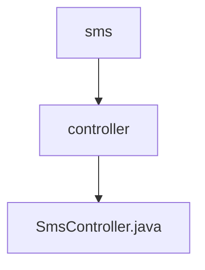

# 基础信息

|      |      |
|------|------|
| 名称 | controller |
| 编码语言 | .java |
| 代码路径 | staffjoy/sms-svc/src/main/java/xyz/staffjoy/sms/controller |
| 包名 | staffjoy.docs.sms-svc.src.main.java.xyz.staffjoy.sms.controller |
| 概述说明 | 短信发送控制器，支持白名单校验和异步发送。 |

# 说明

这是一个短信发送控制器类，使用Spring框架实现。它包含一个POST接口/v1/queue_send，需要公司、账户或机器人服务授权。该接口接收短信请求，首先检查白名单设置，若启用则验证接收号码是否在白名单内，否则拒绝请求。验证通过后异步发送短信，并返回操作结果。整个过程都有详细的日志记录。

### 包内部结构视图

该流程图展示了短信服务的代码结构，顶层为sms目录，其下包含controller子目录。controller目录中存放着核心的SmsController.java控制器文件，负责处理短信服务相关的业务逻辑。整个结构简洁清晰，符合典型MVC架构模式中控制层的组织方式。

# 文件列表 File List

| 名称   | 类型  | 说明 |
|-------|------|-------------|
| [SmsController.java](SmsController.md) | file | 短信发送控制器，支持白名单校验和异步发送。 |

