# 基础信息

|      |      |
|------|------|
| 名称 | AppProps |
| 编码语言 | .java |
| 代码路径 | staffjoy/sms-svc/src/main/java/xyz/staffjoy/sms/props/AppProps.java |
| 包名 | xyz.staffjoy.sms.props |
| 依赖项 | ['lombok.AllArgsConstructor', 'lombok.Builder', 'lombok.Data', 'lombok.NoArgsConstructor', 'org.springframework.boot.context.properties.ConfigurationProperties', 'org.springframework.stereotype.Component', 'javax.validation.constraints.NotNull'] |
| 概述说明 | Java配置类AppProps，包含阿里云邮件和短信配置、白名单开关及并发数设置。 |

# 说明

这是一个名为AppProps的Java类，使用了Lombok注解简化代码，包含阿里云邮件服务相关配置属性。类中定义了三个非空的阿里云访问参数：aliyunAccessKey、aliyunAccessSecret和aliyunSmsSignName。此外还有白名单控制开关whiteListOnly、白名单电话号码whiteListPhoneNumbers以及并发数concurrency配置项。类通过@ConfigurationProperties注解绑定staffjoy前缀的配置属性，支持全参和无参构造。

# 类列表 Class Summary

| 名称   | 类型  | 说明 |
|-------|------|-------------|
| AppProps | class | Java配置类AppProps，包含阿里云邮件和短信配置、白名单开关及并发数设置。 |


## 类 AppProps

|      |      |
|------|------|
| 访问范围 | @Component;@ConfigurationProperties(prefix="staffjoy");@Data;@Builder;@NoArgsConstructor;@AllArgsConstructor;public |
| 类型 | class |
| 名称 | AppProps |
| 说明 | Java配置类AppProps，包含阿里云邮件和短信配置、白名单开关及并发数设置。 |


### UML类图

```mermaid
classDiagram
    class AppProps {
        -String aliyunAccessKey
        -String aliyunAccessSecret
        -String aliyunSmsSignName
        -boolean whiteListOnly
        -String whiteListPhoneNumbers
        -int concurrency
        +AppProps()
        +AppProps(String, String, String, boolean, String, int)
    }
    // 类标注了Spring的@Component和@ConfigurationProperties注解
    // 使用Lombok的@Data、@Builder、@NoArgsConstructor、@AllArgsConstructor
```

这段代码定义了一个Spring Boot配置类AppProps，用于集中管理应用配置属性。类通过@ConfigurationProperties绑定"staffjoy"前缀的配置项，包含阿里云短信服务密钥、白名单控制标志、并发数等字段。Lombok注解自动生成getter/setter、构造器和建造者模式方法，简化了样板代码。该类作为配置中心，为其他组件提供统一的外部化配置访问接口。


### 内部方法调用关系图

```mermaid
graph TD
    A["类AppProps"]
    B["注解: @Component"]
    C["注解: @ConfigurationProperties"]
    D["注解: @Data"]
    E["注解: @Builder"]
    F["注解: @NoArgsConstructor"]
    G["注解: @AllArgsConstructor"]
    H["属性: @NotNull String aliyunAccessKey"]
    I["属性: @NotNull String aliyunAccessSecret"]
    J["属性: @NotNull String aliyunSmsSignName"]
    K["属性: boolean whiteListOnly"]
    L["属性: String whiteListPhoneNumbers"]
    M["属性: int concurrency"]

    A --> B
    A --> C
    A --> D
    A --> E
    A --> F
    A --> G
    A --> H
    A --> I
    A --> J
    A --> K
    A --> L
    A --> M
```



这段代码定义了一个名为AppProps的Spring配置类，使用Lombok注解简化了代码结构。该类包含阿里云DirectMail相关配置属性（访问密钥、密钥和短信签名名称），以及白名单控制标志、白名单电话号码和并发数配置。通过@ConfigurationProperties注解将外部配置文件中的属性绑定到该类实例，@Component使其成为Spring管理的Bean。@Data、@Builder等Lombok注解自动生成getter/setter、构建器等方法。

### 字段列表 Field List

| 名称  | 类型  | 说明 |
|-------|-------|------|
| aliyunSmsSignName | String | 阿里云短信签名名称，非空字符串。 |
| aliyunAccessKey | String | 非空阿里云访问密钥字符串 |
| whiteListOnly | boolean | 私有布尔变量，控制白名单限制。 |
| concurrency | int | 私有整型并发数变量。 |
| whiteListPhoneNumbers | String | 私有字符串变量白名单电话号码 |
| aliyunAccessSecret | String | 非空私有字符串变量aliyunAccessSecret |

### 方法列表 Method List

| 名称  | 类型  | 说明 |
|-------|-------|------|


