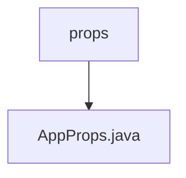

# 基础信息

|      |      |
|------|------|
| 名称 | props |
| 编码语言 | .java |
| 代码路径 | staffjoy/sms-svc/src/main/java/xyz/staffjoy/sms/props |
| 包名 | staffjoy.docs.sms-svc.src.main.java.xyz.staffjoy.sms.props |
| 概述说明 | Java配置类AppProps，包含阿里云邮件和短信配置、白名单开关及并发数设置。 |

# 说明

这是一个名为AppProps的Java类，使用了Lombok注解简化代码，包含阿里云邮件服务相关配置属性。类中定义了三个非空的阿里云访问参数：aliyunAccessKey、aliyunAccessSecret和aliyunSmsSignName。此外还有白名单控制开关whiteListOnly、白名单电话号码whiteListPhoneNumbers以及并发数concurrency配置项。类通过@ConfigurationProperties注解绑定staffjoy前缀的配置属性，支持全参和无参构造。

### 包内部结构视图

该流程图展示了sms-svc项目中props目录与AppProps.java文件的层级关系。props作为父目录包含AppProps.java配置文件，这种结构常见于Java项目的配置管理，其中props目录存放应用属性相关文件，AppProps.java则具体实现属性配置逻辑。整个结构简洁清晰，符合标准的Maven项目目录规范。

# 文件列表 File List

| 名称   | 类型  | 说明 |
|-------|------|-------------|
| [AppProps.java](AppProps.md) | file | Java配置类AppProps，包含阿里云邮件和短信配置、白名单开关及并发数设置。 |

