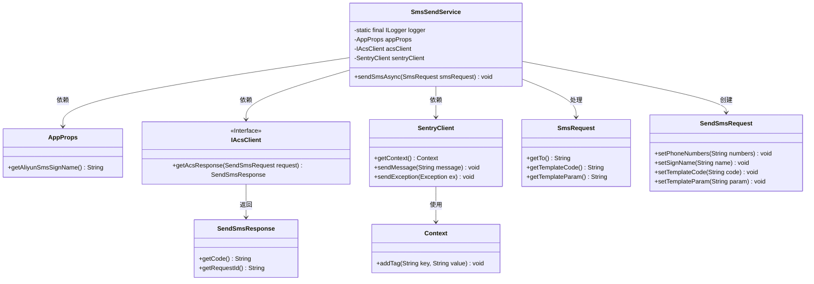
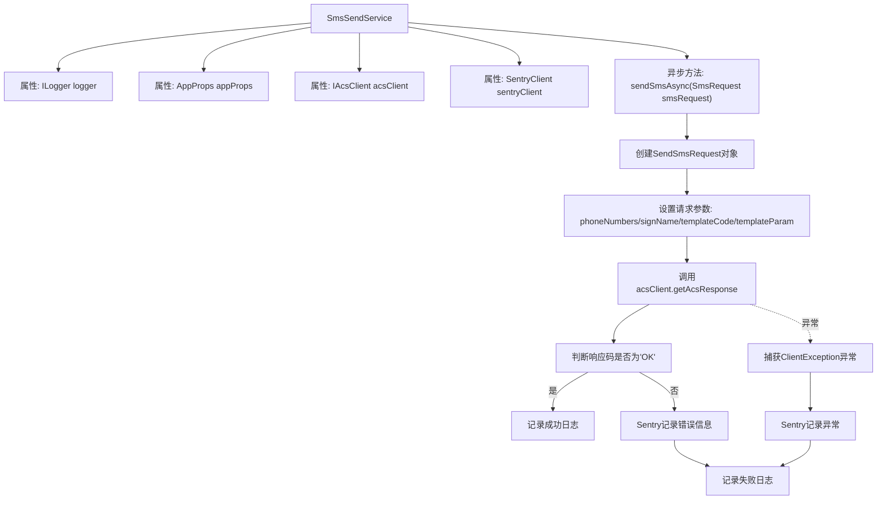

# 基础信息

|      |      |
|------|------|
| 名称 | SmsSendService |
| 编码语言 | .java |
| 代码路径 | staffjoy/sms-svc/src/main/java/xyz/staffjoy/sms/service/SmsSendService.java |
| 包名 | xyz.staffjoy.sms.service |
| 依赖项 | ['com.aliyuncs.IAcsClient', 'com.aliyuncs.dysmsapi.model.v20170525.SendSmsRequest', 'com.aliyuncs.dysmsapi.model.v20170525.SendSmsResponse', 'com.aliyuncs.exceptions.ClientException', 'com.github.structlog4j.ILogger', 'com.github.structlog4j.SLoggerFactory', 'io.sentry.SentryClient', 'io.sentry.context.Context', 'org.springframework.beans.factory.annotation.Autowired', 'org.springframework.scheduling.annotation.Async', 'org.springframework.stereotype.Service', 'xyz.staffjoy.sms.config.AppConfig', 'xyz.staffjoy.sms.props.AppProps', 'xyz.staffjoy.sms.dto.SmsRequest'] |
| 概述说明 | 短信服务类，异步发送短信，记录日志和异常。 |

# 说明

SmsSendService是一个异步发送短信的服务类，使用阿里云短信服务。通过Autowired注入AppProps、IAcsClient和SentryClient依赖。sendSmsAsync方法接收SmsRequest参数，设置接收号码、签名、模板代码和参数后调用阿里云接口发送短信。成功时记录日志，失败时通过Sentry记录错误信息并记录错误日志。处理过程中捕获ClientException异常并记录。

# 类列表 Class Summary

| 名称   | 类型  | 说明 |
|-------|------|-------------|
| SmsSendService | class | 异步发送短信服务，记录成功或失败日志并上报异常。 |

## 类 SmsSendService

|      |      |
|------|------|
| 访问范围 | @Service;public |
| 类型 | class |
| 名称 | SmsSendService |
| 说明 | 异步发送短信服务，记录成功或失败日志并上报异常。 |

### UML类图

这段代码展示了一个短信发送服务(SmsSendService)的类结构，它通过阿里云短信服务(IAcsClient)异步发送短信，并使用Sentry进行错误监控。服务依赖AppProps获取配置，通过IAcsClient接口发送请求，并利用SentryClient记录异常。主要处理流程包括：构建短信请求(SendSmsRequest)、处理响应(SendSmsResponse)以及错误处理时记录上下文(Context)。整个设计体现了依赖注入和异步处理的特性。

### 内部方法调用关系图

这段代码流程图展示了SmsSendService处理短信发送的完整流程。该服务通过异步方式发送短信请求，首先配置短信参数并调用阿里云短信接口，然后根据响应结果分别处理成功和失败情况。成功时记录业务日志，失败时通过Sentry收集错误信息并记录异常日志。整个流程包含请求构建、接口调用、响应处理和异常捕获四个主要阶段，体现了完整的错误监控和日志记录机制。

### 字段列表 Field List

| 名称  | 类型  | 说明 |
|-------|-------|------|
| acsClient | IAcsClient | 自动注入AcsClient实例 |
| appProps | AppProps | 自动注入AppProps配置类实例。 |
| sentryClient | SentryClient | 自动注入SentryClient实例。 |
| logger = SLoggerFactory.getLogger(SmsSendService.class) | ILogger | 静态日志记录器，用于SmsSendService类的日志输出。 |

### 方法列表 Method List

| 名称  | 类型  | 说明 |
|-------|-------|------|
| sendSmsAsync | void | 异步发送短信，成功记录日志，失败上报错误。 |

