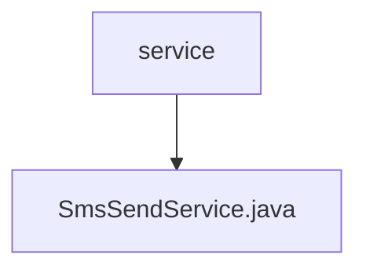

# 基础信息

|      |      |
|------|------|
| 名称 | service |
| 编码语言 | .java |
| 代码路径 | staffjoy/sms-svc/src/main/java/xyz/staffjoy/sms/service |
| 包名 | staffjoy.docs.sms-svc.src.main.java.xyz.staffjoy.sms.service |
| 概述说明 | 短信服务类，异步发送短信，记录日志和异常。 |

# 说明

SmsSendService是一个异步发送短信的服务类，使用阿里云短信服务。通过Autowired注入AppProps、IAcsClient和SentryClient依赖。sendSmsAsync方法接收SmsRequest参数，设置接收号码、签名、模板代码和参数后调用阿里云接口发送短信。成功时记录日志，失败时通过Sentry记录错误信息并记录错误日志。处理过程中捕获ClientException异常并记录。

### 包内部结构视图

该流程图展示了sms-svc项目中service目录的层级结构。根节点为service文件夹，其下包含一个Java文件SmsSendService.java。这种简单的树形结构表明该服务模块可能专注于短信发送功能，且当前仅实现了一个核心服务类。

# 文件列表 File List

| 名称   | 类型  | 说明 |
|-------|------|-------------|
| [SmsSendService.java](SmsSendService.md) | file | 短信服务类，异步发送短信，记录日志和异常。 |

