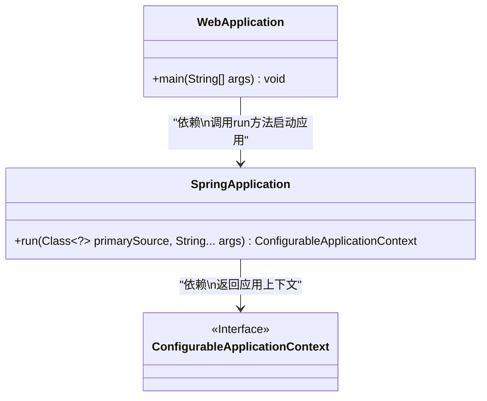
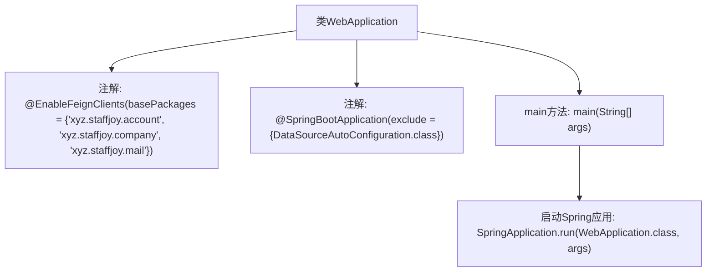

# 基础信息

|      |      |
|------|------|
| 名称 | WebApplication |
| 编码语言 | .java |
| 代码路径 | staffjoy/web-app/src/main/java/xyz/staffjoy/web/WebApplication.java |
| 包名 | xyz.staffjoy.web |
| 依赖项 | ['org.springframework.boot.SpringApplication', 'org.springframework.boot.autoconfigure.SpringBootApplication', 'org.springframework.boot.autoconfigure.jdbc.DataSourceAutoConfiguration', 'org.springframework.cloud.openfeign.EnableFeignClients'] |
| 概述说明 | SpringBoot应用启用Feign客户端，排除数据源自动配置。 |

# 说明

该内容描述了一个基于Spring Boot的Java Web应用主类。通过@EnableFeignClients注解启用了Feign客户端功能，并指定了三个基础包路径（account、company、mail）。@SpringBootApplication注解标记为主启动类，同时排除了数据源自动配置。主方法通过SpringApplication.run启动整个应用。

# 类列表 Class Summary

| 名称   | 类型  | 说明 |
|-------|------|-------------|
| WebApplication | class | SpringBoot应用启用FeignClients，排除数据源自动配置。 |

## 类 WebApplication

|      |      |
|------|------|
| 访问范围 | @EnableFeignClients(basePackages = {"xyz.staffjoy.account", "xyz.staffjoy.company", "xyz.staffjoy.mail"});@SpringBootApplication(exclude = {DataSourceAutoConfiguration.class});public |
| 类型 | class |
| 名称 | WebApplication |
| 说明 | SpringBoot应用启用FeignClients，排除数据源自动配置。 |

### UML类图

这段类图展示了Spring Boot应用的启动结构。WebApplication作为主类，通过调用SpringApplication的run方法来启动应用，该方法返回一个实现了ConfigurableApplicationContext接口的应用上下文对象。@EnableFeignClients注解表明启用了Feign客户端功能，@SpringBootApplication则标记这是一个Spring Boot应用并排除了数据源自动配置。整个结构体现了Spring Boot应用的典型启动流程和核心组件关系。

### 内部方法调用关系图

这段代码是一个Spring Boot应用的启动类，使用了@EnableFeignClients注解来启用Feign客户端，指定了三个基础包路径用于扫描Feign客户端接口。同时通过@SpringBootApplication注解标记为主启动类，并排除了数据源自动配置。main方法中调用SpringApplication.run启动整个应用。流程图清晰地展示了类结构与启动流程的层级关系。

### 字段列表 Field List

| 名称  | 类型  | 说明 |
|-------|-------|------|

### 方法列表 Method List

| 名称  | 类型  | 说明 |
|-------|-------|------|
| main | void | Java启动Spring应用的入口方法。 |

