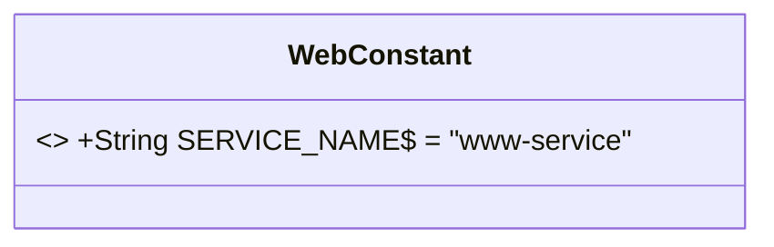
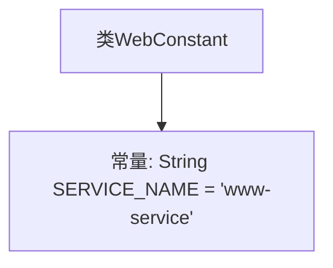

# 基础信息

|      |      |
|------|------|
| 名称 | WebConstant |
| 编码语言 | .java |
| 代码路径 | staffjoy/web-app/src/main/java/xyz/staffjoy/web/WebConstant.java |
| 包名 | xyz.staffjoy.web |
| 依赖项 | [] |
| 概述说明 | 定义常量SERVICE_NAME为"www-service"。 |

# 说明

该内容定义了一个名为WebConstant的公共类，其中包含一个静态常量字符串SERVICE_NAME，其值为"www-service"。这个常量可能用于标识或引用特定的服务名称。整个结构简洁明了，适用于需要全局访问服务名称的场景。

# 类列表 Class Summary

| 名称   | 类型  | 说明 |
|-------|------|-------------|
| WebConstant | class | 定义常量SERVICE_NAME为"www-service"。 |

## 类 WebConstant

|      |      |
|------|------|
| 访问范围 | public |
| 类型 | class |
| 名称 | WebConstant |
| 说明 | 定义常量SERVICE_NAME为"www-service"。 |

### UML类图

这段类图描述了一个简单的WebConstant类，该类包含一个公开静态常量SERVICE_NAME，其值为"www-service"。由于该常量被声明为final，在类图中使用<<final>>标记，并通过$符号表示静态成员。这个类通常用于集中管理Web应用中的常量配置，避免魔法字符串的散落，提高代码的可维护性和可读性。

### 内部方法调用关系图

这段代码定义了一个名为WebConstant的类，其中包含一个静态常量SERVICE_NAME，其值为"www-service"。该常量被声明为public static final，意味着它是公开的、全局唯一的且不可修改的。这种设计通常用于存储应用程序中的全局配置或常用字符串，以避免硬编码和便于统一管理。整个结构非常简单，仅包含一个类和一个常量定义。

### 字段列表 Field List

| 名称  | 类型  | 说明 |
|-------|-------|------|
| SERVICE_NAME = "www-service" | String | 服务名称为www-service |

### 方法列表 Method List

| 名称  | 类型  | 说明 |
|-------|-------|------|

