# 基础信息

|      |      |
|------|------|
| 名称 | web |
| 编码语言 | .java |
| 代码路径 | staffjoy/web-app/src/main/java/xyz/staffjoy/web |
| 包名 | staffjoy.docs.web-app.src.main.java.xyz.staffjoy.web |
| 概述说明 | Spring框架Web应用控制器模块，处理用户认证、账户管理、公司管理、静态页面展示和错误处理等功能。 |

# 说明

# Web应用控制器模块总结

## 概述

该代码模块是一个基于Spring Boot框架的完整Web应用解决方案，主要包含以下核心组件：

1. **控制器层**：处理用户认证、账户管理、静态页面展示和错误处理等核心功能
2. **配置系统**：通过AppProps类管理应用属性，包括reCAPTCHA公钥和签名密钥
3. **服务辅助**：HelperService提供HTTP方法检查、URL构建、异步事件追踪等功能
4. **视图管理**：基于工厂模式的页面模型体系，支持动态页面构建和错误处理
5. **基础配置**：包含异步任务处理、静态资源加载和Thymeleaf模板引擎配置
6. **服务集成**：通过Feign客户端集成account、company和mail服务

模块采用清晰的职责分离设计，各组件通过共享服务保持一致性，并实现了完善的异常处理和日志记录机制。

## 主要业务场景

### 1. 用户认证与安全管理
- **登录/登出流程**：LoginController处理认证，LogoutController管理会话清除
- **密码重置**：ResetController和ConfirmResetController协同完成验证流程
- **安全控制**：基于令牌的身份验证、参数校验和角色检查

### 2. 账户生命周期管理
- **注册激活**：SignupController处理注册，ActivateController完成账户激活
- **信息维护**：多个控制器协同处理密码、个人信息等更新操作
- **数据同步**：通过syncUserAsync方法保持用户数据一致性

### 3. 公司组织管理
- **公司创建**：NewCompanyController处理公司创建及管理员设置
- **成员管理**：集成账户系统处理用户与公司关联关系

### 4. 内容展示系统
- **静态页面**：StaticPageController统一管理首页、关于页等静态内容
- **动态页面**：PageFactory构建登录、重置密码等业务页面
- **错误展示**：ErrorPageFactory生成标准化错误页面(404/500)

### 5. 后台处理系统
- **异步任务**：自定义线程池处理邮件发送、事件追踪等后台任务
- **资源加载**：AssetLoader实现图像Base64编码转换
- **模板渲染**：Thymeleaf方言扩展支持复杂布局

### 6. 监控与运维
- **错误追踪**：集成Sentry进行异常监控和上报
- **日志记录**：统一的异常处理和错误日志机制
- **服务标识**：通过WebConstant维护服务名称常量

模块设计亮点包括：
- 建造者模式实现链式页面构造
- Lombok减少样板代码
- 工厂模式封装页面构建逻辑
- 异步处理提升系统吞吐量
- 统一的监控和错误处理机制

### 包内部结构视图

```mermaid
graph TD
    web --> controller
    web --> props
    web --> service
    web --> view
    web --> config
    web --> WebApplication.java
    web --> WebConstant.java
    controller --> ConfirmResetController.java
    controller --> LogoutController.java
    controller --> exception
    controller --> SignupController.java
    controller --> StaticPageController.java
    controller --> ActivateController.java
    controller --> NewCompanyController.java
    controller --> ResetController.java
    controller --> LoginController.java
    controller --> GlobalErrorController.java
    exception --> ResourceNotFoundException.java
    props --> AppProps.java
    service --> HelperService.java
    view --> error
    view --> Page.java
    view --> Constant.java
    view --> ConfirmResetPage.java
    view --> LoginPage.java
    view --> PageFactory.java
    view --> ResetPage.java
    view --> ActivatePage.java
    error --> ErrorPageFactory.java
    error --> ErrorPage.java
    config --> AppConfig.java
    config --> AssetLoader.java
    config --> ViewConfig.java
```

该流程图展示了Staffjoy Web应用的Java代码目录结构，从根目录web开始，向下分为controller、props、service、view和config五个主要模块。其中controller包含多个具体控制器类和异常处理子目录，view模块包含页面类和错误处理子目录，config包含应用配置类。所有子模块均以最终文件或目录名显示，完整呈现了项目的层级关系。

# 文件列表 File List

| 名称   | 类型  | 说明 |
|-------|------|-------------|
| [WebConstant.java](WebConstant.md) | file | 定义常量SERVICE_NAME为"www-service"。 |
| [WebApplication.java](WebApplication.md) | file | SpringBoot应用启用Feign客户端，排除数据源自动配置。 |
| [config](config/_module.md) | package | Java配置类AppConfig启用异步线程池。AssetLoader加载Base64图像。ViewConfig配置模板方言。 |
| [view](view/_module.md) | package | 错误页面构建模块，含工厂类和数据模型，支持404/500等错误展示，集成监控与标准化结构。 |
| [service](service/_module.md) | package | HelperService提供HTTP方法检查、错误日志、异步事件跟踪、用户同步和邮件发送功能。 |
| [props](props/_module.md) | package | Java配置类AppProps，含验证码密钥和签名密钥。 |
| [controller](controller/_module.md) | package | ConfirmResetController处理密码重置确认。LogoutController处理登出。ResourceNotFoundException表示404错误。SignupController处理注册。StaticPageController管理静态页面。ActivateController处理账户激活。NewCompanyController创建新公司。ResetController处理密码重置。LoginController处理登录。GlobalErrorController处理全局错误。 |

