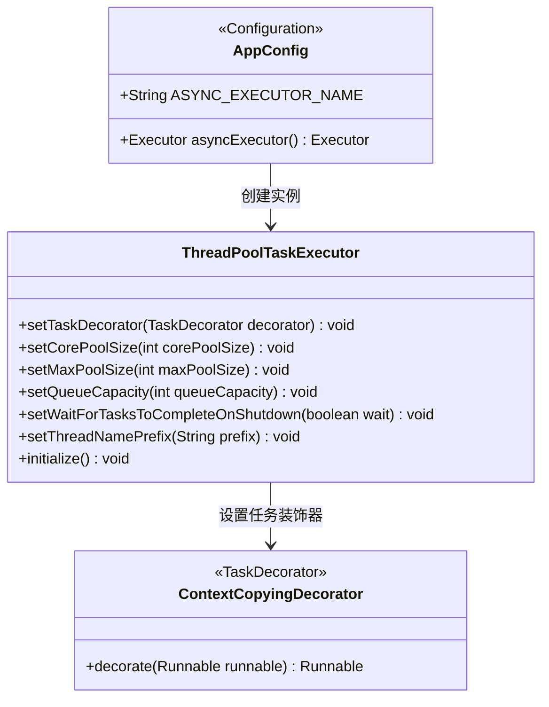
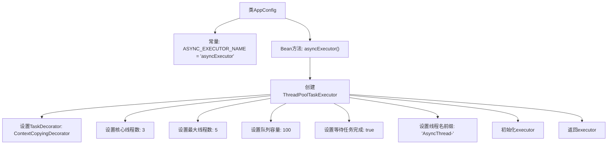

# 基础信息

|      |      |
|------|------|
| 名称 | AppConfig |
| 编码语言 | .java |
| 代码路径 | staffjoy/web-app/src/main/java/xyz/staffjoy/web/config/AppConfig.java |
| 包名 | xyz.staffjoy.web.config |
| 依赖项 | ['org.springframework.context.annotation.Bean', 'org.springframework.context.annotation.Configuration', 'org.springframework.context.annotation.Import', 'org.springframework.scheduling.annotation.EnableAsync', 'org.springframework.scheduling.concurrent.ThreadPoolTaskExecutor', 'xyz.staffjoy.common.async.ContextCopyingDecorator', 'xyz.staffjoy.common.config.StaffjoyWebConfig', 'java.util.concurrent.Executor'] |
| 概述说明 | Java配置类，启用异步并定义线程池执行器，核心3线程，最大5线程，队列100任务。 |

# 说明

这是一个Java配置类AppConfig，启用了异步功能并导入了StaffjoyWebConfig配置。它定义了一个名为asyncExecutor的线程池执行器，核心线程数为3，最大线程数为5，队列容量为100。该执行器设置了任务装饰器ContextCopyingDecorator用于传递请求作用域上下文，支持关闭时等待任务完成，线程名前缀为AsyncThread-。

# 类列表 Class Summary

| 名称   | 类型  | 说明 |
|-------|------|-------------|
| AppConfig | class | Java配置类，启用异步并定义线程池执行器，核心3线程，最大5线程，队列容量100。 |

## 类 AppConfig

|      |      |
|------|------|
| 访问范围 | @Configuration;@EnableAsync;@Import(value = StaffjoyWebConfig.class);@SuppressWarnings(value = "Duplicates");public |
| 类型 | class |
| 名称 | AppConfig |
| 说明 | Java配置类，启用异步并定义线程池执行器，核心3线程，最大5线程，队列容量100。 |

### UML类图

这段代码是一个Spring配置类，主要功能是配置异步任务执行器。AppConfig类通过@Bean注解创建了一个ThreadPoolTaskExecutor实例，设置了核心线程数、最大线程数、队列容量等参数，并使用ContextCopyingDecorator来传递请求上下文。ThreadPoolTaskExecutor是Spring提供的线程池实现，ContextCopyingDecorator实现了TaskDecorator接口用于装饰Runnable任务。整个配置实现了异步任务执行的基本框架，适用于需要后台处理的场景。

### 内部方法调用关系图

这段代码是一个Spring配置类AppConfig，主要功能是配置一个异步任务执行器。通过@EnableAsync启用异步支持，并定义了一个名为asyncExecutor的线程池Bean。该线程池配置了核心线程数3、最大线程数5、队列容量100，使用ContextCopyingDecorator复制请求上下文，并设置了线程名前缀和优雅关闭策略。流程图清晰展示了从类定义到线程池参数配置的完整初始化过程。

### 字段列表 Field List

| 名称  | 类型  | 说明 |
|-------|-------|------|
| ASYNC_EXECUTOR_NAME = "asyncExecutor" | String | 异步执行器名称定义为asyncExecutor。 |

### 方法列表 Method List

| 名称  | 类型  | 说明 |
|-------|-------|------|
| asyncExecutor | Executor | 创建异步线程池，核心3最大5队列100，支持上下文复制和优雅关闭。 |

