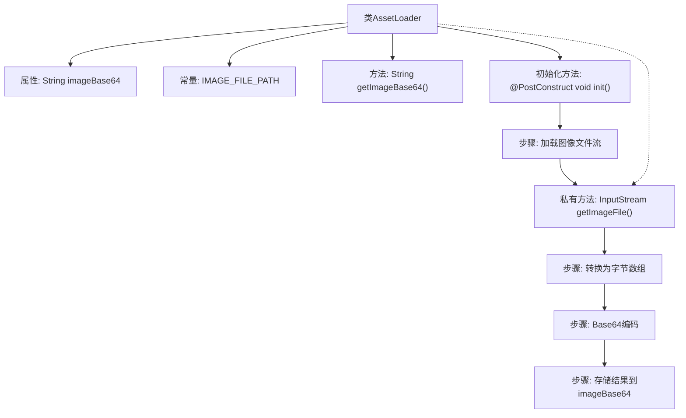

# 基础信息

|      |      |
|------|------|
| 名称 | AssetLoader |
| 编码语言 | .java |
| 代码路径 | staffjoy/web-app/src/main/java/xyz/staffjoy/web/config/AssetLoader.java |
| 包名 | xyz.staffjoy.web.config |
| 依赖项 | ['org.apache.commons.io.IOUtils', 'org.springframework.core.io.ClassPathResource', 'org.springframework.stereotype.Component', 'org.springframework.util.Base64Utils', 'javax.annotation.PostConstruct', 'java.io.File', 'java.io.IOException', 'java.io.InputStream', 'java.nio.file.Files'] |
| 概述说明 | AssetLoader类加载并编码图片为Base64字符串。 |

# 说明

这是一个名为AssetLoader的Java类，主要用于加载并编码图像文件。类中包含一个私有字符串变量imageBase64用于存储编码后的图像数据，以及一个静态常量IMAGE_FILE_PATH指定图像文件路径。类提供了getImageBase64方法获取编码后的图像数据。在初始化方法init中，通过getImageFile方法获取图像文件输入流，将图像转换为字节数组后进行Base64编码，最终存储到imageBase64变量中。getImageFile方法使用ClassPathResource加载指定路径的图像文件并返回输入流。整个类的作用是加载图像文件并将其转换为Base64编码字符串。

# 类列表 Class Summary

| 名称   | 类型  | 说明 |
|-------|------|-------------|
| AssetLoader | class | 加载图片并转为Base64编码的工具类。 |


## 类 AssetLoader

|      |      |
|------|------|
| 访问范围 | @Component;public |
| 类型 | class |
| 名称 | AssetLoader |
| 说明 | 加载图片并转为Base64编码的工具类。 |


### UML类图

```mermaid
classDiagram
    class AssetLoader {
        -String imageBase64
        +String IMAGE_FILE_PATH
        +String getImageBase64()
        +void init() throws IOException
        -InputStream getImageFile() throws IOException
    }
    // AssetLoader 类负责加载并编码图像文件
    // 使用@PostConstruct注解的init方法在初始化时执行图像加载和Base64编码
    // getImageFile方法私有，用于获取图像文件的输入流
```

这段代码展示了一个Spring组件AssetLoader，主要用于加载指定路径下的图像文件并将其转换为Base64编码字符串。类中包含一个私有字段imageBase64存储编码结果，公有方法getImageBase64()用于获取该值。初始化时通过@PostConstruct标记的init()方法自动执行图像加载和编码流程，其中getImageFile()私有方法负责获取图像文件的输入流。整个过程实现了图像资源的自动化加载和编码存储。


### 内部方法调用关系图



这段代码是Spring组件AssetLoader的实现，主要功能是在初始化时加载指定路径的图片文件，将其转换为Base64编码字符串并存储。流程图展示了从类结构到初始化过程的完整调用链：首先通过getImageFile()获取输入流，然后转换为字节数组并进行Base64编码，最终将结果赋值给imageBase64属性。整个过程在@PostConstruct注解的init()方法中完成，确保组件加载时自动执行。

### 字段列表 Field List

| 名称  | 类型  | 说明 |
|-------|-------|------|
| imageBase64 | String | 图片Base64编码字符串 |
| IMAGE_FILE_PATH = "static/assets/images/staffjoy_coffee.png" | String | 静态图片路径变量：IMAGE_FILE_PATH指向"static/assets/images/staffjoy_coffee.png"。 |

### 方法列表 Method List

| 名称  | 类型  | 说明 |
|-------|-------|------|
| getImageFile | InputStream | 获取指定路径图片文件的输入流。 |
| getImageBase64 | String | 获取图片Base64数据的方法。 |
| init | void | 初始化方法加载图片并转为Base64字符串。 |


