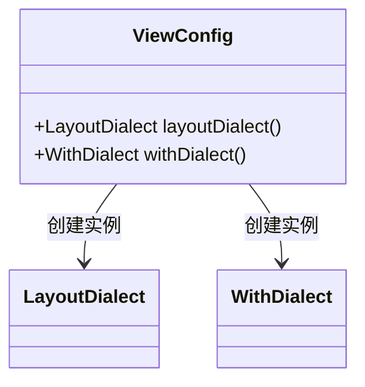
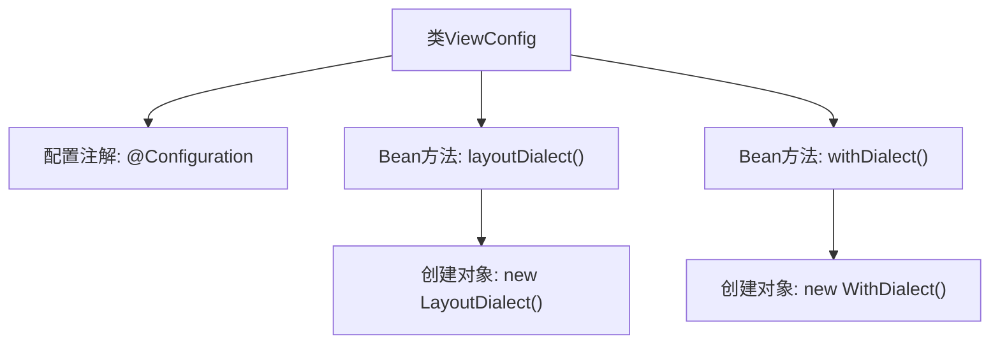

# 基础信息

|      |      |
|------|------|
| 名称 | ViewConfig |
| 编码语言 | .java |
| 代码路径 | staffjoy/web-app/src/main/java/xyz/staffjoy/web/config/ViewConfig.java |
| 包名 | xyz.staffjoy.web.config |
| 依赖项 | ['ch.mfrey.thymeleaf.extras.with.WithDialect', 'nz.net.ultraq.thymeleaf.LayoutDialect', 'org.springframework.context.annotation.Bean', 'org.springframework.context.annotation.Configuration'] |
| 概述说明 | 配置类定义了两个Bean：LayoutDialect和WithDialect。 |

# 说明

这是一个Spring配置类ViewConfig，定义了两个Bean方法。第一个方法layoutDialect()创建并返回一个LayoutDialect实例，用于支持布局方言功能。第二个方法withDialect()创建并返回一个WithDialect实例，用于支持With方言功能。这两个Bean将被Spring容器管理，为应用提供模板引擎的方言扩展支持。整个配置类通过@Configuration注解标明其配置类身份，并通过@Bean注解声明需要由Spring管理的组件。

# 类列表 Class Summary

| 名称   | 类型  | 说明 |
|-------|------|-------------|
| ViewConfig | class | 配置类定义了两个Bean：LayoutDialect和WithDialect。 |

## 类 ViewConfig

|      |      |
|------|------|
| 访问范围 | @Configuration;public |
| 类型 | class |
| 名称 | ViewConfig |
| 说明 | 配置类定义了两个Bean：LayoutDialect和WithDialect。 |

### UML类图

这段类图展示了Spring配置类ViewConfig的结构及其依赖关系。ViewConfig是一个配置类，通过@Bean注解定义了两个工厂方法：layoutDialect()返回LayoutDialect实例，withDialect()返回WithDialect实例。这两个方法分别创建并管理对应组件的生命周期，体现了Spring依赖注入的核心机制。图中清晰呈现了配置类与具体组件之间的实例化关系，LayoutDialect和WithDialect作为独立类被ViewConfig显式构造，符合Spring容器管理Bean的设计模式。

### 内部方法调用关系图

这段代码展示了一个Spring配置类ViewConfig，使用@Configuration注解声明为配置类。类中包含两个@Bean方法：layoutDialect()创建并返回LayoutDialect实例，withDialect()创建并返回WithDialect实例。这两个方法将被Spring容器调用以注册对应的Bean对象，用于Thymeleaf模板引擎的方言扩展配置。流程图清晰地展示了配置类与Bean方法之间的层级关系及对象创建过程。

### 字段列表 Field List

| 名称  | 类型  | 说明 |
|-------|-------|------|

### 方法列表 Method List

| 名称  | 类型  | 说明 |
|-------|-------|------|
| layoutDialect | LayoutDialect | 创建LayoutDialect的Spring Bean实例 |
| withDialect | WithDialect | 定义Bean方法，返回WithDialect实例。 |

