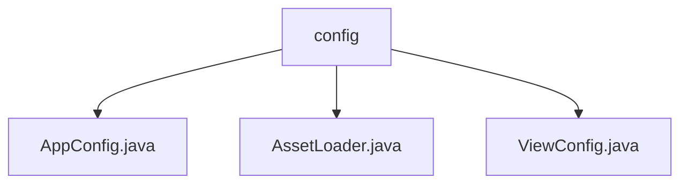

# 基础信息

|      |      |
|------|------|
| 名称 | config |
| 编码语言 | .java |
| 代码路径 | staffjoy/web-app/src/main/java/xyz/staffjoy/web/config |
| 包名 | staffjoy.docs.web-app.src.main.java.xyz.staffjoy.web.config |
| 概述说明 | Java配置类AppConfig启用异步线程池。AssetLoader加载Base64图像。ViewConfig配置模板方言。 |

# 说明

## 概述
该代码模块是一个基于Spring框架的Web应用配置模块，主要包含异步任务处理、静态资源加载和视图模板配置等功能。模块通过多个配置类实现了线程池管理、图像资源Base64编码转换以及Thymeleaf模板引擎方言扩展等核心功能。

## 主要业务场景
1. **异步任务处理**  
   - 通过`AppConfig`配置类提供异步任务执行能力，使用自定义线程池(`asyncExecutor`)处理后台任务
   - 支持请求作用域上下文的传递(ContextCopyingDecorator)
   - 适用于需要后台异步处理的业务场景，如邮件发送、日志记录等

2. **静态资源加载**  
   - `AssetLoader`类实现图像文件的加载和Base64编码转换
   - 适用于需要将图像资源内嵌到HTML/CSS中的场景，如邮件模板中的嵌入式图片

3. **视图模板配置**  
   - `ViewConfig`配置类提供Thymeleaf模板引擎的方言扩展
   - 支持布局方言(LayoutDialect)和With方言(WithDialect)
   - 适用于需要复杂模板布局和片段重用的前端页面渲染场景

### 包内部结构视图

该流程图展示了staffjoy项目的web应用配置模块结构，根节点为config目录，包含三个配置类文件：AppConfig.java处理应用基础配置，AssetLoader.java负责资源加载，ViewConfig.java管理视图配置。这种结构体现了典型的Spring Boot应用配置分层方式，每个配置文件各司其职。

# 文件列表 File List

| 名称   | 类型  | 说明 |
|-------|------|-------------|
| [ViewConfig.java](ViewConfig.md) | file | 配置类定义了两个Bean：LayoutDialect和WithDialect。 |
| [AssetLoader.java](AssetLoader.md) | file | AssetLoader类加载并编码图片为Base64字符串。 |
| [AppConfig.java](AppConfig.md) | file | Java配置类，启用异步并定义线程池执行器，核心3线程，最大5线程，队列100任务。 |

