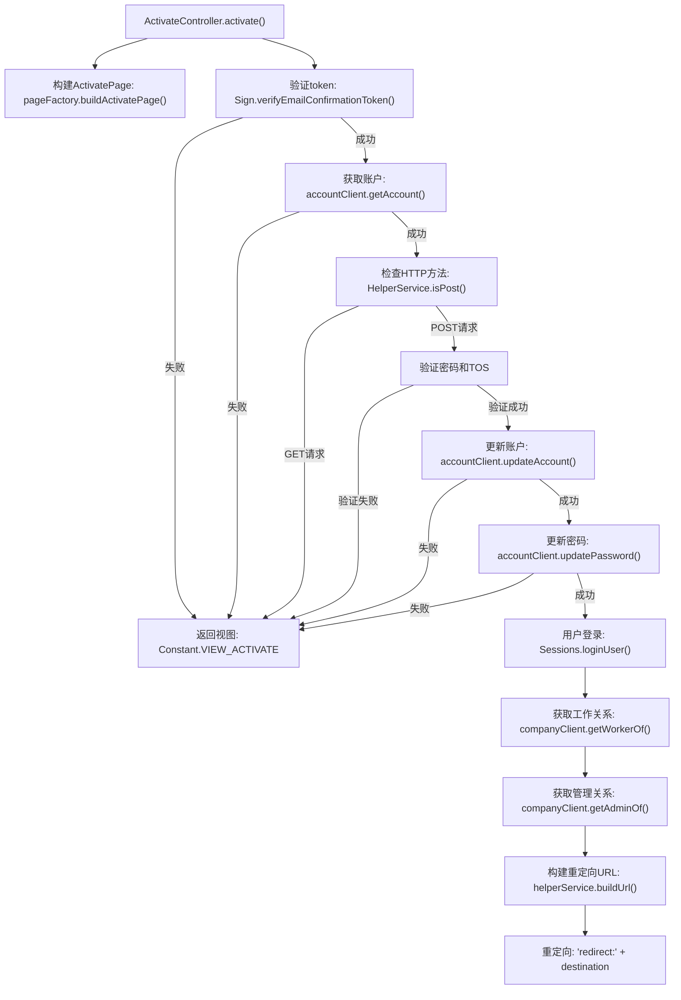

# 基础信息

|      |      |
|------|------|
| 名称 | ActivateController |
| 编码语言 | .java |
| 代码路径 | staffjoy/web-app/src/main/java/xyz/staffjoy/web/controller/ActivateController.java |
| 包名 | xyz.staffjoy.web.controller |
| 依赖项 | ['com.auth0.jwt.interfaces.DecodedJWT', 'com.github.structlog4j.ILogger', 'com.github.structlog4j.SLoggerFactory', 'org.springframework.beans.factory.annotation.Autowired', 'org.springframework.stereotype.Controller', 'org.springframework.ui.Model', 'org.springframework.util.StringUtils', 'org.springframework.web.bind.annotation.PathVariable', 'org.springframework.web.bind.annotation.RequestMapping', 'org.springframework.web.bind.annotation.RequestParam', 'xyz.staffjoy.account.client.AccountClient', 'xyz.staffjoy.account.dto.AccountDto', 'xyz.staffjoy.account.dto.GenericAccountResponse', 'xyz.staffjoy.account.dto.UpdatePasswordRequest', 'xyz.staffjoy.common.api.BaseResponse', 'xyz.staffjoy.common.auth.AuthConstant', 'xyz.staffjoy.common.auth.Sessions', 'xyz.staffjoy.common.crypto.Sign', 'xyz.staffjoy.common.env.EnvConfig', 'xyz.staffjoy.common.error.ServiceException', 'xyz.staffjoy.company.client.CompanyClient', 'xyz.staffjoy.company.dto.AdminOfList', 'xyz.staffjoy.company.dto.GetAdminOfResponse', 'xyz.staffjoy.company.dto.GetWorkerOfResponse', 'xyz.staffjoy.company.dto.WorkerOfList', 'xyz.staffjoy.web.props.AppProps', 'xyz.staffjoy.web.service.HelperService', 'xyz.staffjoy.web.view.ActivatePage', 'xyz.staffjoy.web.view.Constant', 'xyz.staffjoy.web.view.PageFactory', 'javax.servlet.http.HttpServletRequest', 'javax.servlet.http.HttpServletResponse'] |
| 概述说明 | 激活控制器处理用户激活流程，验证令牌，更新账户信息，设置密码并登录，最后根据用户角色重定向。 |

# 说明

ActivateController是一个处理账户激活请求的控制器类。它通过验证电子邮件确认令牌来激活用户账户，并更新用户信息如密码、姓名和电话号码。控制器会检查密码长度和条款同意状态，若验证失败则返回错误信息。成功激活后，用户会自动登录，并根据其角色（管理员、支持人员或普通员工）重定向到不同页面。控制器依赖多个服务如AccountClient和CompanyClient来获取和更新用户信息，并使用HelperService处理异常和日志记录。整个过程包括令牌验证、账户信息更新、密码修改和智能重定向逻辑。

# 类列表 Class Summary

| 名称   | 类型  | 说明 |
|-------|------|-------------|
| ActivateController | class | 激活控制器处理用户激活请求，验证令牌，更新账户信息，设置密码并登录用户，最后根据用户角色重定向到不同页面。 |

## 类 ActivateController

|      |      |
|------|------|
| 访问范围 | @SuppressWarnings("Duplicates");@Controller;public |
| 类型 | class |
| 名称 | ActivateController |
| 说明 | 激活控制器处理用户激活请求，验证令牌，更新账户信息，设置密码并登录用户，最后根据用户角色重定向到不同页面。 |

### UML类图

```mermaid
classDiagram
    class ActivateController {
        <<Controller>>
        -ILogger logger
        -PageFactory pageFactory
        -AppProps appProps
        -EnvConfig envConfig
        -HelperService helperService
        -AccountClient accountClient
        -CompanyClient companyClient
        +activate(String token, String password, String name, String tos, String phonenumber, Model model, HttpServletRequest request, HttpServletResponse response) String
    }

    class PageFactory {
        +buildActivatePage() ActivatePage
    }

    class AppProps {
        +getSigningSecret() String
    }

    class EnvConfig {
        +getExternalApex() String
    }

    class HelperService {
        +logException(ILogger logger, Exception ex, String errMsg) void
        +logError(ILogger logger, String message) void
        +isPost(HttpServletRequest request) boolean
        +buildUrl(String protocol, String host, String path) String
        +buildUrl(String protocol, String host) String
    }

    class AccountClient {
        +getAccount(String auth, String userId) GenericAccountResponse
        +updateAccount(String auth, AccountDto account) GenericAccountResponse
        +updatePassword(String auth, UpdatePasswordRequest request) BaseResponse
    }

    class CompanyClient {
        +getWorkerOf(String auth, String userId) GetWorkerOfResponse
        +getAdminOf(String auth, String userId) GetAdminOfResponse
    }

    class ActivatePage {
        -String token
        -String email
        -String name
        -String phonenumber
        -String errorMessage
        +setToken(String token) void
        +setEmail(String email) void
        +setName(String name) void
        +setPhonenumber(String phonenumber) void
        +setErrorMessage(String errorMessage) void
        +getErrorMessage() String
    }

    class AccountDto {
        -String email
        -String name
        -String phoneNumber
        -boolean confirmedAndActive
        -String id
        -boolean support
        +setEmail(String email) void
        +setConfirmedAndActive(boolean confirmedAndActive) void
        +setName(String name) void
        +setPhoneNumber(String phoneNumber) void
        +getId() String
        +isSupport() boolean
    }

    class GenericAccountResponse {
        -boolean success
        -String message
        -AccountDto account
        +isSuccess() boolean
        +getMessage() String
        +getAccount() AccountDto
    }

    class BaseResponse {
        -boolean success
        -String message
        +isSuccess() boolean
        +getMessage() String
    }

    class GetWorkerOfResponse {
        -boolean success
        -String message
        -WorkerOfList workerOfList
        +isSuccess() boolean
        +getMessage() String
        +getWorkerOfList() WorkerOfList
    }

    class GetAdminOfResponse {
        -boolean success
        -String message
        -AdminOfList adminOfList
        +isSuccess() boolean
        +getMessage() String
        +getAdminOfList() AdminOfList
    }

    class WorkerOfList {
        -List~Team~ teams
        +getTeams() List~Team~
    }

    class AdminOfList {
        -List~Company~ companies
        +getCompanies() List~Company~
    }

    class Sign {
        <<Static>>
        +CLAIM_EMAIL String
        +CLAIM_USER_ID String
        +verifyEmailConfirmationToken(String token, String secret) DecodedJWT
    }

    class Sessions {
        <<Static>>
        +loginUser(String userId, boolean isSupport, boolean remember, String signingSecret, String externalApex, HttpServletResponse response) void
    }

    ActivateController --> PageFactory : 依赖
    ActivateController --> AppProps : 依赖
    ActivateController --> EnvConfig : 依赖
    ActivateController --> HelperService : 依赖
    ActivateController --> AccountClient : 依赖
    ActivateController --> CompanyClient : 依赖
    ActivateController --> ActivatePage : 创建
    ActivateController --> AccountDto : 使用
    ActivateController --> GenericAccountResponse : 使用
    ActivateController --> BaseResponse : 使用
    ActivateController --> GetWorkerOfResponse : 使用
    ActivateController --> GetAdminOfResponse : 使用
    ActivateController --> Sign : 调用静态方法
    ActivateController --> Sessions : 调用静态方法
    HelperService --> ILogger : 使用
    AccountClient --> GenericAccountResponse : 返回
    AccountClient --> BaseResponse : 返回
    CompanyClient --> GetWorkerOfResponse : 返回
    CompanyClient --> GetAdminOfResponse : 返回
    GetWorkerOfResponse --> WorkerOfList : 包含
    GetAdminOfResponse --> AdminOfList : 包含
```

这段代码展示了一个激活控制器(ActivateController)的类图，它处理用户账户激活流程。控制器通过多个依赖服务(如PageFactory、HelperService、AccountClient等)完成以下功能：验证邮箱确认令牌、获取用户账户信息、更新账户信息、设置密码、登录用户，并根据用户角色(管理员/普通员工)进行智能重定向。整个流程涉及多个DTO对象(如AccountDto)和响应对象(如GenericAccountResponse)，通过严格的错误处理和日志记录确保流程可靠性。

### 内部方法调用关系图

这段代码是ActivateController的核心激活流程，主要处理用户账户激活请求。首先验证邮箱确认令牌，然后根据请求类型(GET/POST)分别处理：GET请求返回激活页面，POST请求则验证密码和条款后更新账户信息、密码，并登录用户。最后根据用户角色(管理员/普通员工)智能重定向到不同页面。整个过程包含多层异常处理和日志记录，确保安全性和可追踪性。

### 字段列表 Field List

| 名称  | 类型  | 说明 |
|-------|-------|------|
| helperService | HelperService | 自动注入HelperService实例。 |
| appProps | AppProps | 自动注入AppProps配置类实例。 |
| logger = SLoggerFactory.getLogger(ActivateController.class) | ILogger | 静态日志记录器实例，用于ActivateController类。 |
| envConfig | EnvConfig | 自动注入EnvConfig配置实例。 |
| pageFactory | PageFactory | 自动注入页面工厂对象 |
| accountClient | AccountClient | 自动注入AccountClient实例 |
| companyClient | CompanyClient | 自动注入公司客户端实例 |

### 方法列表 Method List

| 名称  | 类型  | 说明 |
|-------|-------|------|
| activate | String | 处理用户激活请求，验证令牌，更新账户信息，设置密码并登录，最后重定向到相应页面。 |

