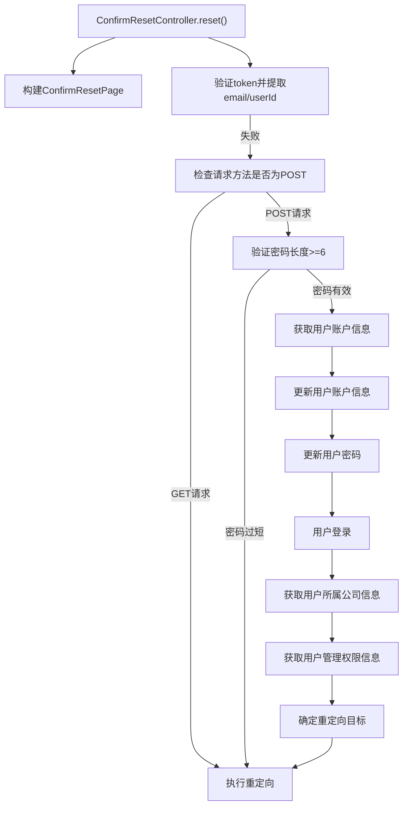

# 基础信息

|      |      |
|------|------|
| 名称 | ConfirmResetController |
| 编码语言 | .java |
| 代码路径 | staffjoy/web-app/src/main/java/xyz/staffjoy/web/controller/ConfirmResetController.java |
| 包名 | xyz.staffjoy.web.controller |
| 依赖项 | ['com.auth0.jwt.interfaces.DecodedJWT', 'com.github.structlog4j.ILogger', 'com.github.structlog4j.SLoggerFactory', 'org.springframework.beans.factory.annotation.Autowired', 'org.springframework.stereotype.Controller', 'org.springframework.ui.Model', 'org.springframework.web.bind.annotation.PathVariable', 'org.springframework.web.bind.annotation.RequestMapping', 'org.springframework.web.bind.annotation.RequestParam', 'xyz.staffjoy.account.client.AccountClient', 'xyz.staffjoy.account.dto.AccountDto', 'xyz.staffjoy.account.dto.GenericAccountResponse', 'xyz.staffjoy.account.dto.UpdatePasswordRequest', 'xyz.staffjoy.common.api.BaseResponse', 'xyz.staffjoy.common.auth.AuthConstant', 'xyz.staffjoy.common.auth.Sessions', 'xyz.staffjoy.common.crypto.Sign', 'xyz.staffjoy.common.env.EnvConfig', 'xyz.staffjoy.common.error.ServiceException', 'xyz.staffjoy.company.client.CompanyClient', 'xyz.staffjoy.company.dto.AdminOfList', 'xyz.staffjoy.company.dto.GetAdminOfResponse', 'xyz.staffjoy.company.dto.GetWorkerOfResponse', 'xyz.staffjoy.company.dto.WorkerOfList', 'xyz.staffjoy.web.props.AppProps', 'xyz.staffjoy.web.service.HelperService', 'xyz.staffjoy.web.view.ConfirmResetPage', 'xyz.staffjoy.web.view.Constant', 'xyz.staffjoy.web.view.PageFactory', 'javax.servlet.http.HttpServletRequest', 'javax.servlet.http.HttpServletResponse'] |
| 概述说明 | 处理密码重置的控制器，验证令牌、更新账户和密码，登录用户并重定向。 |

# 说明

ConfirmResetController是一个处理密码重置确认的控制器类。它通过token验证用户身份，检查密码长度是否合规，更新账户信息和密码，并登录用户。根据用户角色（管理员、支持人员或普通员工）进行智能重定向，分别跳转到应用页面、个人账户页面或新公司注册页面。过程中涉及多个服务调用和异常处理，确保操作的安全性和正确性。

# 类列表 Class Summary

| 名称   | 类型  | 说明 |
|-------|------|-------------|
| ConfirmResetController | class | 控制器处理密码重置，验证令牌，更新账户和密码，登录用户并重定向。 |

## 类 ConfirmResetController

|      |      |
|------|------|
| 访问范围 | @SuppressWarnings("Duplicates");@Controller;public |
| 类型 | class |
| 名称 | ConfirmResetController |
| 说明 | 控制器处理密码重置，验证令牌，更新账户和密码，登录用户并重定向。 |

### UML类图

```mermaid
classDiagram
    class ConfirmResetController {
        <<Controller>>
        -ILogger logger
        -PageFactory pageFactory
        -AppProps appProps
        -EnvConfig envConfig
        -HelperService helperService
        -AccountClient accountClient
        -CompanyClient companyClient
        +reset(String token, String password, Model model, HttpServletRequest request, HttpServletResponse response) String
    }

    class PageFactory {
        +buildConfirmResetPage() ConfirmResetPage
    }

    class ConfirmResetPage {
        -String token
        -String errorMessage
        +setToken(String token)
        +setErrorMessage(String errorMessage)
    }

    class HelperService {
        +logException(ILogger logger, Exception ex, String errMsg)
        +logError(ILogger logger, String message)
        +isPost(HttpServletRequest request) boolean
        +buildUrl(String protocol, String host, String path) String
    }

    class AccountClient {
        +getAccount(String auth, String userId) GenericAccountResponse~AccountDto~
        +updateAccount(String auth, AccountDto account) GenericAccountResponse~AccountDto~
        +updatePassword(String auth, UpdatePasswordRequest request) BaseResponse
    }

    class CompanyClient {
        +getWorkerOf(String auth, String userId) GetWorkerOfResponse~WorkerOfList~
        +getAdminOf(String auth, String userId) GetAdminOfResponse~AdminOfList~
    }

    class AccountDto {
        -String email
        -boolean confirmedAndActive
        +setEmail(String email)
        +setConfirmedAndActive(boolean confirmedAndActive)
    }

    class Sessions {
        +loginUser(String userId, boolean isSupport, boolean remember, String secret, String apex, HttpServletResponse response)
    }

    ConfirmResetController --> PageFactory : 创建页面
    ConfirmResetController --> HelperService : 工具方法
    ConfirmResetController --> AccountClient : 账户操作
    ConfirmResetController --> CompanyClient : 公司信息查询
    ConfirmResetController --> Sessions : 用户登录
    AccountClient ..|> GenericAccountResponse~AccountDto~
    CompanyClient ..|> GetWorkerOfResponse~WorkerOfList~
    CompanyClient ..|> GetAdminOfResponse~AdminOfList~
```

这段代码展示了一个Spring MVC控制器`ConfirmResetController`，用于处理密码重置确认流程。控制器通过多个服务协作完成：验证令牌、更新账户信息、修改密码、用户登录和智能重定向。类图清晰地展示了控制器与各服务类（如`AccountClient`、`CompanyClient`）的依赖关系，以及数据传输对象（如`AccountDto`）和工具类（如`HelperService`）的交互方式。整个流程涉及异常处理、数据验证和基于用户角色的动态重定向。

### 内部方法调用关系图

这段代码实现了一个密码重置确认流程的控制器方法。流程从验证token开始，然后根据请求类型(GET/POST)分别处理：GET请求返回确认页面，POST请求则验证密码、更新账户信息、设置新密码、登录用户，最后根据用户角色(普通员工/管理员/支持人员)智能重定向到不同页面。整个过程包含严格的错误处理和日志记录，确保密码重置流程的安全性和可靠性。

### 字段列表 Field List

| 名称  | 类型  | 说明 |
|-------|-------|------|
| appProps | AppProps | 自动注入AppProps配置类实例。 |
| pageFactory | PageFactory | 自动注入页面工厂对象。 |
| envConfig | EnvConfig | 自动注入EnvConfig配置实例。 |
| helperService | HelperService | 自动注入HelperService实例。 |
| logger = SLoggerFactory.getLogger(ConfirmResetController.class) | ILogger | 静态日志记录器实例，用于ConfirmResetController类。 |
| accountClient | AccountClient | 自动注入AccountClient实例 |
| companyClient | CompanyClient | 自动注入公司客户端实例 |

### 方法列表 Method List

| 名称  | 类型  | 说明 |
|-------|-------|------|
| reset | String | 处理密码重置请求，验证令牌，更新账户信息并重定向用户。 |

