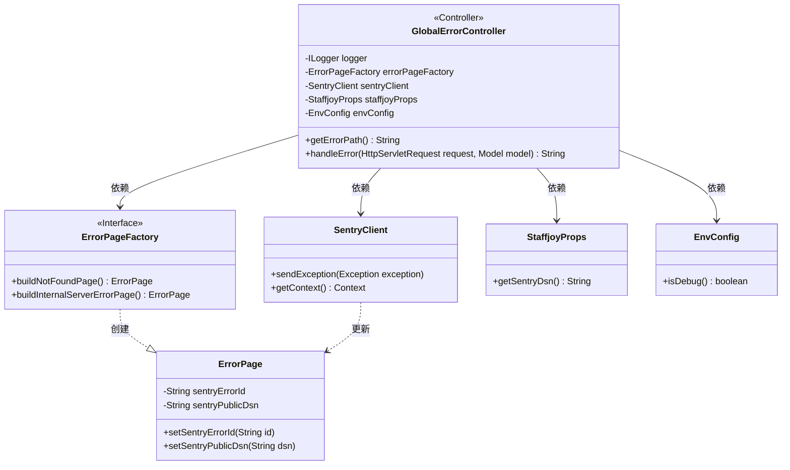
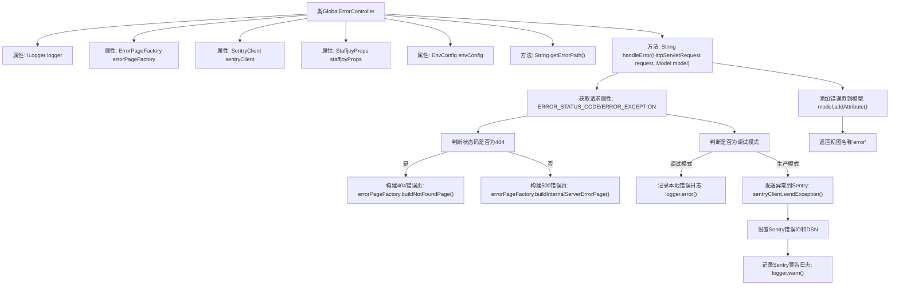

# 基础信息

|      |      |
|------|------|
| 名称 | GlobalErrorController |
| 编码语言 | .java |
| 代码路径 | staffjoy/web-app/src/main/java/xyz/staffjoy/web/controller/GlobalErrorController.java |
| 包名 | xyz.staffjoy.web.controller |
| 依赖项 | ['com.github.structlog4j.ILogger', 'com.github.structlog4j.SLoggerFactory', 'io.sentry.SentryClient', 'org.springframework.beans.factory.annotation.Autowired', 'org.springframework.boot.web.servlet.error.ErrorController', 'org.springframework.http.HttpStatus', 'org.springframework.stereotype.Controller', 'org.springframework.ui.Model', 'org.springframework.web.bind.annotation.RequestMapping', 'xyz.staffjoy.common.config.StaffjoyProps', 'xyz.staffjoy.common.env.EnvConfig', 'xyz.staffjoy.web.view.Constant', 'xyz.staffjoy.web.view.error.ErrorPage', 'xyz.staffjoy.web.view.error.ErrorPageFactory', 'javax.servlet.RequestDispatcher', 'javax.servlet.http.HttpServletRequest', 'java.util.UUID'] |
| 概述说明 | 全局错误控制器，处理404和500错误，集成Sentry上报异常。 |

# 说明

这是一个名为GlobalErrorController的Spring控制器类，实现了ErrorController接口，用于全局错误处理。类中注入了多个依赖组件，包括错误页面工厂、Sentry客户端、配置属性等。主要功能是通过/error路径处理错误请求，根据状态码生成404或500错误页面。在非调试模式下会将异常上报至Sentry监控系统，并记录错误ID。最后将错误页面信息添加到模型并返回error视图。控制器包含详细的错误日志记录和异常上报逻辑。

# 类列表 Class Summary

| 名称   | 类型  | 说明 |
|-------|------|-------------|
| GlobalErrorController | class | 全局错误控制器，处理404和500错误，集成Sentry异常上报。 |

## 类 GlobalErrorController

|      |      |
|------|------|
| 访问范围 | @Controller;@SuppressWarnings(value = "Duplicates");public |
| 类型 | class |
| 名称 | GlobalErrorController |
| 说明 | 全局错误控制器，处理404和500错误，集成Sentry异常上报。 |

### UML类图

这段类图展示了Spring MVC错误处理控制器GlobalErrorController的结构及其依赖关系。控制器通过@Autowired注入四个关键依赖：ErrorPageFactory用于生成错误页面，SentryClient用于错误上报，StaffjoyProps和EnvConfig提供配置信息。控制器实现了ErrorController接口，主要处理/error路径请求，根据不同的HTTP状态码生成对应的错误页面，并在生产环境下将异常信息上报至Sentry错误监控系统。图中清晰地展示了各组件间的协作关系，包括错误页面创建、异常上报和配置获取等关键流程。

### 内部方法调用关系图

该流程图展示了GlobalErrorController处理全局错误的完整流程。控制器首先获取请求中的错误状态码和异常信息，根据状态码决定构建404或500错误页面。如果是生产环境且存在异常，会将异常上报到Sentry监控系统并记录相关日志。最后将错误页面信息添加到模型并返回错误视图。整个过程包含了错误分类处理、环境判断、异常上报和日志记录等关键步骤。

### 字段列表 Field List

| 名称  | 类型  | 说明 |
|-------|-------|------|
| envConfig | EnvConfig | 自动注入环境配置对象envConfig。 |
| sentryClient | SentryClient | 自动注入SentryClient实例。 |
| logger = SLoggerFactory.getLogger(GlobalErrorController.class) | ILogger | 静态日志记录器初始化，用于GlobalErrorController类。 |
| staffjoyProps | StaffjoyProps | 自动注入StaffjoyProps配置属性 |
| errorPageFactory | ErrorPageFactory | 自动注入错误页面工厂实例。 |

### 方法列表 Method List

| 名称  | 类型  | 说明 |
|-------|-------|------|
| getErrorPath | String | 重写getErrorPath方法，返回路径"/error"。 |
| handleError | String | 处理错误请求，根据状态码和异常类型返回不同错误页面，记录日志并上报Sentry。 |

