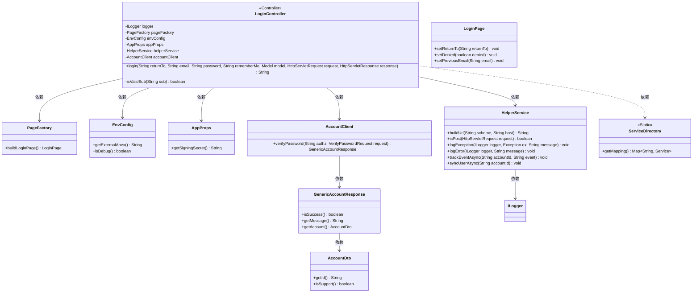
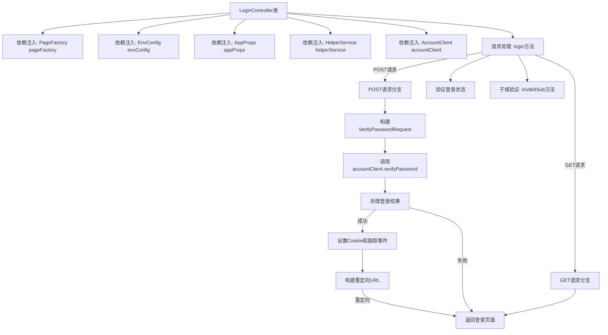

# 基础信息

|      |      |
|------|------|
| 名称 | LoginController |
| 编码语言 | .java |
| 代码路径 | staffjoy/web-app/src/main/java/xyz/staffjoy/web/controller/LoginController.java |
| 包名 | xyz.staffjoy.web.controller |
| 依赖项 | ['com.github.structlog4j.ILogger', 'com.github.structlog4j.SLoggerFactory', 'org.springframework.beans.factory.annotation.Autowired', 'org.springframework.stereotype.Controller', 'org.springframework.ui.Model', 'org.springframework.util.StringUtils', 'org.springframework.web.bind.annotation.RequestMapping', 'org.springframework.web.bind.annotation.RequestParam', 'xyz.staffjoy.account.client.AccountClient', 'xyz.staffjoy.account.dto.AccountDto', 'xyz.staffjoy.account.dto.GenericAccountResponse', 'xyz.staffjoy.account.dto.VerifyPasswordRequest', 'xyz.staffjoy.common.auth.AuthConstant', 'xyz.staffjoy.common.auth.AuthContext', 'xyz.staffjoy.common.auth.Sessions', 'xyz.staffjoy.common.env.EnvConfig', 'xyz.staffjoy.common.env.EnvConstant', 'xyz.staffjoy.common.services.Service', 'xyz.staffjoy.common.services.ServiceDirectory', 'xyz.staffjoy.web.props.AppProps', 'xyz.staffjoy.web.service.HelperService', 'xyz.staffjoy.web.view.Constant', 'xyz.staffjoy.web.view.LoginPage', 'xyz.staffjoy.web.view.PageFactory', 'javax.servlet.http.HttpServletRequest', 'javax.servlet.http.HttpServletResponse', 'java.net.MalformedURLException', 'java.net.URL', 'java.util.Map'] |
| 概述说明 | 登录控制器处理用户登录，验证密码，设置会话cookie，并重定向到指定页面或默认页。 |

# 说明

该代码定义了一个处理登录请求的控制器类LoginController。它通过依赖注入获取多个服务组件，包括页面工厂、环境配置、应用属性和账户客户端等。控制器提供了/login端点，支持GET和POST请求。GET请求返回登录页面，POST请求处理用户认证。认证过程包括验证用户密码、设置会话Cookie、跟踪登录事件和同步用户数据。登录成功后根据return_to参数重定向，失败则显示错误信息。还包括一个辅助方法isValidSub用于验证子域名有效性。整个流程涵盖了用户认证、会话管理、错误处理和重定向逻辑。

# 类列表 Class Summary

| 名称   | 类型  | 说明 |
|-------|------|-------------|
| LoginController | class | 登录控制器处理用户登录，验证密码，设置会话并重定向。 |

## 类 LoginController

|      |      |
|------|------|
| 访问范围 | @Controller;public |
| 类型 | class |
| 名称 | LoginController |
| 说明 | 登录控制器处理用户登录，验证密码，设置会话并重定向。 |

### UML类图

该代码实现了一个登录控制器，处理用户登录请求，验证用户凭证，并管理会话。核心流程包括：构建登录页面、检查认证状态、验证密码、设置会话Cookie、处理重定向逻辑。涉及多个辅助服务如环境配置、账户客户端、帮助工具等，通过依赖注入实现松耦合。包含子域名验证等安全措施，并采用异步事件跟踪和用户同步机制。

### 内部方法调用关系图

这段代码实现了一个Spring MVC的登录控制器，主要处理用户登录流程。流程图展示了从依赖注入开始，到处理GET/POST请求的分支逻辑。核心流程包括：验证用户登录状态、构建密码验证请求、调用账户服务验证、处理验证结果（成功时设置Cookie并跟踪事件，失败时记录日志）、最终返回登录页面或重定向URL。控制器还包含一个子域验证的辅助方法，用于检查重定向URL的有效性。整个流程严格遵循了MVC模式，并考虑了各种边界情况如异常处理、URL校验等。

### 字段列表 Field List

| 名称  | 类型  | 说明 |
|-------|-------|------|
| envConfig | EnvConfig | 自动注入环境配置实例 |
| accountClient | AccountClient | 自动注入AccountClient实例 |
| logger = SLoggerFactory.getLogger(LoginController.class) | ILogger | 静态日志记录器，用于LoginController类。 |
| appProps | AppProps | 自动注入AppProps配置类实例 |
| pageFactory | PageFactory | 自动注入页面工厂对象 |
| helperService | HelperService | 自动注入HelperService实例。 |

### 方法列表 Method List

| 名称  | 类型  | 说明 |
|-------|-------|------|
| login | String | 登录接口处理GET/POST请求，验证密码后设置cookie并跳转。失败记录日志，成功同步用户信息并重定向。 |
| isValidSub | boolean | 检查子域名是否有效：解析URL，匹配服务目录中的键值。 |

