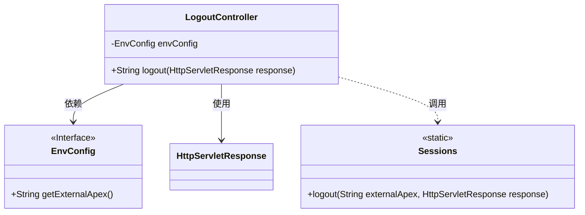
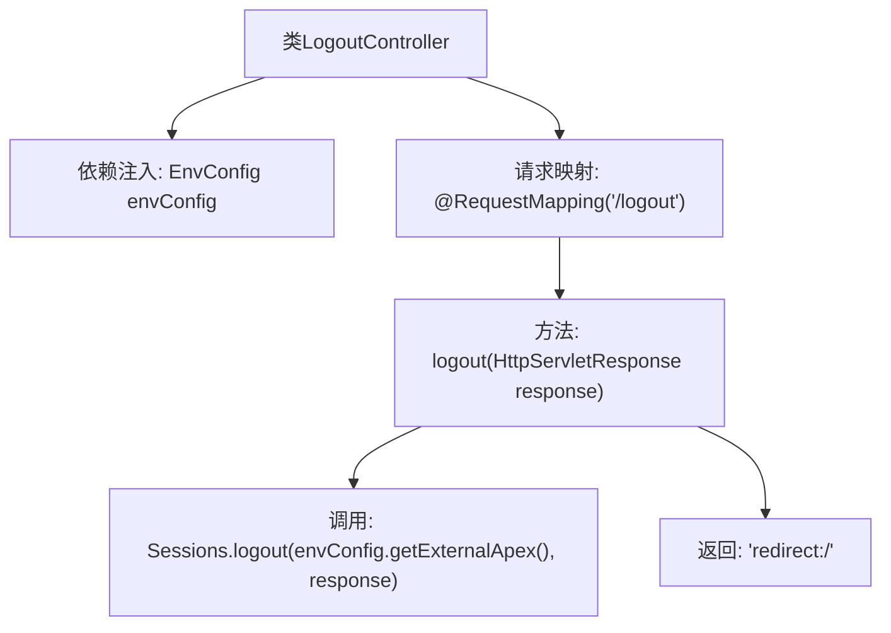

# 基础信息

|      |      |
|------|------|
| 名称 | LogoutController |
| 编码语言 | .java |
| 代码路径 | staffjoy/web-app/src/main/java/xyz/staffjoy/web/controller/LogoutController.java |
| 包名 | xyz.staffjoy.web.controller |
| 依赖项 | ['org.springframework.beans.factory.annotation.Autowired', 'org.springframework.stereotype.Controller', 'org.springframework.web.bind.annotation.RequestMapping', 'xyz.staffjoy.common.auth.Sessions', 'xyz.staffjoy.common.env.EnvConfig', 'javax.servlet.http.HttpServletResponse'] |
| 概述说明 | Java控制器类，处理/logout请求，清除会话并重定向到首页。 |

# 说明

这是一个基于Spring框架的控制器类LogoutController，主要用于处理用户登出功能。该类通过@Controller注解标识为控制器，并自动注入EnvConfig配置类。控制器包含一个/logout路径的请求处理方法，使用@RequestMapping注解映射。方法内部调用Sessions.logout进行登出操作，参数包括从配置获取的外部域名和HTTP响应对象，最后重定向到根路径。整个类简洁地实现了标准的登出流程。

# 类列表 Class Summary

| 名称   | 类型  | 说明 |
|-------|------|-------------|
| LogoutController | class | Java控制器类，处理/logout请求，调用登出方法并重定向到首页。 |

## 类 LogoutController

|      |      |
|------|------|
| 访问范围 | @Controller;public |
| 类型 | class |
| 名称 | LogoutController |
| 说明 | Java控制器类，处理/logout请求，调用登出方法并重定向到首页。 |

### UML类图

这段类图展示了Spring MVC中一个简单的注销控制器结构。LogoutController通过依赖注入使用EnvConfig接口获取配置信息，并调用静态工具类Sessions的logout方法实现注销功能。控制器处理/logout请求时，会清除会话并重定向到首页。图中清晰呈现了类之间的依赖关系（EnvConfig）、使用关系（HttpServletResponse）和静态方法调用关系（Sessions），体现了典型的Spring控制器与工具类的协作模式。

### 内部方法调用关系图

这段流程图描述了LogoutController的处理流程。该控制器通过@Autowired注入EnvConfig配置，提供/logout端点处理注销请求。当调用logout方法时，会使用Sessions.logout清除会话，参数来自envConfig的外部配置，并通过HttpServletResponse操作响应，最后重定向到根路径。整个过程展示了从请求到响应的完整注销逻辑。

### 字段列表 Field List

| 名称  | 类型  | 说明 |
|-------|-------|------|
| envConfig | EnvConfig | 自动注入EnvConfig配置实例 |

### 方法列表 Method List

| 名称  | 类型  | 说明 |
|-------|-------|------|
| logout | String | 注销功能：清除会话并重定向至首页。 |

