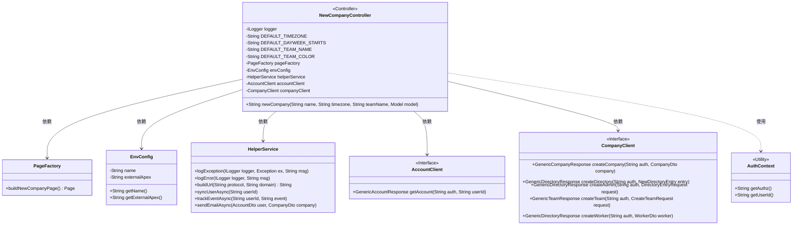
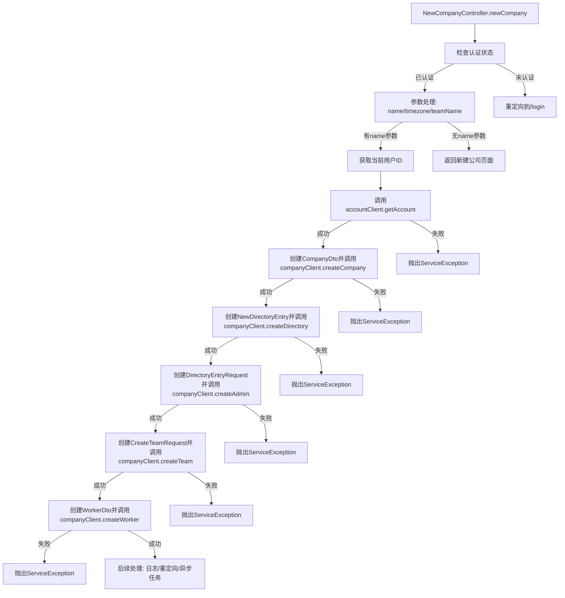

# 基础信息

|      |      |
|------|------|
| 名称 | NewCompanyController |
| 编码语言 | .java |
| 代码路径 | staffjoy/web-app/src/main/java/xyz/staffjoy/web/controller/NewCompanyController.java |
| 包名 | xyz.staffjoy.web.controller |
| 依赖项 | ['com.github.structlog4j.ILogger', 'com.github.structlog4j.SLoggerFactory', 'org.springframework.beans.factory.annotation.Autowired', 'org.springframework.stereotype.Controller', 'org.springframework.ui.Model', 'org.springframework.util.StringUtils', 'org.springframework.web.bind.annotation.RequestMapping', 'org.springframework.web.bind.annotation.RequestParam', 'xyz.staffjoy.account.client.AccountClient', 'xyz.staffjoy.account.dto.AccountDto', 'xyz.staffjoy.account.dto.GenericAccountResponse', 'xyz.staffjoy.common.auth.AuthConstant', 'xyz.staffjoy.common.auth.AuthContext', 'xyz.staffjoy.common.env.EnvConfig', 'xyz.staffjoy.common.env.EnvConstant', 'xyz.staffjoy.common.error.ServiceException', 'xyz.staffjoy.company.client.CompanyClient', 'xyz.staffjoy.company.dto', 'xyz.staffjoy.web.service.HelperService', 'xyz.staffjoy.web.view.Constant', 'xyz.staffjoy.web.view.PageFactory'] |
| 概述说明 | 控制器处理新建公司流程，包括验证、创建公司、目录、团队和员工，最后重定向。 |

# 说明

NewCompanyController是一个处理创建新公司的Spring控制器类。它定义了默认时区、工作日起始和团队名称等常量。通过/new_company端点接收名称、时区和团队名称参数。首先检查用户授权，未授权则重定向到登录页。验证参数后获取当前用户信息，创建公司实体，将用户注册为公司目录成员并设为管理员。随后创建默认团队并将用户添加为团队成员。最后记录日志、同步用户数据、发送事件跟踪，在生产环境中还会发送邮件通知销售团队。操作成功后重定向到应用页面，否则返回新建公司页面。整个过程包含严格的错误处理和日志记录。

# 类列表 Class Summary

| 名称   | 类型  | 说明 |
|-------|------|-------------|
| NewCompanyController | class | 新建公司控制器，处理公司创建、团队设置及用户注册。 |

## 类 NewCompanyController

|      |      |
|------|------|
| 访问范围 | @SuppressWarnings("Duplicates");@Controller;public |
| 类型 | class |
| 名称 | NewCompanyController |
| 说明 | 新建公司控制器，处理公司创建、团队设置及用户注册。 |

### UML类图

类图描述：
该图展示了NewCompanyController及其依赖组件的类关系。控制器通过多个服务类(HelperService、AccountClient、CompanyClient)实现企业创建流程，包含用户验证、公司注册、团队创建等操作。PageFactory用于构建页面，EnvConfig提供环境配置，AuthContext处理认证信息。各组件通过清晰的接口定义协作，形成完整的业务处理链。

### 内部方法调用关系图

该流程图描述了NewCompanyController中newCompany方法的完整执行流程。从认证检查开始，依次展示参数处理、用户信息获取、公司创建、目录管理、团队创建和成员注册等关键步骤，每个步骤都包含成功和失败的分支处理。最后展示了成功后的异步任务和重定向逻辑，完整覆盖了创建新公司业务的所有关键节点和异常处理路径。

### 字段列表 Field List

| 名称  | 类型  | 说明 |
|-------|-------|------|
| helperService | HelperService | 自动注入HelperService实例。 |
| DEFAULT_DAYWEEK_STARTS = "Monday" | String | 静态常量DEFAULT_DAYWEEK_STARTS默认值为"Monday"。 |
| logger = SLoggerFactory.getLogger(LoginController.class) | ILogger | 声明日志记录器实例，用于LoginController类。 |
| DEFAULT_TEAM_NAME = "Team" | String | 静态常量DEFAULT_TEAM_NAME默认值为"Team"。 |
| envConfig | EnvConfig | 自动注入EnvConfig配置实例 |
| pageFactory | PageFactory | 自动注入页面工厂对象 |
| accountClient | AccountClient | 自动注入AccountClient实例 |
| DEFAULT_TIMEZONE = "UTC" | String | 静态常量DEFAULT_TIMEZONE默认值为UTC。 |
| DEFAULT_TEAM_COLOR = "#744fc6" | String | 静态常量DEFAULT_TEAM_COLOR值为"#744fc6"。 |
| companyClient | CompanyClient | 自动注入公司客户端实例 |

### 方法列表 Method List

| 名称  | 类型  | 说明 |
|-------|-------|------|
| newCompany | String | 创建公司接口：验证用户后，处理参数并创建公司、目录、管理员、团队和员工，最后重定向。 |

