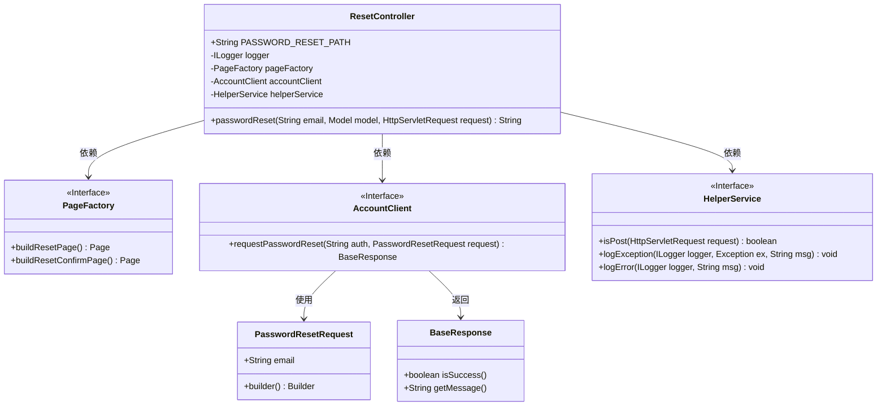
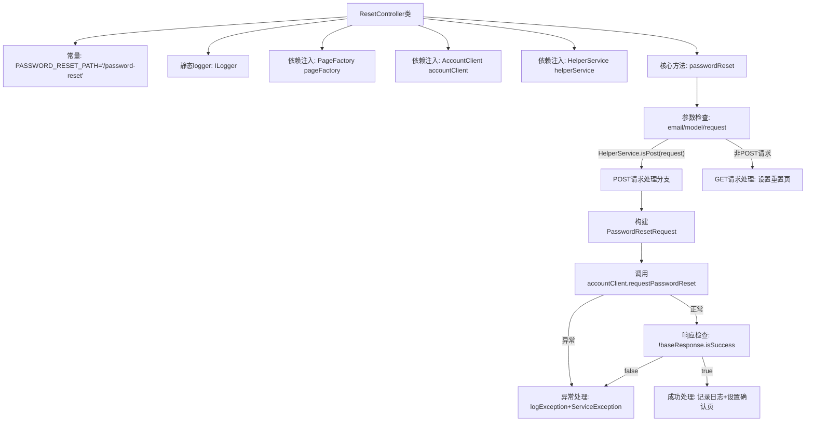

# 基础信息

|      |      |
|------|------|
| 名称 | ResetController |
| 编码语言 | .java |
| 代码路径 | staffjoy/web-app/src/main/java/xyz/staffjoy/web/controller/ResetController.java |
| 包名 | xyz.staffjoy.web.controller |
| 依赖项 | ['com.github.structlog4j.ILogger', 'com.github.structlog4j.SLoggerFactory', 'org.springframework.beans.factory.annotation.Autowired', 'org.springframework.stereotype.Controller', 'org.springframework.ui.Model', 'org.springframework.web.bind.annotation.RequestMapping', 'org.springframework.web.bind.annotation.RequestParam', 'xyz.staffjoy.account.client.AccountClient', 'xyz.staffjoy.account.dto.PasswordResetRequest', 'xyz.staffjoy.common.api.BaseResponse', 'xyz.staffjoy.common.auth.AuthConstant', 'xyz.staffjoy.common.error.ServiceException', 'xyz.staffjoy.web.service.HelperService', 'xyz.staffjoy.web.view.Constant', 'xyz.staffjoy.web.view.PageFactory', 'javax.servlet.http.HttpServletRequest'] |
| 概述说明 | 密码重置控制器，处理POST请求，调用账户服务，记录日志并返回页面。 |

# 说明

ResetController是一个处理密码重置请求的Spring控制器类。它定义了公共常量PASSWORD_RESET_PATH作为路由路径，并注入了PageFactory、AccountClient和HelperService等依赖组件。控制器包含一个passwordReset方法，通过@RequestMapping映射到指定路径，接收可选email参数。该方法首先检查HTTP请求方法，如果是POST请求，则构建PasswordResetRequest对象并调用accountClient发起密码重置请求，处理成功或失败情况。无论GET或POST请求，最后都会构建相应页面模型并返回视图名称。注意代码中省略了Google reCAPTCHA验证的实现。

# 类列表 Class Summary

| 名称   | 类型  | 说明 |
|-------|------|-------------|
| ResetController | class | 重置密码控制器，处理POST请求，调用账户服务，记录日志，返回确认或重置页面。 |

## 类 ResetController

|      |      |
|------|------|
| 访问范围 | @Controller;public |
| 类型 | class |
| 名称 | ResetController |
| 说明 | 重置密码控制器，处理POST请求，调用账户服务，记录日志，返回确认或重置页面。 |

### UML类图

这段代码展示了一个Spring MVC控制器`ResetController`，负责处理密码重置请求。控制器依赖三个服务接口：`PageFactory`用于构建页面，`AccountClient`用于与账户服务交互，`HelperService`提供辅助功能。当收到POST请求时，控制器会验证邮箱并通过`AccountClient`发起密码重置请求，根据响应结果返回不同视图；GET请求则直接返回密码重置页面。整个流程涉及请求参数处理、服务调用、异常处理和视图渲染等典型MVC操作。

### 内部方法调用关系图

流程图描述：该流程图展示了ResetController处理密码重置请求的完整流程。控制器通过@RequestMapping接收/password-reset路径请求，区分POST和GET两种请求方式。POST请求会构建PasswordResetRequest对象并调用accountClient服务，包含异常处理和响应验证；成功则返回确认页面视图。GET请求直接返回密码重置页面。整个过程涉及多个依赖服务和异常处理机制，体现了完整的业务逻辑处理链条。

### 字段列表 Field List

| 名称  | 类型  | 说明 |
|-------|-------|------|
| PASSWORD_RESET_PATH = "/password-reset" | String | 密码重置路径常量定义 |
| logger = SLoggerFactory.getLogger(ResetController.class) | ILogger | 静态日志记录器实例，用于ResetController类。 |
| pageFactory | PageFactory | 自动注入页面工厂对象 |
| accountClient | AccountClient | 自动注入AccountClient实例 |
| helperService | HelperService | 自动注入HelperService实例。 |

### 方法列表 Method List

| 名称  | 类型  | 说明 |
|-------|-------|------|
| passwordReset | String | 处理密码重置请求，验证邮箱并返回结果页。 |

