# 基础信息

|      |      |
|------|------|
| 名称 | SignupController |
| 编码语言 | .java |
| 代码路径 | staffjoy/web-app/src/main/java/xyz/staffjoy/web/controller/SignupController.java |
| 包名 | xyz.staffjoy.web.controller |
| 依赖项 | ['com.github.structlog4j.ILogger', 'com.github.structlog4j.SLoggerFactory', 'org.springframework.beans.factory.annotation.Autowired', 'org.springframework.stereotype.Controller', 'org.springframework.ui.Model', 'org.springframework.util.StringUtils', 'org.springframework.web.bind.annotation.PostMapping', 'org.springframework.web.bind.annotation.RequestParam', 'xyz.staffjoy.account.client.AccountClient', 'xyz.staffjoy.account.dto.AccountDto', 'xyz.staffjoy.account.dto.GenericAccountResponse', 'xyz.staffjoy.account.dto.CreateAccountRequest', 'xyz.staffjoy.common.auth.AuthConstant', 'xyz.staffjoy.web.service.HelperService', 'xyz.staffjoy.web.view.Constant', 'xyz.staffjoy.web.view.PageFactory'] |
| 概述说明 | 注册控制器，处理用户注册请求，验证邮箱并创建账户，失败重定向，成功返回确认页。 |

# 说明

这是一个Spring MVC控制器类SignupController，用于处理用户注册流程。它包含三个自动注入的服务组件：PageFactory、AccountClient和HelperService。控制器提供了一个POST接口/confirm，接收name和email参数，其中email为必填项。主要逻辑是验证邮箱非空后，通过AccountClient创建账户，处理可能的异常和错误响应。创建成功后记录日志并返回确认页面，失败则重定向到注册页面。整个过程包含详细的错误处理和日志记录。

# 类列表 Class Summary

| 名称   | 类型  | 说明 |
|-------|------|-------------|
| SignupController | class | 注册控制器，处理用户注册请求，验证邮箱，创建账户并返回确认页面。 |

## 类 SignupController

|      |      |
|------|------|
| 访问范围 | @Controller;public |
| 类型 | class |
| 名称 | SignupController |
| 说明 | 注册控制器，处理用户注册请求，验证邮箱，创建账户并返回确认页面。 |

### UML类图

这段代码展示了一个Spring MVC的注册控制器(SignupController)，它通过AccountClient与账户服务交互，使用HelperService处理异常和日志记录，并通过PageFactory构建确认页面。控制器接收姓名和邮箱参数，验证后创建账户，根据操作结果返回不同视图。类图清晰地展示了各组件间的依赖关系，包括核心业务逻辑、异常处理和页面构建的分层架构。

### 内部方法调用关系图

```mermaid
graph TD
    A["SignupController类"]
    B["常量: SIGN_UP_REDIRECT_PATH"]
    C["常量: logger"]
    D["依赖注入: pageFactory"]
    E["依赖注入: accountClient"]
    F["依赖注入: helperService"]
    G["方法: signUp(String name, String email, Model model)"]
    H["验证email空值检查"]
    I["构建CreateAccountRequest"]
    J["调用accountClient.createAccount"]
    K["异常处理"]
    L["检查genericAccountResponse.isSuccess"]
    M["记录成功日志"]
    N["添加页面属性到model"]
    O["返回确认视图"]

    A --> B
    A --> C
    A --> D
    A --> E
    A --> F
    A --> G
    G --> H{"!StringUtils.hasText(email)"}
    H -->|是| B
    H -->|否| I
    I --> J
    J --> K{"Exception?"}
    K -->|是| F
    F --> B
    K -->|否| L{"genericAccountResponse.isSuccess"}
    L -->|否| F
    F --> B
    L -->|是| M
    M --> N
    N --> O
```

这段代码是Spring MVC控制器，主要处理用户注册流程。流程图展示了从请求参数验证开始，到创建账户请求、调用客户端服务、异常处理、响应结果检查，最后返回视图的完整过程。关键路径包括：1) 空值检查直接重定向；2) 账户创建失败时的错误处理；3) 成功时的确认页面构建。整个流程严格遵循MVC模式，通过多个条件分支确保业务逻辑的健壮性。

### 字段列表 Field List

| 名称  | 类型  | 说明 |
|-------|-------|------|
| helperService | HelperService | 自动注入HelperService实例。 |
| pageFactory | PageFactory | 自动注入页面工厂对象。 |
| accountClient | AccountClient | 自动注入AccountClient实例 |
| SIGN_UP_REDIRECT_PATH = "redirect:/sign-up" | String | 静态字符串常量，定义注册重定向路径为"/sign-up"。 |
| logger = SLoggerFactory.getLogger(LoginController.class) | ILogger | 静态日志记录器实例，用于LoginController类。 |

### 方法列表 Method List

| 名称  | 类型  | 说明 |
|-------|-------|------|
| signUp | String | 处理用户注册请求，验证邮箱后创建账户，失败重定向，成功返回确认页。 |

