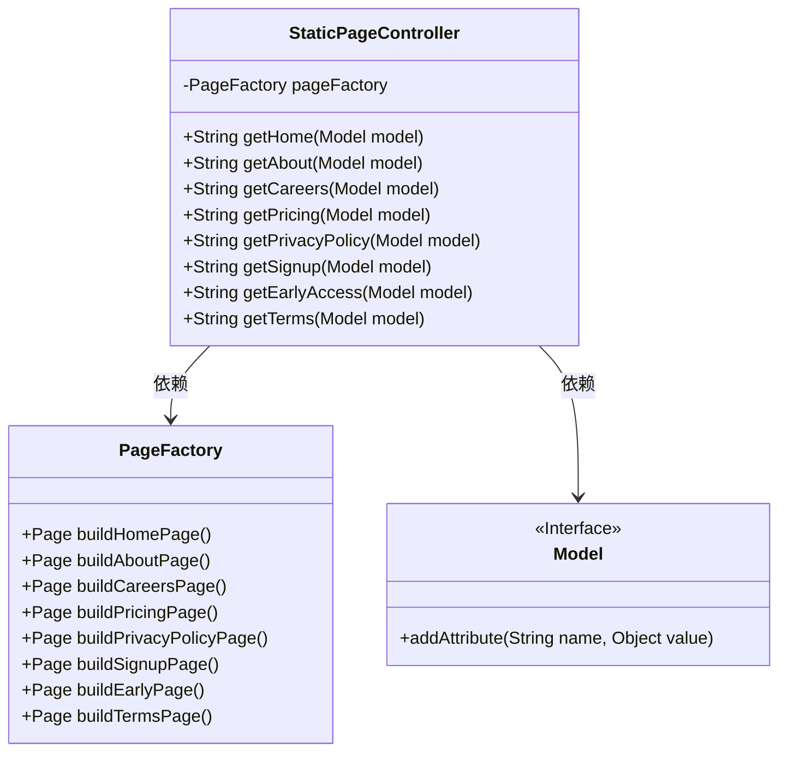
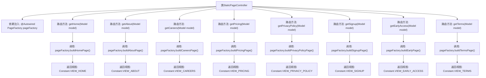

# 基础信息

|      |      |
|------|------|
| 名称 | StaticPageController |
| 编码语言 | .java |
| 代码路径 | staffjoy/web-app/src/main/java/xyz/staffjoy/web/controller/StaticPageController.java |
| 包名 | xyz.staffjoy.web.controller |
| 依赖项 | ['org.springframework.beans.factory.annotation.Autowired', 'org.springframework.stereotype.Controller', 'org.springframework.ui.Model', 'org.springframework.web.bind.annotation.RequestMapping', 'xyz.staffjoy.web.view.Constant', 'xyz.staffjoy.web.view.PageFactory'] |
| 概述说明 | 静态页面控制器，处理主页、关于、招聘、定价、隐私政策、注册、早期访问和条款等请求。 |

# 说明

StaticPageController是一个Spring MVC控制器类，用于处理静态页面的请求。它通过自动装配的PageFactory构建不同页面内容，并将页面对象添加到模型属性中。控制器包含多个请求映射方法，分别对应首页、关于页、招聘页、定价页、隐私政策页、注册页、早期访问页和条款页。每个方法返回对应的视图名称常量，实现静态页面的统一管理和展示。

# 类列表 Class Summary

| 名称   | 类型  | 说明 |
|-------|------|-------------|
| StaticPageController | class | 静态页面控制器，处理主页、关于、招聘等请求。 |

## 类 StaticPageController

|      |      |
|------|------|
| 访问范围 | @Controller;public |
| 类型 | class |
| 名称 | StaticPageController |
| 说明 | 静态页面控制器，处理主页、关于、招聘等请求。 |

### UML类图

这段代码展示了一个Spring MVC控制器`StaticPageController`，它通过`PageFactory`构建不同静态页面（如首页、关于页、招聘页等）并将页面对象添加到Model中，最后返回对应的视图名称。控制器依赖`PageFactory`来创建页面内容，并依赖Spring的`Model`接口来传递数据到视图层。该设计实现了静态页面请求的统一处理，符合MVC架构模式。

### 内部方法调用关系图

该流程图展示了StaticPageController类的完整结构，这是一个Spring MVC控制器，通过@Autowired注入PageFactory实例。控制器包含8个路由方法，分别处理不同URL路径的请求（如首页、关于页、招聘页等）。每个路由方法都调用PageFactory对应的构建方法生成页面数据，并通过Model对象添加属性，最后返回预定义的视图名称常量。所有方法遵循相同的模式：接收Model参数→调用PageFactory构建方法→添加属性→返回视图字符串。

### 字段列表 Field List

| 名称  | 类型  | 说明 |
|-------|-------|------|
| pageFactory | PageFactory | 自动注入PageFactory实例 |

### 方法列表 Method List

| 名称  | 类型  | 说明 |
|-------|-------|------|
| getPrivacyPolicy | String | 控制器方法处理隐私政策请求，返回视图并添加页面属性。 |
| getCareers | String | 控制器方法，映射/careers路径，返回职业页面视图。 |
| getAbout | String | 控制器方法处理/about请求，返回关于页视图。 |
| getPricing | String | Spring控制器方法，映射/pricing，返回定价页面视图。 |
| getHome | String | 控制器方法返回主页视图并添加页面属性。 |
| getSignup | String | 控制器方法处理注册请求，返回注册视图。 |
| getTerms | String | 控制器方法，处理/terms请求，返回条款页面视图。 |
| getEarlyAccess | String | 控制器映射/early-access，返回早期访问视图页。 |

