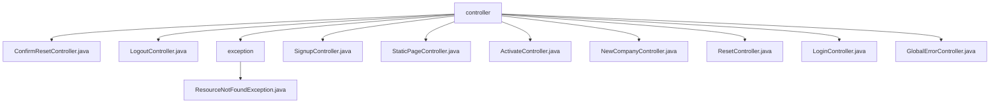

# 基础信息

|      |      |
|------|------|
| 名称 | controller |
| 编码语言 | .java |
| 代码路径 | staffjoy/web-app/src/main/java/xyz/staffjoy/web/controller |
| 包名 | staffjoy.docs.web-app.src.main.java.xyz.staffjoy.web.controller |
| 概述说明 | ConfirmResetController处理密码重置确认。LogoutController处理登出。ResourceNotFoundException表示404错误。SignupController处理注册。StaticPageController管理静态页面。ActivateController处理账户激活。NewCompanyController创建新公司。ResetController处理密码重置。LoginController处理登录。GlobalErrorController处理全局错误。 |

# 说明

# Web应用控制器模块总结

## 概述

该代码模块是一个基于Spring框架的Web应用控制器集合，主要负责处理用户认证、账户管理、静态页面展示和错误处理等核心功能。模块包含多个控制器类，分别处理不同的业务场景，包括登录/登出、密码重置、账户激活、新用户注册、公司创建等流程。控制器之间共享部分服务组件如AccountClient、HelperService和PageFactory，保持一致的异常处理和日志记录机制。

## 主要业务场景

1. **用户认证管理**
   - 登录流程：通过LoginController处理用户认证，设置会话Cookie，跟踪登录事件
   - 登出流程：LogoutController负责清除用户会话并重定向
   - 密码重置：ResetController发起请求，ConfirmResetController完成验证和密码更新

2. **账户生命周期管理**
   - 新用户注册：SignupController处理初始注册信息
   - 账户激活：ActivateController验证令牌并完成账户激活
   - 账户信息更新：多个控制器处理密码、姓名等信息的修改

3. **公司管理**
   - 新公司创建：NewCompanyController处理公司创建流程，包括设置管理员和默认团队
   - 公司成员管理：与账户系统集成，处理用户与公司的关联关系

4. **静态内容展示**
   - 静态页面：StaticPageController统一管理首页、关于页、条款等静态内容
   - 错误页面：GlobalErrorController处理404/500等错误，提供统一错误界面

5. **异常处理**
   - 资源未找到：ResourceNotFoundException表示404错误场景
   - 全局错误处理：GlobalErrorController捕获未处理异常并上报监控系统

6. **安全控制**
   - 令牌验证：多个控制器实现基于令牌的身份验证
   - 参数校验：对输入参数进行严格验证
   - 角色检查：根据用户角色进行智能重定向

该模块设计遵循了清晰的职责分离原则，每个控制器专注于特定业务功能，同时通过共享服务组件保持一致性。控制器间通过重定向实现流程衔接，形成完整的用户交互闭环。

### 包内部结构视图

该流程图展示了web-app项目中controller目录的层级结构，包含11个控制器类和1个异常处理子目录。顶层是controller节点，其下直接连接9个不同的控制器类文件和一个exception子目录，exception子目录下又包含ResourceNotFoundException异常处理类。这种结构清晰地反映了MVC架构中控制器的组织方式。

# 文件列表 File List

| 名称   | 类型  | 说明 |
|-------|------|-------------|
| [ConfirmResetController.java](ConfirmResetController.md) | file | 处理密码重置的控制器，验证令牌、更新账户和密码，登录用户并重定向。 |
| [LogoutController.java](LogoutController.md) | file | Java控制器类，处理/logout请求，清除会话并重定向到首页。 |
| [exception](exception/_module.md) | package | 资源未找到异常类，继承运行时异常，带消息构造器。 |
| [LoginController.java](LoginController.md) | file | 登录控制器处理用户登录，验证密码，设置会话cookie，并重定向到指定页面或默认页。 |
| [ResetController.java](ResetController.md) | file | 密码重置控制器，处理POST请求，调用账户服务，记录日志并返回页面。 |
| [NewCompanyController.java](NewCompanyController.md) | file | 控制器处理新建公司流程，包括验证、创建公司、目录、团队和员工，最后重定向。 |
| [ActivateController.java](ActivateController.md) | file | 激活控制器处理用户激活流程，验证令牌，更新账户信息，设置密码并登录，最后根据用户角色重定向。 |
| [StaticPageController.java](StaticPageController.md) | file | 静态页面控制器，处理主页、关于、招聘、定价、隐私政策、注册、早期访问和条款等请求。 |
| [SignupController.java](SignupController.md) | file | 注册控制器，处理用户注册请求，验证邮箱并创建账户，失败重定向，成功返回确认页。 |
| [GlobalErrorController.java](GlobalErrorController.md) | file | 全局错误控制器，处理404和500错误，集成Sentry上报异常。 |

