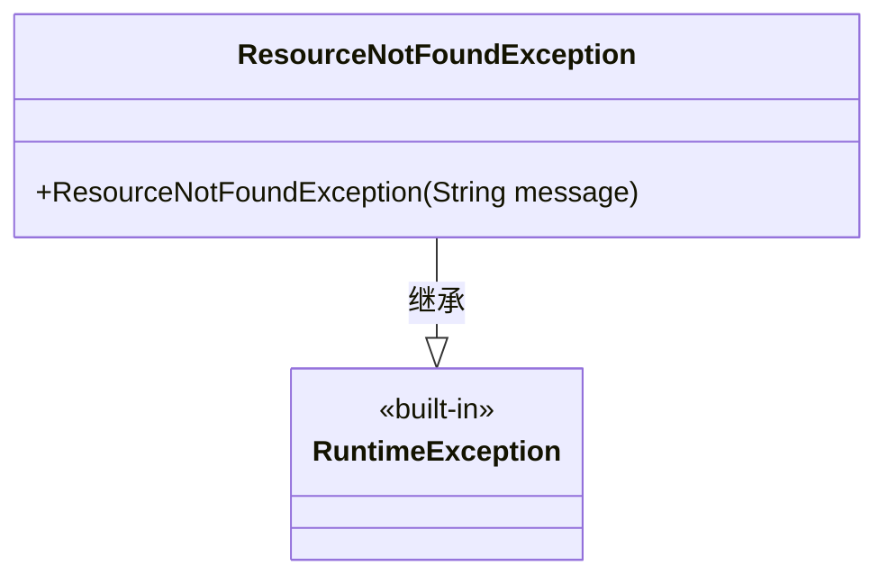
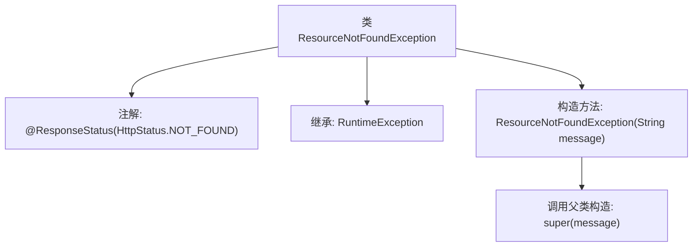

# 基础信息

|      |      |
|------|------|
| 名称 | ResourceNotFoundException |
| 编码语言 | .java |
| 代码路径 | staffjoy/web-app/src/main/java/xyz/staffjoy/web/controller/exception/ResourceNotFoundException.java |
| 包名 | xyz.staffjoy.web.controller.exception |
| 依赖项 | ['org.springframework.http.HttpStatus', 'org.springframework.web.bind.annotation.ResponseStatus'] |
| 概述说明 | 资源未找到异常类，继承运行时异常，带消息构造器。 |

# 说明

该内容定义了一个名为ResourceNotFoundException的Java异常类，继承自RuntimeException。类上标注了@ResponseStatus注解，设置HTTP状态码为NOT_FOUND（404）。该类包含一个构造函数，接收字符串参数message并传递给父类构造函数。该异常用于表示资源未找到的情况，适合在REST API中处理404错误场景。

# 类列表 Class Summary

| 名称   | 类型  | 说明 |
|-------|------|-------------|
| ResourceNotFoundException | class | 资源未找到异常类，继承运行时异常，带消息构造器。 |

## 类 ResourceNotFoundException

|      |      |
|------|------|
| 访问范围 | @ResponseStatus(value = HttpStatus.NOT_FOUND);public |
| 类型 | class |
| 名称 | ResourceNotFoundException |
| 说明 | 资源未找到异常类，继承运行时异常，带消息构造器。 |

### UML类图

这段类图展示了ResourceNotFoundException异常类的结构，它继承自Java内置的RuntimeException类。ResourceNotFoundException是一个自定义运行时异常，包含一个公有构造函数用于接收错误消息。类图清晰地体现了继承关系，符合Spring框架中@ResponseStatus注解标记的异常处理模式，适用于资源未找到时返回HTTP 404状态码的场景。

### 内部方法调用关系图

这段代码定义了一个自定义异常类ResourceNotFoundException，它继承自RuntimeException，并通过@ResponseStatus注解标记为HTTP 404状态码。流程图展示了类的核心结构：注解声明、继承关系和构造方法实现。构造方法通过super调用父类构造函数传递错误消息，用于在资源不存在时抛出该异常。整个设计简洁明确，符合Spring框架的异常处理规范。

### 字段列表 Field List

| 名称  | 类型  | 说明 |
|-------|-------|------|

### 方法列表 Method List

| 名称  | 类型  | 说明 |
|-------|-------|------|

