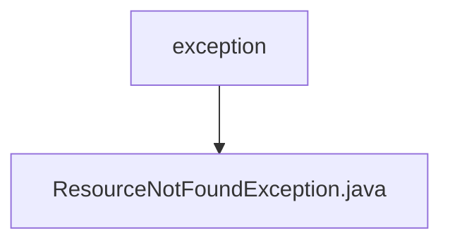

# 基础信息

|      |      |
|------|------|
| 名称 | exception |
| 编码语言 | .java |
| 代码路径 | staffjoy/web-app/src/main/java/xyz/staffjoy/web/controller/exception |
| 包名 | staffjoy.docs.web-app.src.main.java.xyz.staffjoy.web.controller.exception |
| 概述说明 | 资源未找到异常类，继承运行时异常，带消息构造器。 |

# 说明

该内容定义了一个名为ResourceNotFoundException的Java异常类，继承自RuntimeException。类上标注了@ResponseStatus注解，设置HTTP状态码为NOT_FOUND（404）。该类包含一个构造函数，接收字符串参数message并传递给父类构造函数。该异常用于表示资源未找到的情况，适合在REST API中处理404错误场景。

### 包内部结构视图

该流程图展示了web应用中的异常处理模块结构，exception文件夹包含一个ResourceNotFoundException.java文件，用于处理资源未找到的异常情况。这种结构是典型的Spring Boot应用异常处理方式，将特定异常类组织在专用目录下，便于统一管理和维护异常处理逻辑。

# 文件列表 File List

| 名称   | 类型  | 说明 |
|-------|------|-------------|
| [ResourceNotFoundException.java](ResourceNotFoundException.md) | file | 资源未找到异常类，继承运行时异常，带消息构造器。 |

