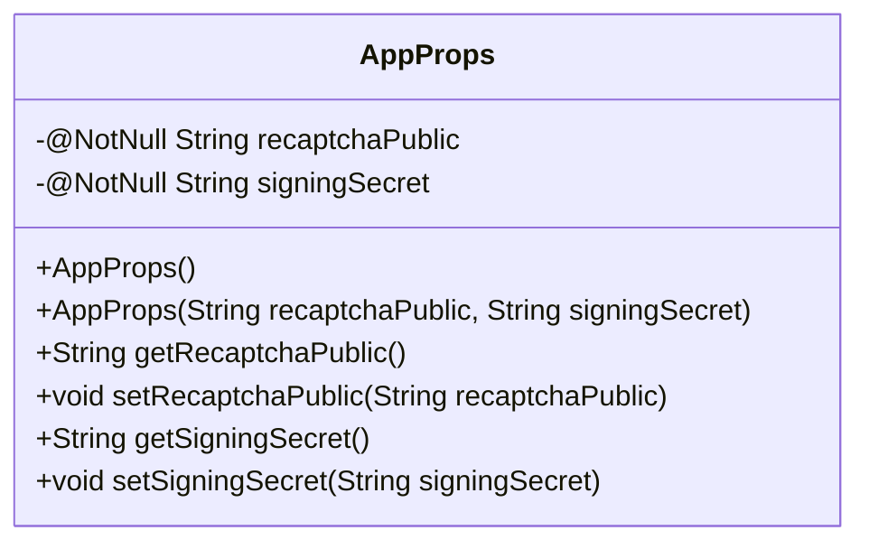
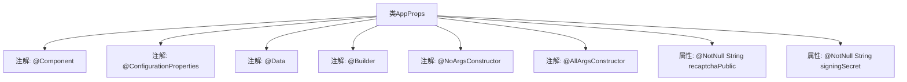

# 基础信息

|      |      |
|------|------|
| 名称 | AppProps |
| 编码语言 | .java |
| 代码路径 | staffjoy/web-app/src/main/java/xyz/staffjoy/web/props/AppProps.java |
| 包名 | xyz.staffjoy.web.props |
| 依赖项 | ['lombok.AllArgsConstructor', 'lombok.Builder', 'lombok.Data', 'lombok.NoArgsConstructor', 'org.springframework.boot.context.properties.ConfigurationProperties', 'org.springframework.stereotype.Component', 'javax.validation.constraints.NotNull'] |
| 概述说明 | Java配置类AppProps，含验证码密钥和签名密钥。 |

# 说明

该内容定义了一个名为AppProps的Java类，用于配置应用程序属性。类使用了Lombok注解@Data、@Builder、@NoArgsConstructor和@AllArgsConstructor，自动生成getter/setter、构建器模式和无参/全参构造函数。通过@ConfigurationProperties注解绑定前缀为"staffjoy"的配置属性。类包含两个非空字段：recaptchaPublic（reCAPTCHA公钥）和signingSecret（签名密钥），均标记为@NotNull确保不为空。

# 类列表 Class Summary

| 名称   | 类型  | 说明 |
|-------|------|-------------|
| AppProps | class | Java配置类AppProps，含验证码公钥和签名密钥。 |

## 类 AppProps

|      |      |
|------|------|
| 访问范围 | @Component;@ConfigurationProperties(prefix="staffjoy");@Data;@Builder;@NoArgsConstructor;@AllArgsConstructor;public |
| 类型 | class |
| 名称 | AppProps |
| 说明 | Java配置类AppProps，含验证码公钥和签名密钥。 |

### UML类图

这段类图展示了一个Spring Boot配置属性类AppProps，使用Lombok注解简化了代码。该类包含两个不可为空的私有属性：recaptchaPublic（reCAPTCHA公钥）和signingSecret（签名密钥），通过@Data自动生成getter/setter，@Builder提供建造者模式，@NoArgsConstructor和@AllArgsConstructor生成无参和全参构造函数。该类通过@ConfigurationProperties绑定"staffjoy"前缀的配置，@Component将其注册为Spring组件。

### 内部方法调用关系图

该流程图展示了Spring Boot配置类AppProps的结构，它是一个使用Lombok注解的配置属性类。类上标注了@Component表示由Spring管理，@ConfigurationProperties用于绑定staffjoy前缀的配置项。通过@Data自动生成getter/setter，@Builder支持建造者模式，同时包含无参和全参构造器。两个@NotNull属性分别存储reCAPTCHA公钥和签名密钥，用于应用的安全验证场景。

### 字段列表 Field List

| 名称  | 类型  | 说明 |
|-------|-------|------|
| recaptchaPublic | String | 非空字符串变量recaptchaPublic |
| signingSecret | String | 非空字符串签名密钥 |

### 方法列表 Method List

| 名称  | 类型  | 说明 |
|-------|-------|------|

