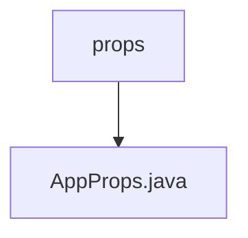

# 基础信息

|      |      |
|------|------|
| 名称 | props |
| 编码语言 | .java |
| 代码路径 | staffjoy/web-app/src/main/java/xyz/staffjoy/web/props |
| 包名 | staffjoy.docs.web-app.src.main.java.xyz.staffjoy.web.props |
| 概述说明 | Java配置类AppProps，含验证码密钥和签名密钥。 |

# 说明

该内容定义了一个名为AppProps的Java类，用于配置应用程序属性。类使用了Lombok注解@Data、@Builder、@NoArgsConstructor和@AllArgsConstructor，自动生成getter/setter、构建器模式和无参/全参构造函数。通过@ConfigurationProperties注解绑定前缀为"staffjoy"的配置属性。类包含两个非空字段：recaptchaPublic（reCAPTCHA公钥）和signingSecret（签名密钥），均标记为@NotNull确保不为空。

### 包内部结构视图

该流程图展示了web应用中的属性配置结构，顶层是props目录，其下包含一个具体的属性配置文件AppProps.java。这种结构常见于Spring Boot应用的配置管理，通过独立的属性文件来维护应用配置参数，便于环境隔离和集中管理。

# 文件列表 File List

| 名称   | 类型  | 说明 |
|-------|------|-------------|
| [AppProps.java](AppProps.md) | file | Java配置类AppProps，含验证码密钥和签名密钥。 |

