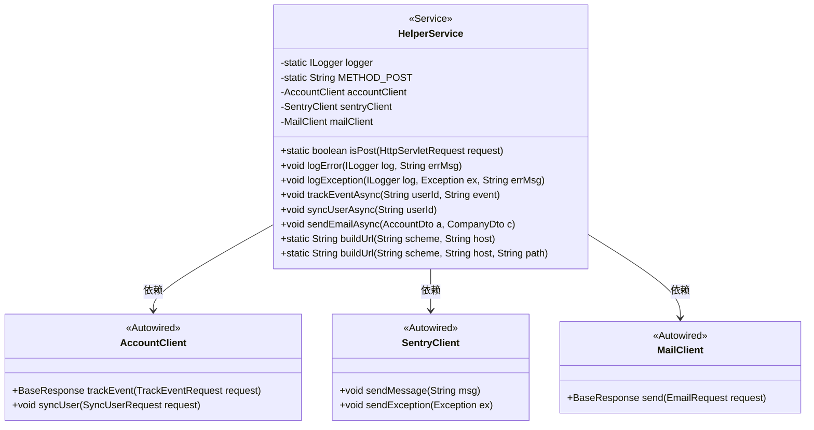
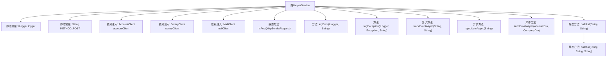
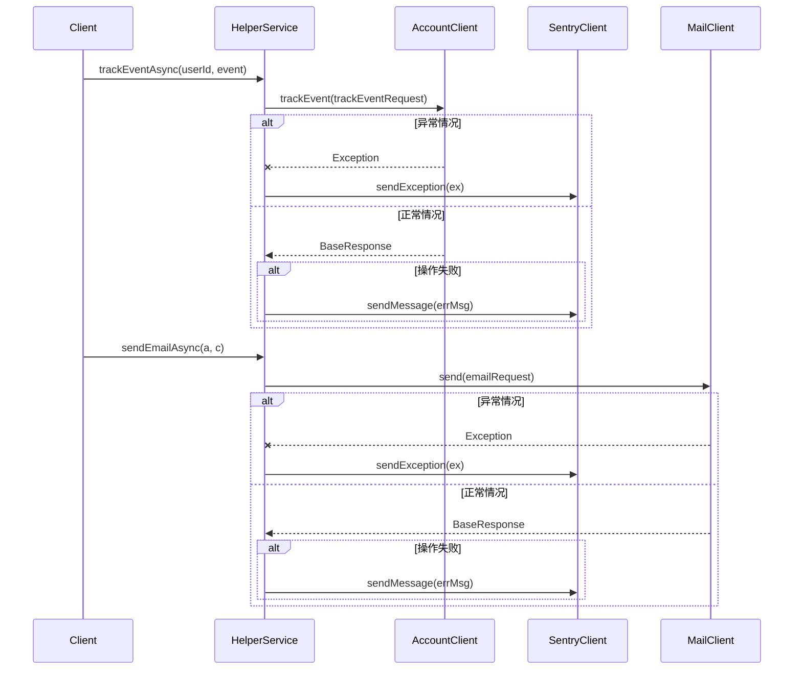

# 基础信息

|      |      |
|------|------|
| 名称 | HelperService |
| 编码语言 | .java |
| 代码路径 | staffjoy/web-app/src/main/java/xyz/staffjoy/web/service/HelperService.java |
| 包名 | xyz.staffjoy.web.service |
| 依赖项 | ['com.github.structlog4j.ILogger', 'com.github.structlog4j.SLoggerFactory', 'io.sentry.SentryClient', 'org.springframework.beans.factory.annotation.Autowired', 'org.springframework.scheduling.annotation.Async', 'org.springframework.stereotype.Service', 'xyz.staffjoy.account.client.AccountClient', 'xyz.staffjoy.account.dto.AccountDto', 'xyz.staffjoy.account.dto.SyncUserRequest', 'xyz.staffjoy.account.dto.TrackEventRequest', 'xyz.staffjoy.common.api.BaseResponse', 'xyz.staffjoy.common.error.ServiceException', 'xyz.staffjoy.company.dto.CompanyDto', 'xyz.staffjoy.mail.client.MailClient', 'xyz.staffjoy.mail.dto.EmailRequest', 'xyz.staffjoy.web.config.AppConfig', 'javax.servlet.http.HttpServletRequest', 'java.net.URI', 'java.net.URISyntaxException'] |
| 概述说明 | HelperService提供HTTP方法检查、错误日志、异步事件跟踪、用户同步和邮件发送功能。 |

# 说明

HelperService是一个服务类，提供多种辅助功能。包含静态方法isPost检查HTTP请求是否为POST方法，以及buildUrl构建URL。使用AccountClient、SentryClient和MailClient进行依赖注入。提供异步方法trackEventAsync追踪用户事件，syncUserAsync同步用户数据，sendEmailAsync发送邮件。所有操作均记录日志并通过Sentry上报错误。异常处理和错误日志记录通过logError和logException方法实现。

# 类列表 Class Summary

| 名称   | 类型  | 说明 |
|-------|------|-------------|
| HelperService | class | HelperService提供日志、错误跟踪、异步事件处理及URL构建功能。 |

## 类 HelperService

|      |      |
|------|------|
| 访问范围 | @Service;public |
| 类型 | class |
| 名称 | HelperService |
| 说明 | HelperService提供日志、错误跟踪、异步事件处理及URL构建功能。 |

### UML类图

类图描述：
HelperService是一个Spring服务类，提供多种辅助功能，包括HTTP方法检查、错误日志记录、异步事件跟踪、用户同步和邮件发送等。它依赖三个客户端组件：AccountClient用于账户相关操作，SentryClient用于错误监控，MailClient用于邮件发送。类中包含静态工具方法和实例方法，通过@Async注解实现异步操作，并统一处理异常和响应结果。

### 内部方法调用关系图

该流程图展示了HelperService类的核心结构和异步方法调用链。作为工具类，它包含日志记录、错误上报、异步事件跟踪、用户同步和邮件发送等功能，通过AccountClient、SentryClient和MailClient三个外部服务实现业务逻辑。时序图重点描述了trackEventAsync和sendEmailAsync两个异步方法的执行流程，包括正常响应处理和异常捕获上报机制，体现了服务间调用的错误处理策略。所有异步操作均通过@Async注解实现非阻塞调用，异常时通过SentryClient进行集中监控。

### 字段列表 Field List

| 名称  | 类型  | 说明 |
|-------|-------|------|
| accountClient | AccountClient | 自动注入AccountClient实例 |
| sentryClient | SentryClient | 自动注入SentryClient实例 |
| METHOD_POST = "POST" | String | 静态常量字符串METHOD_POST值为"POST"。 |
| mailClient | MailClient | 自动注入邮件客户端实例。 |
| logger = SLoggerFactory.getLogger(HelperService.class) | ILogger | 静态日志记录器初始化，用于HelperService类。 |

### 方法列表 Method List

| 名称  | 类型  | 说明 |
|-------|-------|------|
| trackEventAsync | void | 异步方法trackEventAsync记录用户事件，调用accountClient处理，异常或失败时记录日志。 |
| logError | void | 记录错误日志并发送至Sentry客户端。 |
| isPost | boolean | 检查请求是否为POST方法。 |
| logException | void | 记录异常并发送到Sentry |
| syncUserAsync | void | 异步方法syncUserAsync，通过accountClient同步用户数据。 |
| sendEmailAsync | void | 异步发送员工加入邮件给销售部门，包含员工和公司信息。 |
| buildUrl | String | 静态方法buildUrl生成URL，参数为scheme和host，调用重载方法。 |
| buildUrl | String | 构建URL方法：传入协议、主机和路径，返回完整URL，异常时记录日志并抛出服务异常。 |

