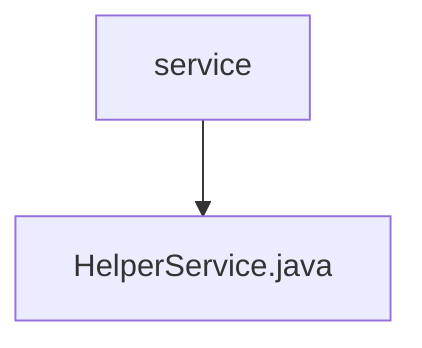

# 基础信息

|      |      |
|------|------|
| 名称 | service |
| 编码语言 | .java |
| 代码路径 | staffjoy/web-app/src/main/java/xyz/staffjoy/web/service |
| 包名 | staffjoy.docs.web-app.src.main.java.xyz.staffjoy.web.service |
| 概述说明 | HelperService提供HTTP方法检查、错误日志、异步事件跟踪、用户同步和邮件发送功能。 |

# 说明

HelperService是一个服务类，提供多种辅助功能。包含静态方法isPost检查HTTP请求是否为POST方法，以及buildUrl构建URL。使用AccountClient、SentryClient和MailClient进行依赖注入。提供异步方法trackEventAsync追踪用户事件，syncUserAsync同步用户数据，sendEmailAsync发送邮件。所有操作均记录日志并通过Sentry上报错误。异常处理和错误日志记录通过logError和logException方法实现。

### 包内部结构视图

该流程图展示了web应用服务层的简单结构，service作为父目录包含HelperService.java实现文件。这种单层结构表明服务模块可能处于早期开发阶段或功能高度集中，仅通过一个辅助服务类提供核心功能支持。

# 文件列表 File List

| 名称   | 类型  | 说明 |
|-------|------|-------------|
| [HelperService.java](HelperService.md) | file | HelperService提供HTTP方法检查、错误日志、异步事件跟踪、用户同步和邮件发送功能。 |

