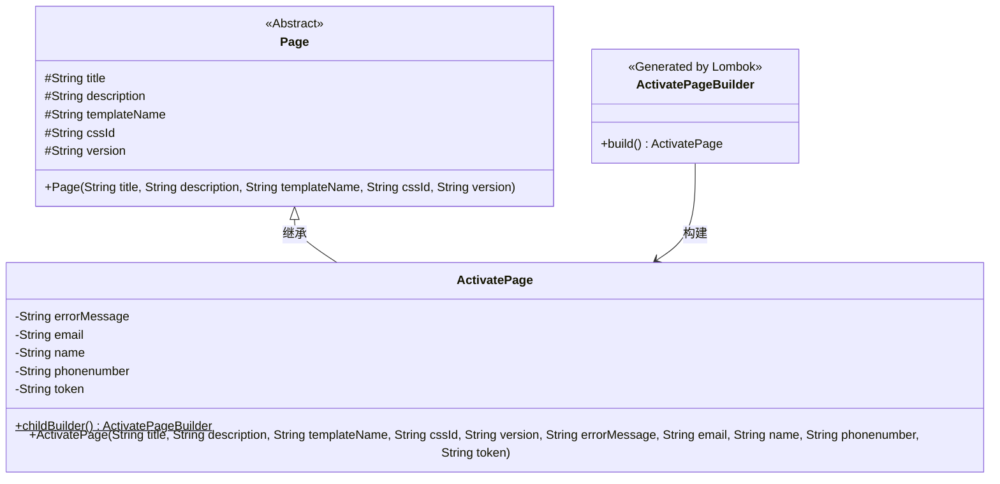
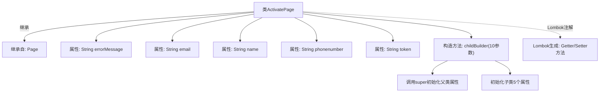

# 基础信息

|      |      |
|------|------|
| 名称 | ActivatePage |
| 编码语言 | .java |
| 代码路径 | staffjoy/web-app/src/main/java/xyz/staffjoy/web/view/ActivatePage.java |
| 包名 | xyz.staffjoy.web.view |
| 依赖项 | ['lombok.Builder', 'lombok.Getter', 'lombok.Setter'] |
| 概述说明 | 激活页面类，含错误信息、邮箱、姓名、电话、令牌字段，使用Lombok构建器继承。 |

# 说明

这是一个名为ActivatePage的Java类，继承自Page类。该类使用Lombok注解自动生成getter和setter方法。包含五个私有字段：errorMessage、email、name、phonenumber和token。通过childBuilder构建器方法实现带参数的构造函数，需传入父类Page的五个参数（title、description、templateName、cssId、version）及本类的五个字段值。构造函数内部调用父类构造函数并初始化本类字段。注释提到使用Lombok构建器继承的解决方案。

# 类列表 Class Summary

| 名称   | 类型  | 说明 |
|-------|------|-------------|
| ActivatePage | class | 激活页类，含错误信息、邮箱、姓名、电话、令牌字段，使用Lombok构建器继承。 |

## 类 ActivatePage

|      |      |
|------|------|
| 访问范围 | @Getter;@Setter;public |
| 类型 | class |
| 名称 | ActivatePage |
| 说明 | 激活页类，含错误信息、邮箱、姓名、电话、令牌字段，使用Lombok构建器继承。 |

### UML类图

这段代码展示了一个ActivatePage类继承自抽象类Page，并使用Lombok的@Builder注解实现建造者模式。ActivatePage扩展了Page的基础属性，新增了错误信息、电子邮件、姓名、电话号码和令牌等字段。通过childBuilder方法创建建造者实例，最终构建ActivatePage对象。类图清晰地反映了继承关系和建造者模式的应用，其中Page作为基类提供通用页面属性，ActivatePageBuilder负责构造过程的封装。

### 内部方法调用关系图

该流程图展示了ActivatePage类的完整结构，这是一个使用Lombok注解的继承实现。类继承自Page父类，包含5个字符串属性和一个特殊构造方法childBuilder。通过@Getter/@Setter注解自动生成访问方法，构造方法先调用父类构造器初始化title等5个父类属性，再初始化子类的errorMessage等5个属性。采用建造者模式创建对象，解决了Lombok在继承场景下的构建器问题。

### 字段列表 Field List

| 名称  | 类型  | 说明 |
|-------|-------|------|
| errorMessage | String | 私有错误信息字符串变量。 |
| token | String | 私有字符串类型变量token。 |
| email | String | 私有字符串类型变量email |
| name | String | 私有字符串变量name。 |
| phonenumber | String | 私有字符串变量phonenumber |

### 方法列表 Method List

| 名称  | 类型  | 说明 |
|-------|-------|------|

