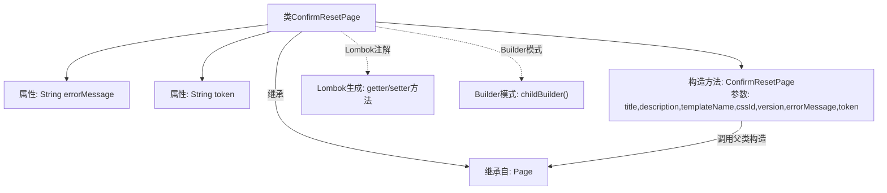

# 基础信息

|      |      |
|------|------|
| 名称 | ConfirmResetPage |
| 编码语言 | .java |
| 代码路径 | staffjoy/web-app/src/main/java/xyz/staffjoy/web/view/ConfirmResetPage.java |
| 包名 | xyz.staffjoy.web.view |
| 依赖项 | ['lombok.Builder', 'lombok.Getter', 'lombok.Setter'] |
| 概述说明 | 确认重置页类，含错误信息和令牌字段，使用Lombok构建器继承。 |

# 说明

这是一个名为ConfirmResetPage的Java类，继承自Page类。该类使用Lombok库的@Getter和@Setter注解自动生成getter和setter方法。包含两个私有字段：errorMessage和token。通过@Builder注解实现建造者模式，使用childBuilder作为构建方法名，解决了Lombok构建器继承问题。构造函数接收父类Page的title、description、templateName、cssId、version参数，以及子类特有的errorMessage和token参数。

# 类列表 Class Summary

| 名称   | 类型  | 说明 |
|-------|------|-------------|
| ConfirmResetPage | class | 确认重置页类，含错误信息和令牌字段，使用Lombok构建器继承方案。 |


## 类 ConfirmResetPage

|      |      |
|------|------|
| 访问范围 | @Getter;@Setter;public |
| 类型 | class |
| 名称 | ConfirmResetPage |
| 说明 | 确认重置页类，含错误信息和令牌字段，使用Lombok构建器继承方案。 |


### UML类图

```mermaid
classDiagram
    class Page {
        <<Abstract>>
        #String title
        #String description
        #String templateName
        #String cssId
        #String version
        +Page(String title, String description, String templateName, String cssId, String version)
    }
    
    class ConfirmResetPage {
        -String errorMessage
        -String token
        +childBuilder() ConfirmResetPageBuilder
        +ConfirmResetPage(String title, String description, String templateName, String cssId, String version, String errorMessage, String token)
    }
    
    ConfirmResetPage --|> Page : 继承
    // ConfirmResetPage继承自抽象类Page，添加了errorMessage和token字段
    // 使用Lombok的@Builder注解创建构建器模式，通过childBuilder方法实现
```

这段类图展示了ConfirmResetPage继承自抽象类Page的层级关系。ConfirmResetPage作为子类，在Page基类的基础上新增了两个私有字段errorMessage和token，并通过Lombok的@Builder注解实现了构建器模式。特别值得注意的是使用了childBuilder方法来解决Lombok构建器在继承场景下的限制，这是通过特定注解配置实现的变通方案。类结构清晰地反映了代码中通过构造函数调用super()初始化父类属性，再初始化子类属性的逻辑流程。


### 内部方法调用关系图



该流程图展示了ConfirmResetPage类的结构，这是一个使用Lombok注解的Java类，继承自Page基类。类包含两个私有属性(errorMessage和token)，通过@Builder注解实现了建造者模式(childBuilder方法)，同时通过@Getter/@Setter自动生成访问方法。构造方法会调用父类Page的构造函数初始化基础属性，再初始化本类特有属性。整体设计体现了Lombok简化代码和建造者模式灵活构造对象的特性。

### 字段列表 Field List

| 名称  | 类型  | 说明 |
|-------|-------|------|
| errorMessage | String | 私有错误信息字符串变量。 |
| token | String | 私有字符串变量token。 |

### 方法列表 Method List

| 名称  | 类型  | 说明 |
|-------|-------|------|


