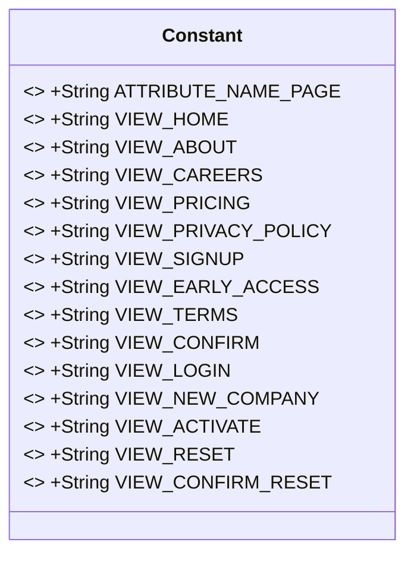

# 基础信息

|      |      |
|------|------|
| 名称 | Constant |
| 编码语言 | .java |
| 代码路径 | staffjoy/web-app/src/main/java/xyz/staffjoy/web/view/Constant.java |
| 包名 | xyz.staffjoy.web.view |
| 依赖项 | [] |
| 概述说明 | 定义页面路径常量类，包含主页、登录、注册等视图路径。 |

# 说明

该代码定义了一个名为Constant的公共类，包含多个静态常量字符串，用于表示不同页面的视图路径和属性名称。主要常量包括页面属性名ATTRIBUTE_NAME_PAGE，以及多个视图路径如主页VIEW_HOME、关于页VIEW_ABOUT、职业页VIEW_CAREERS、定价页VIEW_PRICING、隐私政策页VIEW_PRIVACY_POLICY、注册页VIEW_SIGNUP、早期访问页VIEW_EARLY_ACCESS、条款页VIEW_TERMS、确认页VIEW_CONFIRM、登录页VIEW_LOGIN、新公司页VIEW_NEW_COMPANY、激活页VIEW_ACTIVATE、重置页VIEW_RESET和确认重置页VIEW_CONFIRM_RESET。这些常量用于统一管理视图路径，便于代码维护和引用。

# 类列表 Class Summary

| 名称   | 类型  | 说明 |
|-------|------|-------------|
| Constant | class | 定义页面路径常量类，包含主页、登录、注册等视图路径。 |

## 类 Constant

|      |      |
|------|------|
| 访问范围 | public |
| 类型 | class |
| 名称 | Constant |
| 说明 | 定义页面路径常量类，包含主页、登录、注册等视图路径。 |

### UML类图

该类图展示了一个名为Constant的实用工具类，包含15个公开静态常量字符串字段，用于存储Web应用的视图路径和页面属性名。所有字段均为final修饰，表示不可修改的常量值，主要用于集中管理视图模板路径和统一属性命名。这些常量可能被控制器、服务或其他组件引用，以确保路径和属性名的一致性，避免硬编码字符串分散在代码各处。类设计符合常量类的典型模式，不包含任何方法或实例字段。

### 内部方法调用关系图

```mermaid
graph TD
    A["类Constant"]
    B["常量: ATTRIBUTE_NAME_PAGE = 'page'"]
    C["视图常量组1"]
    D["VIEW_HOME = 'pages/home'"]
    E["VIEW_ABOUT = 'pages/about'"]
    F["VIEW_CAREERS = 'pages/careers'"]
    G["VIEW_PRICING = 'pages/pricing'"]
    H["VIEW_PRIVACY_POLICY = 'pages/privacypolicy'"]
    I["VIEW_SIGNUP = 'pages/signup'"]
    J["VIEW_EARLY_ACCESS = 'pages/early'"]
    K["VIEW_TERMS = 'pages/terms'"]
    L["视图常量组2"]
    M["VIEW_CONFIRM = 'pages/confirm'"]
    N["VIEW_LOGIN = 'pages/login'"]
    O["VIEW_NEW_COMPANY = 'pages/new_company'"]
    P["VIEW_ACTIVATE = 'pages/activate'"]
    Q["VIEW_RESET = 'pages/reset'"]
    R["VIEW_CONFIRM_RESET = 'pages/confirmreset'"]

    A --> B
    A --> C
    A --> L
    C --> D
    C --> E
    C --> F
    C --> G
    C --> H
    C --> I
    C --> J
    C --> K
    L --> M
    L --> N
    L --> O
    L --> P
    L --> Q
    L --> R
```

这段代码定义了一个包含多个公共静态常量的Constant类，主要用于存储页面路径和属性名称。常量分为两组：第一组包含基本页面路径如首页、关于页等；第二组包含用户认证相关路径如登录、注册确认等。所有常量均为final类型，确保在程序运行期间不可修改，适合作为全局配置使用。

### 字段列表 Field List

| 名称  | 类型  | 说明 |
|-------|-------|------|
| VIEW_EARLY_ACCESS = "pages/early" | String | 静态常量VIEW_EARLY_ACCESS值为"pages/early"。 |
| VIEW_SIGNUP = "pages/signup" | String | 静态常量VIEW_SIGNUP定义为注册页面路径。 |
| VIEW_TERMS = "pages/terms" | String | 定义常量VIEW_TERMS，值为"pages/terms"。 |
| VIEW_PRIVACY_POLICY = "pages/privacypolicy" | String | 静态常量定义隐私政策页面路径。 |
| VIEW_NEW_COMPANY = "pages/new_company" | String | 静态常量VIEW_NEW_COMPANY值为"pages/new_company"。 |
| VIEW_PRICING = "pages/pricing" | String | 静态常量VIEW_PRICING值为"pages/pricing"。 |
| VIEW_ABOUT = "pages/about" | String | 静态常量VIEW_ABOUT定义页面路径"pages/about"。 |
| VIEW_HOME = "pages/home" | String | 定义常量VIEW_HOME，值为"pages/home"。 |
| ATTRIBUTE_NAME_PAGE = "page" | String | 静态常量字符串，属性名"page"。 |
| VIEW_RESET = "pages/reset" | String | 静态常量VIEW_RESET值为"pages/reset"。 |
| VIEW_CONFIRM = "pages/confirm" | String | 定义常量VIEW_CONFIRM，值为"pages/confirm"。 |
| VIEW_ACTIVATE = "pages/activate" | String | 静态常量VIEW_ACTIVATE值为"pages/activate"。 |
| VIEW_CAREERS = "pages/careers" | String | 定义常量VIEW_CAREERS，值为"pages/careers"。 |
| VIEW_LOGIN = "pages/login" | String | 静态常量VIEW_LOGIN定义登录页面路径为"pages/login"。 |
| VIEW_CONFIRM_RESET = "pages/confirmreset" | String | 静态常量VIEW_CONFIRM_RESET值为确认重置页面路径。 |

### 方法列表 Method List

| 名称  | 类型  | 说明 |
|-------|-------|------|

