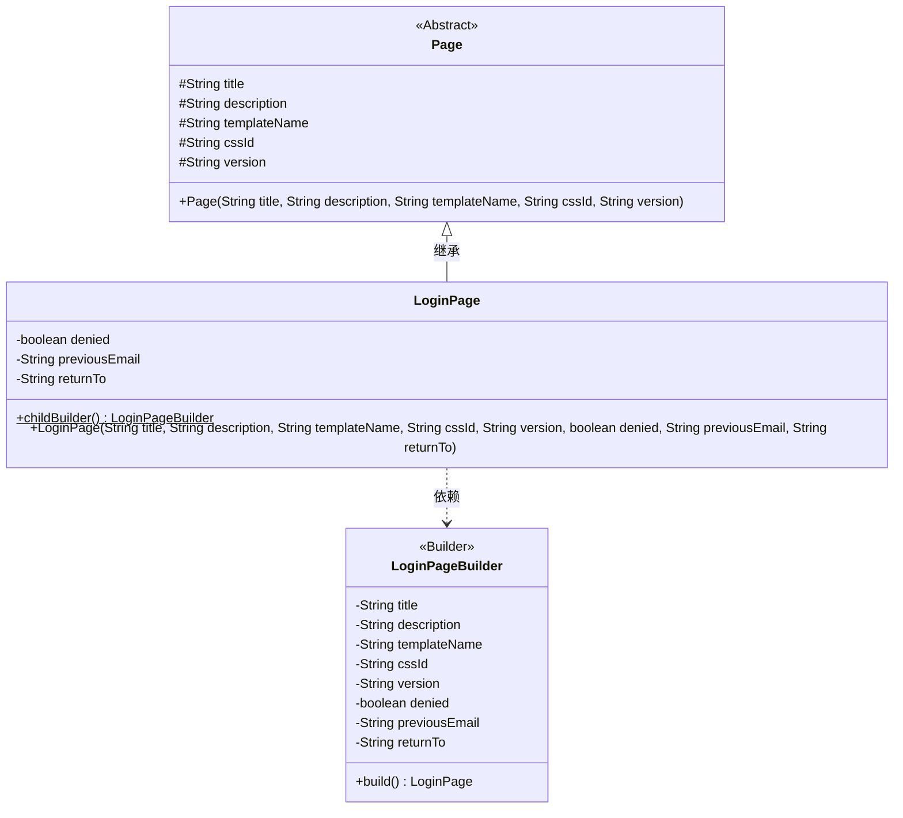
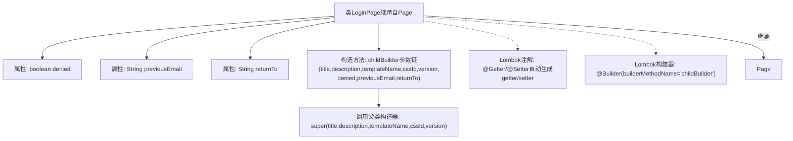

# 基础信息

|      |      |
|------|------|
| 名称 | LoginPage |
| 编码语言 | .java |
| 代码路径 | staffjoy/web-app/src/main/java/xyz/staffjoy/web/view/LoginPage.java |
| 包名 | xyz.staffjoy.web.view |
| 依赖项 | ['lombok.Builder', 'lombok.Getter', 'lombok.Setter'] |
| 概述说明 | 登录页类继承Page，含denied、previousEmail、returnTo字段，使用Lombok构建器继承方案。 |

# 说明

该代码定义了一个名为LoginPage的Java类，继承自Page类。类中包含三个私有字段：denied（布尔类型）、previousEmail和returnTo（均为字符串类型）。通过Lombok注解@Getter和@Setter自动生成字段的getter和setter方法。使用@Builder注解实现建造者模式，并通过builderMethodName指定子类建造器名称为childBuilder。构造函数接收父类Page的参数及自身三个字段参数，并调用父类构造函数进行初始化。注释提到这是解决Lombok建造器继承问题的方案，参考了Baeldung网站的相关文章。

# 类列表 Class Summary

| 名称   | 类型  | 说明 |
|-------|------|-------------|
| LoginPage | class | 登录页类，继承Page，含denied、previousEmail、returnTo字段，使用Lombok构建器继承。 |

## 类 LoginPage

|      |      |
|------|------|
| 访问范围 | @Getter;@Setter;public |
| 类型 | class |
| 名称 | LoginPage |
| 说明 | 登录页类，继承Page，含denied、previousEmail、returnTo字段，使用Lombok构建器继承。 |

### UML类图

类图描述：该图展示了一个继承自抽象类Page的LoginPage类，使用Lombok的@Builder注解实现建造者模式。LoginPage新增了denied、previousEmail和returnTo三个私有字段，并通过childBuilder方法提供构造器。图中明确显示了类之间的继承关系和建造者模式的依赖关系，其中LoginPageBuilder作为内部建造者类负责对象构造。

### 内部方法调用关系图

该流程图展示了LoginPage类的核心结构，这是一个使用Lombok注解增强的Java类。类继承自Page父类，包含三个私有属性（denied、previousEmail、returnTo），通过@Builder注解实现构造器的链式调用（builderMethodName指定为childBuilder），并自动生成getter/setter方法。特别注意通过super()显式调用父类构造器完成继承初始化，且采用Lombok的构建器继承解决方案处理父类参数传递问题。

### 字段列表 Field List

| 名称  | 类型  | 说明 |
|-------|-------|------|
| previousEmail | String | 私有字符串变量previousEmail |
| denied | boolean | 私有布尔变量denied |
| returnTo | String | 私有字符串变量returnTo |

### 方法列表 Method List

| 名称  | 类型  | 说明 |
|-------|-------|------|

