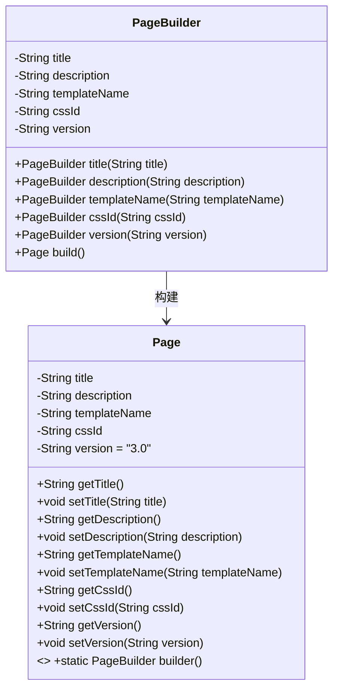
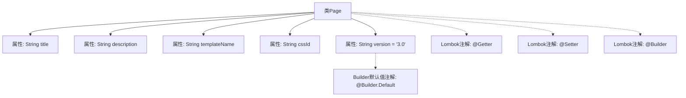

# 基础信息

|      |      |
|------|------|
| 名称 | Page |
| 编码语言 | .java |
| 代码路径 | staffjoy/web-app/src/main/java/xyz/staffjoy/web/view/Page.java |
| 包名 | xyz.staffjoy.web.view |
| 依赖项 | [None] |
| 概述说明 | Java类Page，含标题、描述、模板名、CSS ID和默认版本3.0，使用Lombok注解生成getter、setter和builder。 |

# 说明

这是一个使用Lombok注解的Java类Page，包含title、description、templateName、cssId四个字符串属性和一个默认值为3.0的version属性。通过@Getter和@Setter自动生成getter和setter方法，@Builder支持链式构造，@Builder.Default为version提供默认值。类用于表示页面信息，结构简洁高效。

# 类列表 Class Summary

| 名称   | 类型  | 说明 |
|-------|------|-------------|
| Page | class | Java类Page，含title、description等字段，默认version为3.0。 |

## 类 Page

|      |      |
|------|------|
| 访问范围 | @Getter;@Setter;@Builder;public |
| 类型 | class |
| 名称 | Page |
| 说明 | Java类Page，含title、description等字段，默认version为3.0。 |

### UML类图

这段代码展示了一个使用Lombok注解的Page类，包含标题、描述、模板名称、CSS标识和版本号等属性，并通过@Builder支持链式构造。类图中清晰呈现了Page类的私有字段、公共getter/setter方法以及关联的PageBuilder内部类，后者负责实现建造者模式。版本号字段带有默认值"3.0"，建造者通过分步设置属性最终构建Page对象，体现了对象创建的灵活性和封装性。

### 内部方法调用关系图

这段代码定义了一个使用Lombok注解的Page类，包含标题、描述、模板名称、CSS标识和版本等属性。通过@Getter和@Setter自动生成getter和setter方法，@Builder提供建造者模式支持，其中version属性通过@Builder.Default设置了默认值"3.0"。流程图清晰展示了类结构与注解的关联关系，体现了Lombok简化代码的特点。

### 字段列表 Field List

| 名称  | 类型  | 说明 |
|-------|-------|------|
| title | String | 私有字符串变量title |
| description | String | 私有字符串变量描述。 |
| version = "3.0" | String | 默认版本号为3.0的私有字符串变量。 |
| templateName | String | 私有字符串变量templateName |
| cssId | String | 私有字符串变量cssId |

### 方法列表 Method List

| 名称  | 类型  | 说明 |
|-------|-------|------|

