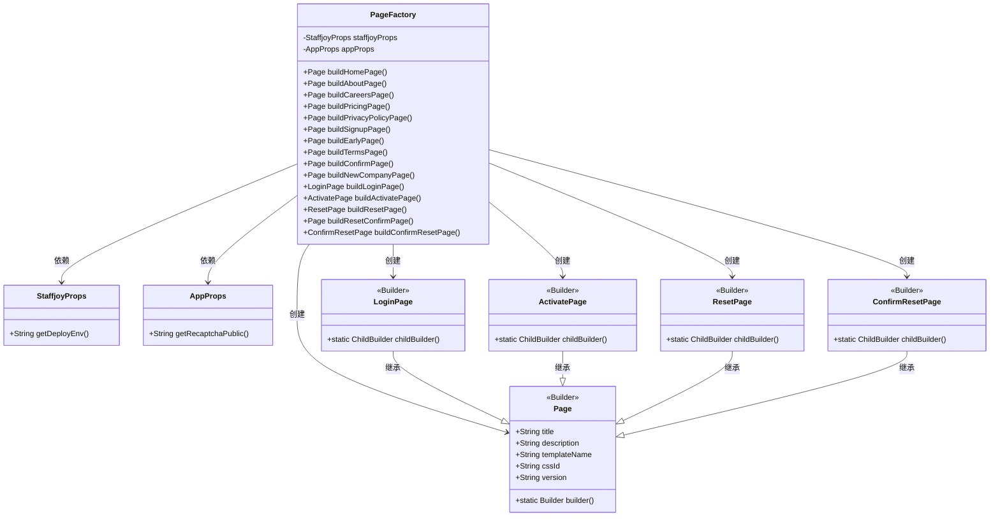

# 基础信息

|      |      |
|------|------|
| 名称 | PageFactory |
| 编码语言 | .java |
| 代码路径 | staffjoy/web-app/src/main/java/xyz/staffjoy/web/view/PageFactory.java |
| 包名 | xyz.staffjoy.web.view |
| 依赖项 | ['org.springframework.beans.factory.annotation.Autowired', 'org.springframework.stereotype.Component', 'xyz.staffjoy.common.config.StaffjoyProps', 'xyz.staffjoy.web.props.AppProps'] |
| 概述说明 | PageFactory类提供多个页面构建方法，包括主页、关于、招聘、定价、隐私政策、注册、早期访问、条款、确认、新公司、登录、激活、重置密码等。 |

# 说明

PageFactory类是一个用于构建不同页面的组件，包含多个方法用于生成特定页面。每个页面包含标题、描述、模板名称、版本等信息，部分页面还包含CSS ID。方法包括构建主页、关于页、招聘页、定价页、隐私政策页、注册页、早期访问页、条款页、确认页、新公司页、登录页、激活页、重置密码页、重置确认页等。所有页面版本信息均从StaffjoyProps获取，部分页面使用子类构建器继承功能。

# 类列表 Class Summary

| 名称   | 类型  | 说明 |
|-------|------|-------------|
| PageFactory | class | PageFactory类提供多个方法构建不同页面，包含标题、描述、模板等属性。 |

## 类 PageFactory

|      |      |
|------|------|
| 访问范围 | @Component;public |
| 类型 | class |
| 名称 | PageFactory |
| 说明 | PageFactory类提供多个方法构建不同页面，包含标题、描述、模板等属性。 |

### UML类图

这段代码描述了一个Spring组件`PageFactory`，它负责构建各种页面对象。该类通过依赖注入获取`StaffjoyProps`和`AppProps`配置，提供了多个构建方法用于创建不同类型的页面（如首页、关于页、登录页等）。所有页面都继承自基础`Page`类，部分特殊页面（如登录页、重置密码页）使用Lombok构建器模式进行扩展。类图清晰地展示了工厂类与各种页面类之间的创建关系，以及页面类之间的继承层次。

### 内部方法调用关系图

```mermaid
graph TD
    A["类PageFactory"]
    B["属性: StaffjoyProps staffjoyProps"]
    C["属性: AppProps appProps"]
    D["方法: Page buildHomePage()"]
    E["方法: Page buildAboutPage()"]
    F["方法: Page buildCareersPage()"]
    G["方法: Page buildPricingPage()"]
    H["方法: Page buildPrivacyPolicyPage()"]
    I["方法: Page buildSignupPage()"]
    J["方法: Page buildEarlyPage()"]
    K["方法: Page buildTermsPage()"]
    L["方法: Page buildConfirmPage()"]
    M["方法: Page buildNewCompanyPage()"]
    N["方法: LoginPage buildLoginPage()"]
    O["方法: ActivatePage buildActivatePage()"]
    P["方法: ResetPage buildResetPage()"]
    Q["方法: Page buildResetConfirmPage()"]
    R["方法: ConfirmResetPage buildConfirmResetPage()"]

    A --> B
    A --> C
    A --> D
    A --> E
    A --> F
    A --> G
    A --> H
    A --> I
    A --> J
    A --> K
    A --> L
    A --> M
    A --> N
    A --> O
    A --> P
    A --> Q
    A --> R
```

这段代码展示了一个Spring组件类`PageFactory`，它负责构建不同类型的页面对象。该类通过`@Autowired`注入了两个配置属性类`StaffjoyProps`和`AppProps`，并提供了多个构建方法，每个方法都返回一个特定类型的页面对象。这些方法使用建造者模式来设置页面的标题、描述、模板名称等属性，其中大部分方法返回基础`Page`对象，而`buildLoginPage()`、`buildActivatePage()`等特殊方法返回继承自`Page`的特定子类对象。所有构建方法都共享`version`属性，该属性从`StaffjoyProps`中获取。

### 字段列表 Field List

| 名称  | 类型  | 说明 |
|-------|-------|------|
| appProps | AppProps | 自动注入AppProps配置属性 |
| StaffjoyProps | StaffjoyProps | 自动注入StaffjoyProps配置类 |

### 方法列表 Method List

| 名称  | 类型  | 说明 |
|-------|-------|------|
| buildTermsPage | Page | 构建Staffjoy服务条款页面，包含标题、描述、模板和版本信息。 |
| buildNewCompanyPage | Page | 构建新公司页面方法，设置标题、描述、模板、CSS ID和版本。 |
| buildCareersPage | Page | 构建职业招聘页面，含标题、描述、模板和版本信息。 |
| buildHomePage | Page | 构建主页方法：返回含标题、描述、模板和版本信息的页面对象。 |
| buildConfirmPage | Page | 构建确认页面，提示用户查收邮件并点击确认链接。 |
| buildPricingPage | Page | 构建定价页面，包含标题、描述、模板和版本信息。 |
| buildAboutPage | Page | 构建关于Staffjoy团队的页面，包含成员信息和公司起源。 |
| buildLoginPage | LoginPage | 构建登录页，包含标题、描述、模板名、CSS ID和版本信息。 |
| buildPrivacyPolicyPage | Page | 构建隐私政策页面，包含标题、描述、模板和版本信息。 |
| buildActivatePage | ActivatePage | 构建激活页面，包含标题、模板、CSS标识和版本信息。 |
| buildEarlyPage | Page | 构建早期访问注册页面，含标题、描述、模板名、CSS ID和部署环境版本。 |
| buildSignupPage | Page | 构建注册页：标题"隐私政策"，描述"30天免费试用注册"，模板"signup"，CSS ID"sign-up"，版本为部署环境。 |
| buildResetPage | ResetPage | 构建重置密码页面，包含标题、CSS ID、模板、描述、验证码和版本信息。 |
| buildResetConfirmPage | Page | 构建重置确认页，含标题、描述、模板名、CSS ID和版本信息。 |
| buildConfirmResetPage | ConfirmResetPage | 构建重置密码确认页，含标题、描述、CSS ID、模板名和版本信息。 |

