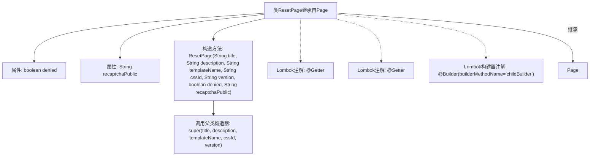

# 基础信息

|      |      |
|------|------|
| 名称 | ResetPage |
| 编码语言 | .java |
| 代码路径 | staffjoy/web-app/src/main/java/xyz/staffjoy/web/view/ResetPage.java |
| 包名 | xyz.staffjoy.web.view |
| 依赖项 | ['lombok.Builder', 'lombok.Getter', 'lombok.Setter'] |
| 概述说明 | ResetPage类继承Page，含denied和recaptchaPublic字段，使用Lombok注解生成getter/setter，通过childBuilder构建。 |

# 说明

这段代码定义了一个名为ResetPage的Java类，继承自Page类。该类使用Lombok注解@Getter和@Setter自动生成getter和setter方法。包含两个私有字段：denied（布尔类型）和recaptchaPublic（字符串类型）。通过@Builder注解实现建造者模式，使用childBuilder作为构建方法名，构造函数接受父类Page的参数以及自身两个字段作为参数，并通过super调用父类构造函数。注释提到这是解决Lombok构建器继承问题的一种方案，并提供了参考链接。

# 类列表 Class Summary

| 名称   | 类型  | 说明 |
|-------|------|-------------|
| ResetPage | class | ResetPage类继承Page，含denied和recaptchaPublic字段，使用Lombok注解和构建器模式。 |


## 类 ResetPage

|      |      |
|------|------|
| 访问范围 | @Getter;@Setter;public |
| 类型 | class |
| 名称 | ResetPage |
| 说明 | ResetPage类继承Page，含denied和recaptchaPublic字段，使用Lombok注解和构建器模式。 |


### UML类图

```mermaid
classDiagram
    class Page {
        <<Abstract>>
        #String title
        #String description
        #String templateName
        #String cssId
        #String version
        +Page(String title, String description, String templateName, String cssId, String version)
    }

    class ResetPage {
        -boolean denied
        -String recaptchaPublic
        +childBuilder()$ ResetPageBuilder
        +ResetPage(String title, String description, String templateName, String cssId, String version, boolean denied, String recaptchaPublic)
    }

    Page <|-- ResetPage : 继承
    ResetPage ..|> @Getter : 实现
    ResetPage ..|> @Setter : 实现
    ResetPage ..|> @Builder : 实现
```

这段类图展示了ResetPage继承自抽象类Page的关系，并标注了Lombok注解的实现。ResetPage新增了两个私有字段denied和recaptchaPublic，通过childBuilder静态方法提供建造者模式构造。类结构体现了Lombok注解自动生成getter/setter和建造者的特性，同时保持了与父类Page的构造参数传递关系，符合Builder模式在继承场景下的特殊处理方式。


### 内部方法调用关系图



这段代码展示了一个使用Lombok注解的ResetPage类，继承自Page基类。流程图清晰呈现了类的结构，包括两个私有属性denied和recaptchaPublic，以及通过@Builder实现的构造器模式。构造方法中显式调用了父类Page的构造器，同时Lombok的@Getter和@Setter注解自动生成属性的访问方法。整体设计体现了Lombok简化代码和构建器模式继承的典型用法。

### 字段列表 Field List

| 名称  | 类型  | 说明 |
|-------|-------|------|
| recaptchaPublic | String | 私有字符串变量recaptchaPublic |
| denied | boolean | 私有布尔变量denied |

### 方法列表 Method List

| 名称  | 类型  | 说明 |
|-------|-------|------|


