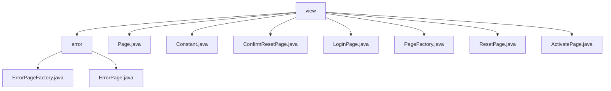

# 基础信息

|      |      |
|------|------|
| 名称 | view |
| 编码语言 | .java |
| 代码路径 | staffjoy/web-app/src/main/java/xyz/staffjoy/web/view |
| 包名 | staffjoy.docs.web-app.src.main.java.xyz.staffjoy.web.view |
| 概述说明 | 错误页面构建模块，含工厂类和数据模型，支持404/500等错误展示，集成监控与标准化结构。 |

# 说明

## 概述  
该代码模块是一个基于Java的Web视图管理系统，核心功能包括：  
1. **页面模型体系**：  
   - 基础类`Page`作为所有页面的父类，使用Lombok简化代码，定义了标题、描述、模板名、CSS ID和版本号等通用属性，支持建造者模式。  
   - 多个子类（如`LoginPage`、`ResetPage`、`ActivatePage`等）扩展特定功能字段（如错误消息、令牌、验证码等），通过`childBuilder`解决Lombok建造器继承问题。  
2. **工厂模式封装**：  
   - `PageFactory`集中管理各类页面的构建逻辑，统一设置版本号等公共属性。  
   - `ErrorPageFactory`专用于生成标准化的错误页面（404/500），集成Sentry监控和动态资源内嵌。  
3. **常量管理**：  
   - `Constant`类定义视图路径和属性名的静态常量，确保系统级配置的一致性。  

## 主要业务场景  
1. **用户认证流程**：  
   - 登录/注册（`LoginPage`）、密码重置（`ResetPage`）、账户激活（`ActivatePage`）等场景的页面动态构建，支持错误消息（如`denied`）、令牌（`token`）等业务字段传递。  
2. **静态内容展示**：  
   - 通过`PageFactory`快速生成主页、关于页、定价页等静态内容，统一版本管理和模板配置。  
3. **错误处理与监控**：  
   - 标准化HTTP错误页面（404/500）的生成，内置Sentry错误追踪ID和DSN配置，提升运维效率。  
4. **视图路由管理**：  
   - 利用`Constant`的路径常量统一维护视图路由，降低硬编码风险。  

**设计亮点**：  
- 通过建造者模式实现链式构造，增强代码可读性。  
- 使用Lombok减少样板代码，结合继承体系实现灵活扩展。  
- 错误页面集成监控和动态资源（Base64图片），提升可靠性和用户体验。

### 包内部结构视图

该流程图展示了web-app项目中view目录的层级结构。顶层view目录包含error子目录和7个独立页面文件，其中error目录下又包含ErrorPageFactory和ErrorPage两个文件。这种结构清晰地呈现了视图层中错误页面与其他页面模板的组织方式，体现了MVC架构中视图层的典型文件布局。

# 文件列表 File List

| 名称   | 类型  | 说明 |
|-------|------|-------------|
| [PageFactory.java](PageFactory.md) | file | PageFactory类提供多个页面构建方法，包括主页、关于、招聘、定价、隐私政策、注册、早期访问、条款、确认、新公司、登录、激活、重置密码等。 |
| [LoginPage.java](LoginPage.md) | file | 登录页类继承Page，含denied、previousEmail、returnTo字段，使用Lombok构建器继承方案。 |
| [ConfirmResetPage.java](ConfirmResetPage.md) | file | 确认重置页类，含错误信息和令牌字段，使用Lombok构建器继承。 |
| [Constant.java](Constant.md) | file | 定义页面路径常量类，包含主页、登录、注册等视图路径。 |
| [Page.java](Page.md) | file | Java类Page，含标题、描述、模板名、CSS ID和默认版本3.0，使用Lombok注解生成getter、setter和builder。 |
| [ActivatePage.java](ActivatePage.md) | file | 激活页面类，含错误信息、邮箱、姓名、电话、令牌字段，使用Lombok构建器继承。 |
| [ResetPage.java](ResetPage.md) | file | ResetPage类继承Page，含denied和recaptchaPublic字段，使用Lombok注解生成getter/setter，通过childBuilder构建。 |
| [error](error/_module.md) | package | ErrorPageFactory类含两个方法，分别构建404和500错误页面，包含标题、解释、状态码、链接和图片。ErrorPage类使用Lombok简化代码，含标题、解释、状态码、链接、错误追踪和图片字段。 |

