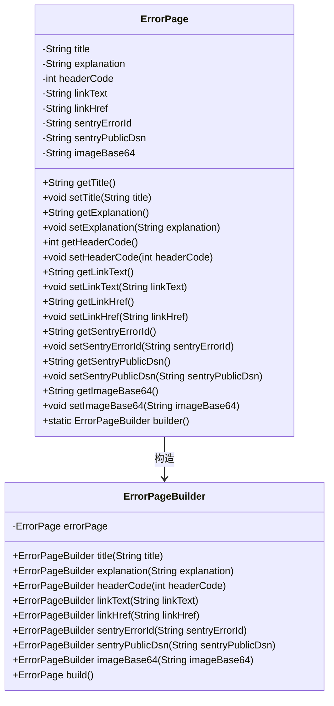
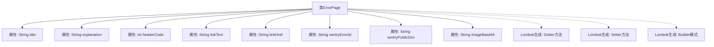

# 基础信息

|      |      |
|------|------|
| 名称 | ErrorPage |
| 编码语言 | .java |
| 代码路径 | staffjoy/web-app/src/main/java/xyz/staffjoy/web/view/error/ErrorPage.java |
| 包名 | xyz.staffjoy.web.view.error |
| 依赖项 | ['lombok.Builder', 'lombok.Getter', 'lombok.Setter'] |
| 概述说明 | 错误页类，含标题、说明、状态码、链接、跟踪ID、配置及图片。 |

# 说明

该内容描述了一个名为ErrorPage的Java类，使用Lombok注解简化代码。类包含多个字段：title用于页面标题和标题标签，explanation向用户解释错误原因，headerCode表示HTTP状态码，linkText和linkHref定义跳转链接文本和地址，sentryErrorId用于后端错误追踪，sentryPublicDsn为Sentry配置，imageBase64存储Base64编码的图片数据。通过@Builder支持建造者模式，@Getter和@Setter自动生成getter和setter方法。

# 类列表 Class Summary

| 名称   | 类型  | 说明 |
|-------|------|-------------|
| ErrorPage | class | 错误页面类，包含标题、说明、状态码、链接、错误追踪及图片配置。 |

## 类 ErrorPage

|      |      |
|------|------|
| 访问范围 | @Getter;@Setter;@Builder;public |
| 类型 | class |
| 名称 | ErrorPage |
| 说明 | 错误页面类，包含标题、说明、状态码、链接、错误追踪及图片配置。 |

### UML类图

这段代码展示了一个使用Lombok注解的ErrorPage类，用于构建错误页面信息。该类包含标题、解释文本、HTTP状态码、链接文本和地址、Sentry错误跟踪ID和公共DSN配置，以及Base64编码的图像数据。通过@Builder注解生成的ErrorPageBuilder类提供了流畅的构建接口，而@Getter和@Setter注解自动生成了所有字段的访问方法。这种设计模式常用于需要灵活构造复杂对象的场景，特别是在Web应用中处理错误页面时。

### 内部方法调用关系图

这段流程图展示了ErrorPage类的结构，该类使用Lombok注解自动生成Getter、Setter和Builder方法。类包含9个属性，分别用于存储错误页面的标题、说明文字、HTTP状态码、导航链接文本、链接地址、Sentry错误ID、Sentry公共DSN配置以及Base64编码的图片数据。通过Lombok的@Getter、@Setter和@Builder注解，简化了样板代码的编写，使类定义更加简洁。

### 字段列表 Field List

| 名称  | 类型  | 说明 |
|-------|-------|------|
| sentryErrorId | String | 私有字符串变量sentryErrorId |
| sentryPublicDsn | String | 私有字符串变量sentryPublicDsn |
| imageBase64 | String | 图片Base64编码数据 |
| title | String | 私有字符串变量title |
| linkHref | String | 私有字符串变量linkHref |
| explanation | String | 私有字符串变量explanation |
| linkText | String | 私有字符串变量linkText |
| headerCode | int | 私有整型变量headerCode。 |

### 方法列表 Method List

| 名称  | 类型  | 说明 |
|-------|-------|------|

