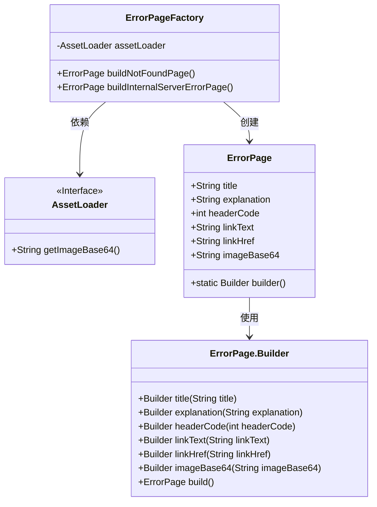
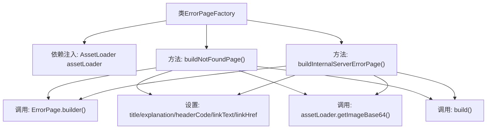

# 基础信息

|      |      |
|------|------|
| 名称 | ErrorPageFactory |
| 编码语言 | .java |
| 代码路径 | staffjoy/web-app/src/main/java/xyz/staffjoy/web/view/error/ErrorPageFactory.java |
| 包名 | xyz.staffjoy.web.view.error |
| 依赖项 | ['org.springframework.beans.factory.annotation.Autowired', 'org.springframework.http.HttpStatus', 'org.springframework.stereotype.Component', 'xyz.staffjoy.web.config.AssetLoader'] |
| 概述说明 | ErrorPageFactory类生成404和500错误页面，包含标题、说明、状态码、链接和图片。 |

# 说明

ErrorPageFactory类是一个用于构建错误页面的组件，包含两个方法。buildNotFoundPage方法创建404错误页面，包含标题、解释信息、HTTP状态码、返回链接和Base64编码图片。buildInternalServerErrorPage方法创建500错误页面，包含标题、解释信息、HTTP状态码、系统状态页链接和Base64编码图片。两个方法都通过AssetLoader获取图片资源。

# 类列表 Class Summary

| 名称   | 类型  | 说明 |
|-------|------|-------------|
| ErrorPageFactory | class | ErrorPageFactory类创建404和500错误页面，包含标题、说明、状态码、链接和图片。 |

## 类 ErrorPageFactory

|      |      |
|------|------|
| 访问范围 | @Component;public |
| 类型 | class |
| 名称 | ErrorPageFactory |
| 说明 | ErrorPageFactory类创建404和500错误页面，包含标题、说明、状态码、链接和图片。 |

### UML类图

这段代码展示了一个错误页面工厂系统，其中ErrorPageFactory类通过依赖注入的AssetLoader接口获取图片资源，并使用建造者模式构造两种不同类型的错误页面（404和500）。类图清晰地呈现了四个核心组件的关系：工厂类依赖资源加载器接口，通过ErrorPage类的内部建造者逐步设置页面属性，最终构建完整的错误页面对象。整个设计体现了依赖注入和建造者模式的典型应用，具有清晰的职责分离和灵活的配置能力。

### 内部方法调用关系图

该流程图展示了ErrorPageFactory类的结构和工作流程。该类通过@Component注解声明为Spring组件，包含两个核心方法buildNotFoundPage()和buildInternalServerErrorPage()，均使用建造者模式创建ErrorPage对象。两个方法都设置了页面标题、说明文字、HTTP状态码、链接文本和URL，并调用assetLoader获取Base64编码的图片数据。流程图清晰地呈现了类与方法的层级关系，以及方法内部的操作序列，体现了错误页面构建的标准化流程。

### 字段列表 Field List

| 名称  | 类型  | 说明 |
|-------|-------|------|
| assetLoader | AssetLoader | 自动注入资产加载器实例。 |

### 方法列表 Method List

| 名称  | 类型  | 说明 |
|-------|-------|------|
| buildNotFoundPage | ErrorPage | 构建404错误页面，包含标题、说明、状态码、返回链接和图片。 |
| buildInternalServerErrorPage | ErrorPage | 构建内部服务器错误页面，含标题、说明、状态码、链接和图片。 |

