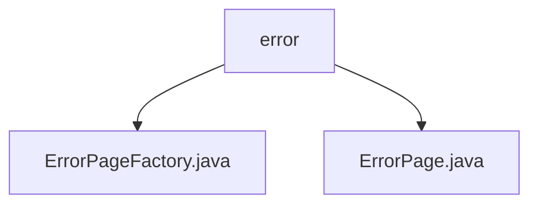

# 基础信息

|      |      |
|------|------|
| 名称 | error |
| 编码语言 | .java |
| 代码路径 | staffjoy/web-app/src/main/java/xyz/staffjoy/web/view/error |
| 包名 | staffjoy.docs.web-app.src.main.java.xyz.staffjoy.web.view.error |
| 概述说明 | ErrorPageFactory类含两个方法，分别构建404和500错误页面，包含标题、解释、状态码、链接和图片。ErrorPage类使用Lombok简化代码，含标题、解释、状态码、链接、错误追踪和图片字段。 |

# 说明

## 概述  
该代码模块主要提供错误页面的构建与展示功能，包含两个核心组件：  
1. **ErrorPageFactory**：工厂类，用于构建不同类型的错误页面（如404、500），封装了页面元素的创建逻辑，包括标题、解释信息、HTTP状态码、跳转链接及Base64编码图片等。  
2. **ErrorPage**：数据模型类，使用Lombok注解简化代码，定义了错误页面的字段结构（如标题、错误说明、链接等），支持建造者模式，便于灵活构造页面对象。  

## 主要业务场景  
1. **HTTP错误响应**：  
   - 当用户访问不存在的路由时（404），通过`buildNotFoundPage`生成包含返回链接的友好错误页面。  
   - 当服务端发生异常时（500），通过`buildInternalServerErrorPage`生成包含系统状态页链接和错误追踪ID（Sentry）的页面，辅助问题排查。  
2. **统一错误展示**：  
   - 标准化错误页面的结构和内容，确保用户体验一致。  
   - 通过Base64图片内嵌、动态链接配置等方式，降低外部依赖，提升页面加载可靠性。  
3. **错误监控集成**：  
   - 在500错误页面中集成Sentry错误追踪ID和公共DSN配置，便于后端监控和问题定位。

### 包内部结构视图

该流程图展示了web应用错误视图模块的层级结构。顶层节点为error文件夹，包含两个Java文件：ErrorPageFactory.java和ErrorPage.java。这两个文件分别实现错误页面工厂和错误页面功能，共同构成错误处理视图层的基础组件。结构简洁清晰，体现了MVC架构中视图层的典型文件组织方式。

# 文件列表 File List

| 名称   | 类型  | 说明 |
|-------|------|-------------|
| [ErrorPageFactory.java](ErrorPageFactory.md) | file | ErrorPageFactory类生成404和500错误页面，包含标题、说明、状态码、链接和图片。 |
| [ErrorPage.java](ErrorPage.md) | file | 错误页类，含标题、说明、状态码、链接、跟踪ID、配置及图片。 |

