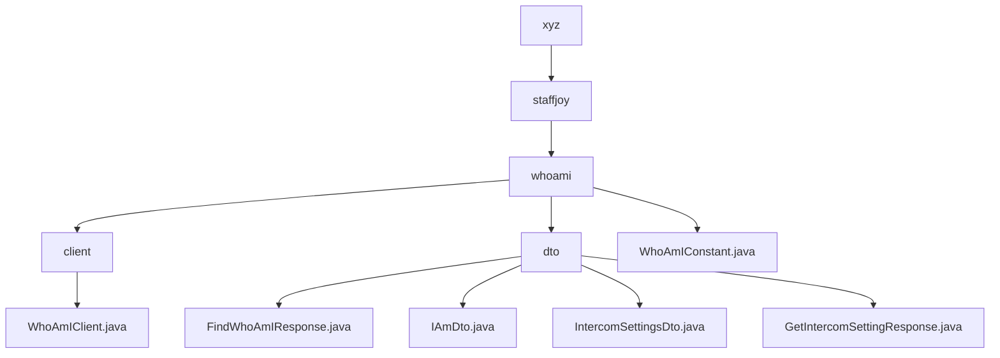

# 基础信息

|      |      |
|------|------|
| 名称 | xyz |
| 编码语言 | .java |
| 代码路径 | staffjoy/whoami-api/src/main/java/xyz |
| 包名 | staffjoy.docs.whoami-api.src.main.java.xyz |
| 概述说明 | Spring Cloud Feign客户端接口，定义WhoAmI服务的两个GET方法，需认证头。包含用户身份和Intercom设置的DTO类，使用Lombok简化代码。常量类定义服务名。 |

# 说明

## 概述

该代码模块是Staffjoy项目中whoami-api模块的核心组成部分，主要提供用户身份识别和Intercom集成相关的功能。模块采用Java语言开发，基于Spring Cloud微服务架构，主要包含以下核心组件：

1. **Feign客户端接口**：用于与whoami服务进行HTTP通信
2. **DTO集合**：包含用户身份和Intercom配置相关的数据传输对象
3. **服务常量**：定义服务名称等基础常量

模块充分利用了Lombok库简化样板代码，所有DTO都遵循Java Bean规范并支持建造者模式。响应类采用标准化的BaseResponse继承结构，确保统一的响应格式。

## 主要业务场景

1. **用户身份识别服务**：
   - 通过Feign客户端提供`findWhoAmI`方法获取当前用户完整身份信息
   - 返回数据包含用户ID、工作者列表、管理员列表和技术支持人员标识
   - 使用`FindWhoAmIResponse`和`IAmDto`进行结构化数据传输

2. **Intercom集成服务**：
   - 通过`getIntercomSettings`方法获取Intercom配置
   - 使用`IntercomSettingsDto`传输Intercom的appId、用户凭证等配置信息
   - 支持用户基本信息(name/email)和账户创建时间的传输

3. **微服务通信基础**：
   - 通过`WhoAmIConstant.SERVICE_NAME`("whoami-service")标识服务
   - 所有远程调用都要求传递认证头信息(RequestHeader)
   - 采用标准化的路径前缀("/v1/whoami")进行API版本控制

4. **标准化响应处理**：
   - 所有响应类继承自BaseResponse确保统一结构
   - 使用Lombok自动生成toString/equals/hashCode方法
   - 建造者模式提供灵活的构造方式

### 包内部结构视图

该流程图展示了whoami-api项目的Java源代码层级结构。从根目录xyz开始，依次展开staffjoy和whoami子目录。whoami目录下包含client子目录、dto子目录以及WhoAmIConstant.java文件。client目录包含WhoAmIClient.java文件，dto目录则包含四个不同的DTO类文件。整个结构清晰地反映了项目的模块划分和文件组织方式。

# 文件列表 File List

| 名称   | 类型  | 说明 |
|-------|------|-------------|
| [staffjoy](staffjoy/_module.md) | package | Spring Cloud Feign客户端接口，定义WhoAmI服务的两个GET方法，需认证头。包含用户身份和Intercom设置的DTO类，使用Lombok简化代码。常量类定义服务名。 |

