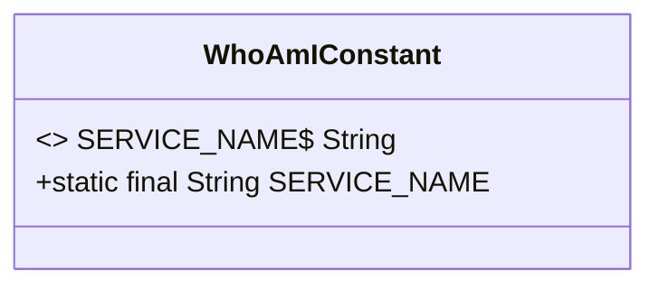
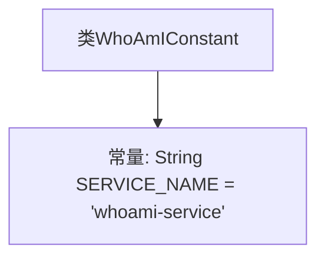

# 基础信息

|      |      |
|------|------|
| 名称 | WhoAmIConstant |
| 编码语言 | .java |
| 代码路径 | staffjoy/whoami-api/src/main/java/xyz/staffjoy/whoami/WhoAmIConstant.java |
| 包名 | xyz.staffjoy.whoami |
| 依赖项 | [] |
| 概述说明 | 公开类定义常量SERVICE_NAME值为whoami-service |

# 说明

这是一个Java类定义，名为WhoAmIConstant，包含一个公开静态常量SERVICE_NAME，其值为字符串"whoami-service"。该常量用于标识服务名称，通常用于微服务架构或分布式系统中。类结构简洁明了，仅包含一个常量声明，符合常量类的典型设计模式。

# 类列表 Class Summary

| 名称   | 类型  | 说明 |
|-------|------|-------------|
| WhoAmIConstant | class | 公开类定义服务名常量"whoami-service"。 |

## 类 WhoAmIConstant

|      |      |
|------|------|
| 访问范围 | public |
| 类型 | class |
| 名称 | WhoAmIConstant |
| 说明 | 公开类定义服务名常量"whoami-service"。 |

### UML类图

这段类图描述了一个简单的常量类WhoAmIConstant，其中包含一个公有静态不可变字符串常量SERVICE_NAME，其值为"whoami-service"。该类仅用于存储服务标识名称，没有实例方法或状态，符合常量工具类的设计模式。通过<<final>>标记和$符号表明该字段是编译时常量，且命名符合Java常量规范（全大写+下划线）。类结构简洁，适用于全局服务标识的场景。

### 内部方法调用关系图

这段流程图展示了WhoAmIConstant类的简单结构，该类仅包含一个公开静态常量SERVICE_NAME，其值为字符串"whoami-service"。由于没有方法或复杂逻辑，流程图仅显示类与常量之间的从属关系。这种常量类通常用于集中管理应用程序中的固定字符串或配置值，便于全局引用和维护。

### 字段列表 Field List

| 名称  | 类型  | 说明 |
|-------|-------|------|
| SERVICE_NAME = "whoami-service" | String | 定义常量SERVICE_NAME值为"whoami-service"。 |

### 方法列表 Method List

| 名称  | 类型  | 说明 |
|-------|-------|------|

