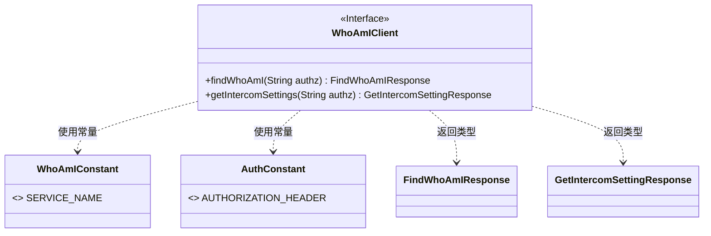
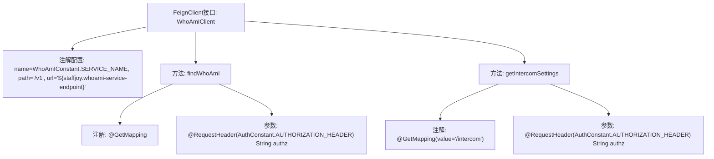

# 基础信息

|      |      |
|------|------|
| 名称 | WhoAmIClient |
| 编码语言 | .java |
| 代码路径 | staffjoy/whoami-api/src/main/java/xyz/staffjoy/whoami/client/WhoAmIClient.java |
| 包名 | xyz.staffjoy.whoami.client |
| 依赖项 | ['org.springframework.cloud.openfeign.FeignClient', 'org.springframework.web.bind.annotation.GetMapping', 'org.springframework.web.bind.annotation.RequestHeader', 'xyz.staffjoy.common.auth.AuthConstant', 'xyz.staffjoy.whoami.WhoAmIConstant', 'xyz.staffjoy.whoami.dto.FindWhoAmIResponse', 'xyz.staffjoy.whoami.dto.GetIntercomSettingResponse'] |
| 概述说明 | Feign客户端接口，包含查询身份和Intercom设置两个GET方法。 |

# 说明

这是一个使用Spring Cloud Feign的客户端接口定义，用于与名为WhoAmI的服务进行HTTP通信。接口通过FeignClient注解指定了服务名称、基础路径和远程服务地址。它定义了两个GET请求方法：findWhoAmI用于获取用户身份信息，需要传入认证头；getIntercomSettings用于获取Intercom设置，同样需要认证头。两个方法都通过RequestHeader注解传递授权信息。

# 类列表 Class Summary

| 名称   | 类型  | 说明 |
|-------|------|-------------|
| WhoAmIClient | interface | Feign客户端接口，包含查询身份和获取Intercom设置两个方法。 |

## 类 WhoAmIClient

|      |      |
|------|------|
| 访问范围 | @FeignClient(name = WhoAmIConstant.SERVICE_NAME, path = "/v1", url = "${staffjoy.whoami-service-endpoint}");public |
| 类型 | interface |
| 名称 | WhoAmIClient |
| 说明 | Feign客户端接口，包含查询身份和获取Intercom设置两个方法。 |

### UML类图

这段类图展示了一个基于Spring Cloud Feign的客户端接口WhoAmIClient，该接口通过HTTP GET请求与服务端交互。接口使用@FeignClient注解配置服务名称和路径，定义了两个方法：findWhoAmI用于查询用户身份，getIntercomSettings用于获取Intercom设置。两个方法都需要在请求头中传入授权信息，依赖WhoAmIConstant和AuthConstant中的常量配置，并分别返回FindWhoAmIResponse和GetIntercomSettingResponse类型的结果。

### 内部方法调用关系图

该流程图展示了WhoAmIClient接口的结构，这是一个基于Spring Cloud Feign的声明式HTTP客户端。接口通过@FeignClient注解配置服务名称、基础路径和动态URL端点，包含两个GET请求方法：findWhoAmI（根路径请求）和getIntercomSettings（/intercom路径请求），均需要传入认证头参数。流程图清晰呈现了注解配置与方法之间的层级关系，以及每个方法的请求映射和参数要求。

### 字段列表 Field List

| 名称  | 类型  | 说明 |
|-------|-------|------|

### 方法列表 Method List

| 名称  | 类型  | 说明 |
|-------|-------|------|
| getIntercomSettings | GetIntercomSettingResponse | 获取对讲设置接口，需认证头信息。 |
| findWhoAmI | FindWhoAmIResponse | 获取用户身份接口，需认证头参数。 |

