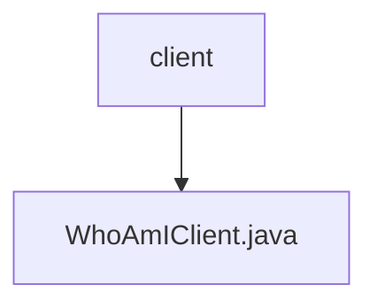

# 基础信息

|      |      |
|------|------|
| 名称 | client |
| 编码语言 | .java |
| 代码路径 | staffjoy/whoami-api/src/main/java/xyz/staffjoy/whoami/client |
| 包名 | staffjoy.docs.whoami-api.src.main.java.xyz.staffjoy.whoami.client |
| 概述说明 | Feign客户端接口，包含查询身份和Intercom设置两个GET方法。 |

# 说明

这是一个使用Spring Cloud Feign的客户端接口定义，用于与名为WhoAmI的服务进行HTTP通信。接口通过FeignClient注解指定了服务名称、基础路径和远程服务地址。它定义了两个GET请求方法：findWhoAmI用于获取用户身份信息，需要传入认证头；getIntercomSettings用于获取Intercom设置，同样需要认证头。两个方法都通过RequestHeader注解传递授权信息。

### 包内部结构视图

该流程图展示了whoami-api项目中client目录的层级结构，client目录下包含一个Java客户端文件WhoAmIClient.java。这种简洁的层级关系是典型的小型微服务项目结构，体现了单一职责原则，客户端接口与其实现被组织在同一目录中。

# 文件列表 File List

| 名称   | 类型  | 说明 |
|-------|------|-------------|
| [WhoAmIClient.java](WhoAmIClient.md) | file | Feign客户端接口，包含查询身份和Intercom设置两个GET方法。 |

