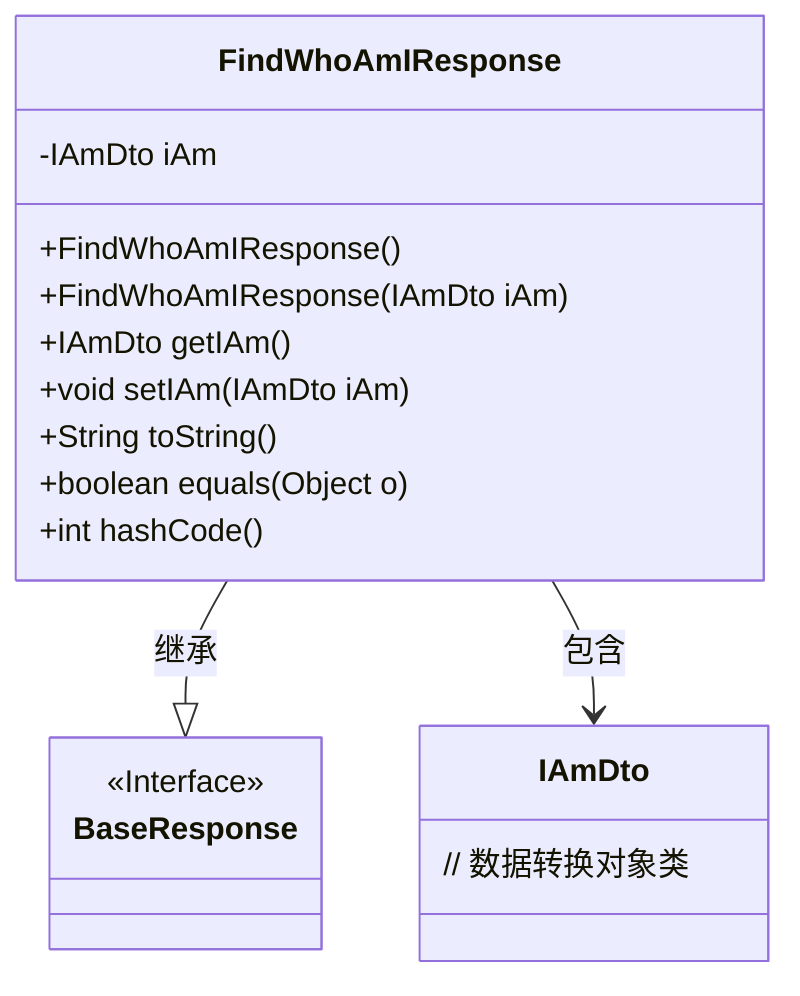
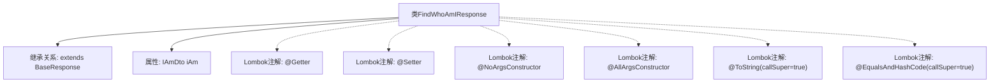

# 基础信息

|      |      |
|------|------|
| 名称 | FindWhoAmIResponse |
| 编码语言 | .java |
| 代码路径 | staffjoy/whoami-api/src/main/java/xyz/staffjoy/whoami/dto/FindWhoAmIResponse.java |
| 包名 | xyz.staffjoy.whoami.dto |
| 依赖项 | [None, 'xyz.staffjoy.common.api.BaseResponse'] |
| 概述说明 | Java类FindWhoAmIResponse继承BaseResponse，包含iAm字段及常用注解。 |

# 说明

该代码段定义了一个名为FindWhoAmIResponse的Java类，继承自BaseResponse。类使用了Lombok注解自动生成getter、setter、无参构造器、全参构造器，并重写了toString和equals/hashCode方法（包含父类字段）。类包含一个IAmDto类型的私有字段iAm。

# 类列表 Class Summary

| 名称   | 类型  | 说明 |
|-------|------|-------------|
| FindWhoAmIResponse | class | Java类FindWhoAmIResponse继承BaseResponse，包含iAm字段及常用注解。 |

## 类 FindWhoAmIResponse

|      |      |
|------|------|
| 访问范围 | @Getter;@Setter;@NoArgsConstructor;@AllArgsConstructor;@ToString(callSuper = true);@EqualsAndHashCode(callSuper = true);public |
| 类型 | class |
| 名称 | FindWhoAmIResponse |
| 说明 | Java类FindWhoAmIResponse继承BaseResponse，包含iAm字段及常用注解。 |

### UML类图

这段类图展示了FindWhoAmIResponse继承自BaseResponse接口，并包含一个IAmDto类型私有成员的结构。通过Lombok注解自动生成构造方法、getter/setter、toString、equals和hashCode方法。类图清晰地反映了实体间的继承与组合关系，其中FindWhoAmIResponse作为核心业务类，既实现了基础响应接口规范，又封装了具体业务数据对象。

### 内部方法调用关系图

这段代码定义了一个名为FindWhoAmIResponse的类，该类继承自BaseResponse。主要功能是通过Lombok注解自动生成getter/setter方法、无参构造器、全参构造器，并重写了toString和equals/hashCode方法（包含父类字段）。核心属性是一个IAmDto类型的iAm对象，用于存储身份信息。整个类结构简洁，通过注解减少了样板代码。

### 字段列表 Field List

| 名称  | 类型  | 说明 |
|-------|-------|------|
| iAm | IAmDto | 私有IAmDto类型变量iAm |

### 方法列表 Method List

| 名称  | 类型  | 说明 |
|-------|-------|------|

