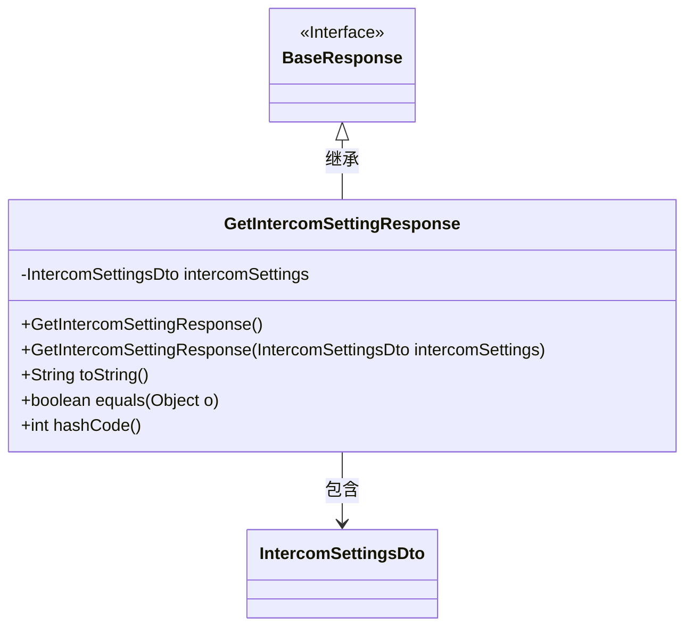
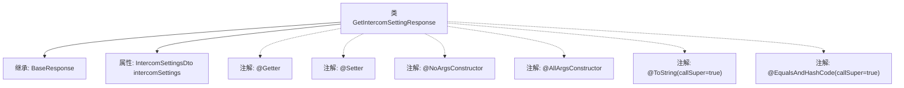

# 基础信息

|      |      |
|------|------|
| 名称 | GetIntercomSettingResponse |
| 编码语言 | .java |
| 代码路径 | staffjoy/whoami-api/src/main/java/xyz/staffjoy/whoami/dto/GetIntercomSettingResponse.java |
| 包名 | xyz.staffjoy.whoami.dto |
| 依赖项 | [None, 'xyz.staffjoy.common.api.BaseResponse'] |
| 概述说明 | Java类GetIntercomSettingResponse继承BaseResponse，包含IntercomSettingsDto属性及常用注解。 |

# 说明

该内容描述了一个名为GetIntercomSettingResponse的Java类，该类继承自BaseResponse。使用了Lombok库的多个注解：@Getter和@Setter自动生成getter和setter方法，@NoArgsConstructor和@AllArgsConstructor分别生成无参和全参构造函数。@ToString和@EqualsAndHashCode注解启用了callSuper属性，确保在生成toString、equals和hashCode方法时包含父类的字段。类中包含一个IntercomSettingsDto类型的私有字段intercomSettings。

# 类列表 Class Summary

| 名称   | 类型  | 说明 |
|-------|------|-------------|
| GetIntercomSettingResponse | class | Java类GetIntercomSettingResponse继承BaseResponse，包含IntercomSettingsDto字段及常用注解。 |

## 类 GetIntercomSettingResponse

|      |      |
|------|------|
| 访问范围 | @Getter;@Setter;@NoArgsConstructor;@AllArgsConstructor;@ToString(callSuper = true);@EqualsAndHashCode(callSuper = true);public |
| 类型 | class |
| 名称 | GetIntercomSettingResponse |
| 说明 | Java类GetIntercomSettingResponse继承BaseResponse，包含IntercomSettingsDto字段及常用注解。 |

### UML类图

这段类图展示了GetIntercomSettingResponse继承自BaseResponse接口，并包含一个IntercomSettingsDto私有成员。该类通过Lombok注解自动生成了无参构造器、全参构造器、getter/setter方法，以及重写了toString()、equals()和hashCode()方法。图中清晰呈现了类之间的继承关系和组合关系，符合Java类结构规范。

### 内部方法调用关系图

这段代码展示了一个使用Lombok注解的Java类`GetIntercomSettingResponse`，它继承自`BaseResponse`并包含一个`IntercomSettingsDto`类型的属性。类通过注解自动生成getter/setter、无参构造器、全参构造器、toString和equals/hashCode方法，其中后两个方法会调用父类实现。流程图清晰地呈现了类的继承关系、属性定义和注解配置，体现了Lombok简化POJO代码的特点。

### 字段列表 Field List

| 名称  | 类型  | 说明 |
|-------|-------|------|
| intercomSettings | IntercomSettingsDto | 私有Intercom设置对象 |

### 方法列表 Method List

| 名称  | 类型  | 说明 |
|-------|-------|------|

