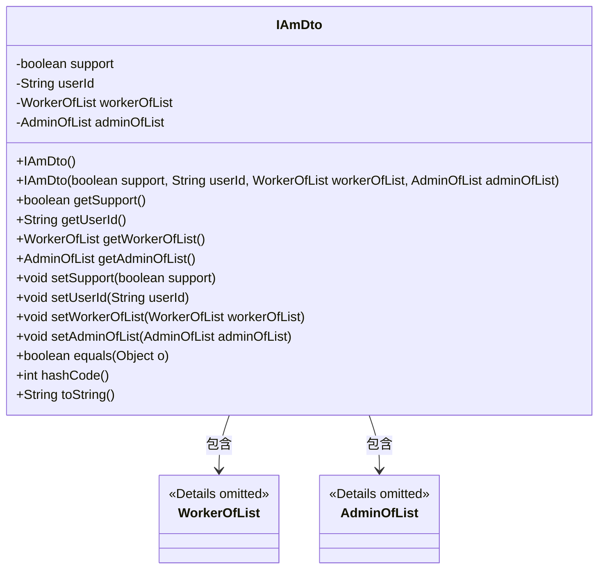
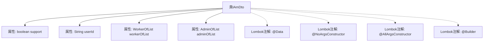

# 基础信息

|      |      |
|------|------|
| 名称 | IAmDto |
| 编码语言 | .java |
| 代码路径 | staffjoy/whoami-api/src/main/java/xyz/staffjoy/whoami/dto/IAmDto.java |
| 包名 | xyz.staffjoy.whoami.dto |
| 依赖项 | ['lombok.AllArgsConstructor', 'lombok.Builder', 'lombok.Data', 'lombok.NoArgsConstructor', 'xyz.staffjoy.company.dto.AdminOfList', 'xyz.staffjoy.company.dto.WorkerOfList'] |
| 概述说明 | IAmDto类包含支持状态、用户ID、工作列表和管理列表字段。 |

# 说明

该内容定义了一个名为IAmDto的Java类，使用了Lombok库的四个注解：@Data自动生成getter/setter等方法，@NoArgsConstructor生成无参构造器，@AllArgsConstructor生成全参构造器，@Builder提供建造者模式支持。类包含四个字段：布尔类型support表示支持状态，字符串类型userId存储用户ID，WorkerOfList类型workerOfList表示工作者列表，AdminOfList类型adminOfList表示管理员列表。该设计便于快速构建包含用户身份信息的传输对象。

# 类列表 Class Summary

| 名称   | 类型  | 说明 |
|-------|------|-------------|
| IAmDto | class | IAmDto类：包含support、userId、workerOfList和adminOfList字段，支持无参、全参和构建器构造。 |

## 类 IAmDto

|      |      |
|------|------|
| 访问范围 | @Data;@NoArgsConstructor;@AllArgsConstructor;@Builder;public |
| 类型 | class |
| 名称 | IAmDto |
| 说明 | IAmDto类：包含support、userId、workerOfList和adminOfList字段，支持无参、全参和构建器构造。 |

### UML类图

该代码是一个使用Lombok注解的Java数据传输对象（DTO）类，包含四个私有字段：布尔类型support、字符串userId，以及两个自定义类型WorkerOfList和AdminOfList。通过Lombok自动生成无参构造器、全参构造器、getter/setter、equals/hashCode和toString方法。类图展示了IAmDto与WorkerOfList和AdminOfList的组合关系，前者通过字段持有后两者的实例。这种结构常用于分层架构中封装跨层数据，特别适合Spring Boot等框架的REST API场景。

### 内部方法调用关系图

该流程图展示了IAmDto类的结构，包含4个私有属性和4个Lombok注解。@Data自动生成getter/setter/equals等方法，@NoArgsConstructor创建无参构造器，@AllArgsConstructor生成全参构造器，@Builder提供建造者模式支持。属性包括布尔类型的support、字符串类型的userId，以及两个自定义类型对象workerOfList和adminOfList。通过Lombok注解显著减少了样板代码的编写。

### 字段列表 Field List

| 名称  | 类型  | 说明 |
|-------|-------|------|
| userId | String | 私有用户ID字符串变量 |
| support | boolean | 私有布尔变量support |
| workerOfList | WorkerOfList | 私有WorkerOfList类型变量workerOfList |
| adminOfList | AdminOfList | 私有管理员列表变量adminOfList |

### 方法列表 Method List

| 名称  | 类型  | 说明 |
|-------|-------|------|

