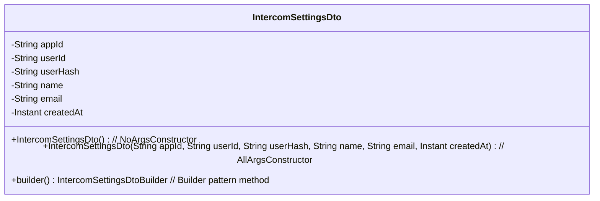
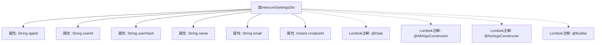

# 基础信息

|      |      |
|------|------|
| 名称 | IntercomSettingsDto |
| 编码语言 | .java |
| 代码路径 | staffjoy/whoami-api/src/main/java/xyz/staffjoy/whoami/dto/IntercomSettingsDto.java |
| 包名 | xyz.staffjoy.whoami.dto |
| 依赖项 | ['lombok.AllArgsConstructor', 'lombok.Builder', 'lombok.Data', 'lombok.NoArgsConstructor', 'java.time.Instant'] |
| 概述说明 | IntercomSettingsDto类定义，包含应用ID、用户信息及创建时间字段。 |

# 说明

这是一个名为IntercomSettingsDto的Java类，使用了Lombok库的注解来简化代码。类中包含六个字符串类型字段：appId、userId、userHash、name、email，以及一个Instant类型的createdAt字段。通过@AllArgsConstructor和@NoArgsConstructor注解，该类拥有全参数和无参数构造函数。@Builder注解提供了建造者模式支持，方便对象创建。这个类可能用于存储与Intercom服务相关的用户设置信息。

# 类列表 Class Summary

| 名称   | 类型  | 说明 |
|-------|------|-------------|
| IntercomSettingsDto | class | IntercomSettingsDto类包含应用ID、用户ID、哈希、姓名、邮箱和创建时间字段。 |

## 类 IntercomSettingsDto

|      |      |
|------|------|
| 访问范围 | @Data;@AllArgsConstructor;@NoArgsConstructor;@Builder;public |
| 类型 | class |
| 名称 | IntercomSettingsDto |
| 说明 | IntercomSettingsDto类包含应用ID、用户ID、哈希、姓名、邮箱和创建时间字段。 |

### UML类图

该类图展示了一个数据传输对象IntercomSettingsDto，使用Lombok注解自动生成构造器和方法。类包含6个私有字段，分别存储应用ID、用户ID、哈希值、姓名、邮箱和创建时间。通过@AllArgsConstructor和@NoArgsConstructor生成全参数和无参构造器，@Builder提供建造者模式支持。这种设计简化了对象创建过程，特别适用于需要灵活构建复杂对象的场景，同时保持了良好的封装性。

### 内部方法调用关系图

该流程图展示了IntercomSettingsDto类的结构，包含6个字符串和Instant类型的属性，以及4个Lombok注解。@Data自动生成getter/setter/equals等方法，@AllArgsConstructor和@NoArgsConstructor分别生成全参和无参构造方法，@Builder提供建造者模式支持。整个类设计用于封装Intercom服务的配置数据，通过注解简化了样板代码的编写。

### 字段列表 Field List

| 名称  | 类型  | 说明 |
|-------|-------|------|
| email | String | 私有字符串类型变量email |
| userId | String | 私有字符串类型变量userId |
| userHash | String | 用户哈希值私有变量 |
| appId | String | 私有字符串变量appId |
| name | String | 私有字符串变量name |
| createdAt | Instant | 私有创建时间字段 |

### 方法列表 Method List

| 名称  | 类型  | 说明 |
|-------|-------|------|

