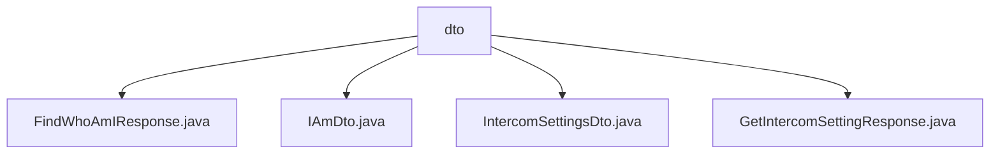

# 基础信息

|      |      |
|------|------|
| 名称 | dto |
| 编码语言 | .java |
| 代码路径 | staffjoy/whoami-api/src/main/java/xyz/staffjoy/whoami/dto |
| 包名 | staffjoy.docs.whoami-api.src.main.java.xyz.staffjoy.whoami.dto |
| 概述说明 | FindWhoAmIResponse继承BaseResponse含IAmDto字段。IAmDto存储用户身份信息。IntercomSettingsDto存Intercom设置。GetIntercomSettingResponse继承BaseResponse含IntercomSettingsDto字段。 |

# 说明

## 概述
该代码模块是一个基于Java的DTO（数据传输对象）集合，属于Staffjoy项目的whoami-api模块。模块主要包含用户身份识别和Intercom集成相关的数据传输对象，使用Lombok库大幅简化了样板代码。所有类都遵循了标准的Java Bean规范，并提供了建造者模式支持。

## 主要业务场景
1. **用户身份识别**：
   - `FindWhoAmIResponse`和`IAmDto`协同工作，用于返回当前用户的完整身份信息
   - 支持识别用户是否为技术支持人员（support字段）
   - 包含用户ID、所属工作者列表(WorkerOfList)和管理员列表(AdminOfList)信息

2. **Intercom集成**：
   - `IntercomSettingsDto`和`GetIntercomSettingResponse`配合使用
   - 存储和传输Intercom服务的用户配置信息
   - 包含appId、用户凭证(userHash)、基本信息(name/email)和账户创建时间等字段

3. **标准化响应格式**：
   - 所有响应类(`FindWhoAmIResponse`、`GetIntercomSettingResponse`)都继承自`BaseResponse`
   - 通过Lombok注解确保包含父类字段的toString/equals/hashCode方法
   - 采用建造者模式提供灵活的构造方式

### 包内部结构视图

该流程图展示了whoami-api项目中dto目录下的文件结构关系。根节点dto包含四个Java文件：FindWhoAmIResponse.java、IAmDto.java、IntercomSettingsDto.java和GetIntercomSettingResponse.java，这些文件均属于数据传输对象层，用于定义API接口的响应数据结构。每个文件都直接隶属于dto目录，没有更深层级的嵌套关系。

# 文件列表 File List

| 名称   | 类型  | 说明 |
|-------|------|-------------|
| [GetIntercomSettingResponse.java](GetIntercomSettingResponse.md) | file | Java类GetIntercomSettingResponse继承BaseResponse，包含IntercomSettingsDto属性及常用注解。 |
| [IntercomSettingsDto.java](IntercomSettingsDto.md) | file | IntercomSettingsDto类定义，包含应用ID、用户信息及创建时间字段。 |
| [IAmDto.java](IAmDto.md) | file | IAmDto类包含支持状态、用户ID、工作列表和管理列表字段。 |
| [FindWhoAmIResponse.java](FindWhoAmIResponse.md) | file | Java类FindWhoAmIResponse继承BaseResponse，包含iAm字段及常用注解。 |

