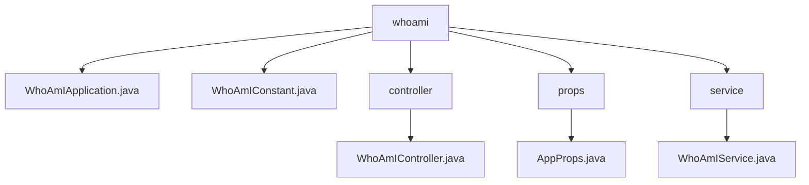

# 基础信息

|      |      |
|------|------|
| 名称 | staffjoy |
| 编码语言 | .java |
| 代码路径 | staffjoy/whoami-svc/src/main/java/xyz/staffjoy |
| 包名 | staffjoy.docs.whoami-svc.src.main.java.xyz.staffjoy |
| 概述说明 | Spring框架的REST控制器WhoAmIController，含两个需认证的GET端点。AppProps类存储Intercom配置。WhoAmIService处理用户信息和设置。WhoAmIApplication是启动类。WhoAmIConstant定义服务名常量。 |

# 说明

## 概述  
该代码模块是一个基于Spring Boot的微服务，名为`whoami-service`，主要用于处理用户身份识别和相关设置查询。模块通过REST API提供以下核心功能：  
1. 获取当前认证用户的详细信息（包括工作和管理信息）。  
2. 获取用户的Intercom（客服工具）配置信息。  

模块采用典型的Spring分层架构，包含控制器层（`WhoAmIController`）、服务层（`WhoAmIService`）、配置类（`AppProps`）和启动类（`WhoAmIApplication`）。通过Feign客户端（`CompanyClient`和`AccountClient`）与其他微服务（如公司服务和账户服务）交互，并集成Sentry进行错误监控。

## 主要业务场景  
1. **用户身份查询**  
   - 场景：前端应用需要显示当前用户的工作信息（如所属公司、管理权限等）。  
   - 流程：  
     - 用户发起GET请求到`/v1/findWhoAmI`端点。  
     - 控制器从`AuthContext`提取用户ID，调用`WhoAmIService`。  
     - 服务层通过`CompanyClient`获取用户的工作和管理数据，构建`IAmDto`响应。  
     - 支持用户（如管理员）会被特殊标记。  

2. **Intercom设置查询**  
   - 场景：前端需要根据用户账户状态动态加载Intercom客服配置。  
   - 流程：  
     - 用户发起GET请求到`/v1/getIntercomSettings`端点。  
     - 控制器从`AuthContext`获取用户ID，调用`WhoAmIService`。  
     - 服务层通过`AccountClient`查询用户账户信息，结合`AppProps`中的Intercom密钥生成`IntercomSettingsDto`。  

3. **异常处理**  
   - 服务层方法均包含异常捕获逻辑，错误日志会发送到Sentry，并抛出`ServiceException`返回给客户端。  

4. **服务配置**  
   - 通过`AppProps`集中管理Intercom的`appId`和`signingSecret`，避免硬编码。  
   - 启动类排除了数据源自动配置（无本地数据库依赖），仅依赖外部微服务接口。

### 包内部结构视图

该流程图展示了whoami模块的层级结构，根节点为whoami目录，包含应用程序主类、常量类以及三个子目录：controller（控制器）、props（配置属性）和service（服务层）。每个子目录下分别包含对应的实现文件，形成清晰的MVC架构模式，符合典型Spring Boot应用的项目结构规范。

# 文件列表 File List

| 名称   | 类型  | 说明 |
|-------|------|-------------|
| [whoami](whoami/_module.md) | package | Spring框架的REST控制器WhoAmIController，含两个需认证的GET端点。AppProps类存储Intercom配置。WhoAmIService处理用户信息和设置。WhoAmIApplication是启动类。WhoAmIConstant定义服务名常量。 |

