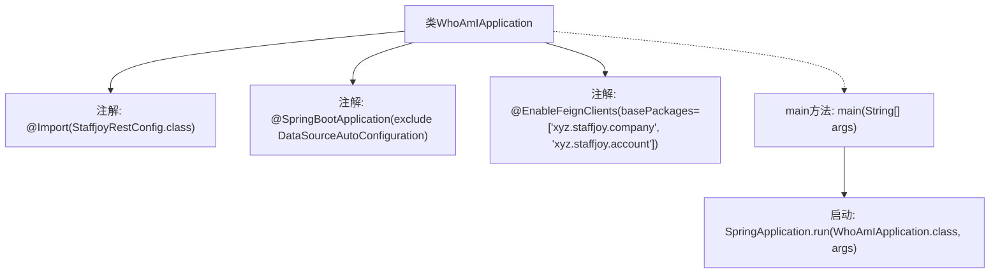

# 基础信息

|      |      |
|------|------|
| 名称 | WhoAmIApplication |
| 编码语言 | .java |
| 代码路径 | staffjoy/whoami-svc/src/main/java/xyz/staffjoy/whoami/WhoAmIApplication.java |
| 包名 | xyz.staffjoy.whoami |
| 依赖项 | ['org.springframework.boot.SpringApplication', 'org.springframework.boot.autoconfigure.SpringBootApplication', 'org.springframework.boot.autoconfigure.jdbc.DataSourceAutoConfiguration', 'org.springframework.cloud.openfeign.EnableFeignClients', 'org.springframework.context.annotation.Import', 'xyz.staffjoy.common.config.StaffjoyRestConfig'] |
| 概述说明 | SpringBoot应用WhoAmI，排除数据源配置，启用Feign客户端，包含公司和账户服务包。 |

# 说明

这是一个名为WhoAmIApplication的Spring Boot应用主类。它通过@SpringBootApplication注解标记为启动类，并排除了DataSourceAutoConfiguration自动配置。使用@Import导入了StaffjoyRestConfig配置类，同时通过@EnableFeignClients启用了对xyz.staffjoy.company和xyz.staffjoy.account包下Feign客户端的支持。主方法通过SpringApplication.run启动应用。

# 类列表 Class Summary

| 名称   | 类型  | 说明 |
|-------|------|-------------|
| WhoAmIApplication | class | SpringBoot应用WhoAmI，排除数据源配置，启用Feign客户端，依赖Staffjoy配置。 |


## 类 WhoAmIApplication

|      |      |
|------|------|
| 访问范围 | @Import(value = StaffjoyRestConfig.class);@SpringBootApplication(exclude = {DataSourceAutoConfiguration.class});@EnableFeignClients(basePackages = {"xyz.staffjoy.company", "xyz.staffjoy.account"});public |
| 类型 | class |
| 名称 | WhoAmIApplication |
| 说明 | SpringBoot应用WhoAmI，排除数据源配置，启用Feign客户端，依赖Staffjoy配置。 |


### UML类图

```mermaid
classDiagram
    class WhoAmIApplication {
        +main(String[] args) void
    }
    class StaffjoyRestConfig {
    }
    class DataSourceAutoConfiguration {
    }
    <<interface>> "xyz.staffjoy.company"
    <<interface>> "xyz.staffjoy.account"

    WhoAmIApplication --> StaffjoyRestConfig : 依赖
    WhoAmIApplication --> DataSourceAutoConfiguration : 排除自动配置
    WhoAmIApplication --> "xyz.staffjoy.company" : 启用Feign客户端
    WhoAmIApplication --> "xyz.staffjoy.account" : 启用Feign客户端
```

这段代码展示了一个Spring Boot应用的启动类WhoAmIApplication，它通过注解配置了应用的基本行为。类图显示了WhoAmIApplication与StaffjoyRestConfig的依赖关系，排除了DataSourceAutoConfiguration的自动配置，并通过@EnableFeignClients启用了对xyz.staffjoy.company和xyz.staffjoy.account两个包下Feign客户端的支持。该应用作为微服务架构的一部分，主要负责身份认证和权限管理功能。


### 内部方法调用关系图



该流程图展示了WhoAmIApplication类的核心结构和启动流程。类通过三个关键注解配置Spring Boot应用：导入Rest配置、排除数据源自动配置、启用对指定包路径的Feign客户端支持。main方法作为入口点，调用SpringApplication.run启动整个应用。这种结构典型用于微服务架构中的身份识别服务，通过Feign实现跨服务通信。

### 字段列表 Field List

| 名称  | 类型  | 说明 |
|-------|-------|------|

### 方法列表 Method List

| 名称  | 类型  | 说明 |
|-------|-------|------|
| main | void | Java启动Spring应用的main方法。 |


